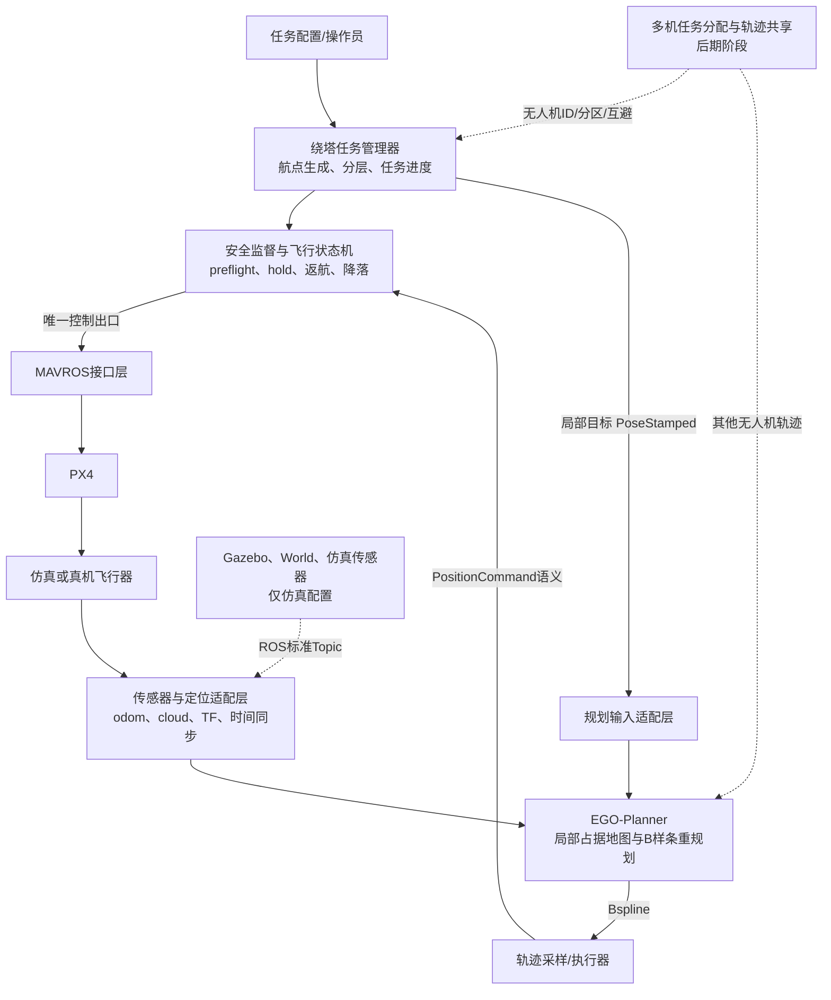

# EGO-Planner 工程落地学习与实施路线

> 项目：AstraDroneOpen  
> 审计与复核日期：2026-07-20  
> 当前分支：`ego-project`  
> 当前 HEAD：`498c7c6c501c9d0b638ba1416e5b283bce6dd347`  
> 本文范围：ROS1、PX4、MAVROS、Gazebo、FAST-LIO、EGO-Planner、无人机运动与避障；不涉及 YOLO、违规判断和 QGIS。  
> 本文只是学习和实施计划，不代表已完成代码修改或飞行验收。

## 阅读说明与证据等级

本文使用四种标签，避免把代码存在、历史记录和运行成功混为一谈：

- **[已确认]**：本轮已通过当前 Git、源码、配置、已有文件或短时只读命令确认。
- **[报告未复核]**：来自 `CODE_AUDIT_REPORT.md`，本轮没有重新执行相同检查。
- **[推测]**：依据当前结构作出的工程判断，需要后续编译或运行验证。
- **[无法确认]**：仅靠当前静态材料无法得出结论。

“文件存在”只证明实现入口存在，不证明它现在能够编译、启动或安全飞行；“已有二进制测试通过”也不等于“当前源码重新构建通过”。后续每个阶段都必须以实际 Topic、日志、轨迹、Gazebo 结果和测试结果作为验收证据。

---

# A. 当前工程概况

## A.1 审计基线、分支与工作区

- **[已确认]** 当前分支为 `ego-project`，HEAD 为 `498c7c6`，与审计报告的基线分支和提交完全一致。现有本地 `stage6` 分支也指向同一提交。
- **[已确认]** 当前 HEAD 相对 `main` 有 10 个提交；merge-base 为 `9a8a662`；`main...HEAD` 有 76 个改动文件、14,202 行新增、1,807 行删除。这些数字与报告一致。
- **[已确认]** 当前工作区不是报告记录的“干净状态”：受版本控制的 `ego-planner学习.md` 已被删除，`CODE_AUDIT_REPORT.md` 尚未跟踪；加上本文后，目标学习文档也处于未跟踪状态。本轮没有恢复、覆盖或清理用户已有改动。
- **[已确认]** 当前分支没有配置远端跟踪分支；`main` 跟踪的是 `origin/master`，且本地显示领先 6 个提交。后续若要推送或建立正式协作流，需要单独决定分支和远端策略。

### 当前分支是否适合作为后续基础

结论分两层：

1. **学习、仿真原型和继续梳理 EGO 接入：有条件适合。** 它包含悬停/多航点/轨迹任务、FAST-LIO、EGO、bridge 和 Stage 6 编排，且当前 HEAD 正好与审计基线一致，最方便复现实验和理解链路。
2. **正式工程基线、生产基线或真机基线：目前不适合。** 软降落参数、解锁前坐标门禁、EGO 指令执行语义、控制权唯一性、外部 PX4 可复现性、超时终态和 EGO vendor 修改管理仍有阻断项。

因此，**[推荐但尚未执行]** 暂时把 `ego-project@498c7c6` 当作“受审计的学习/集成候选基线”，不要称为真机或交付基线。开始任何代码阶段前，必须由项目负责人确认如何处理已有未提交改动，以及是否继续以该提交为基础。未经确认不切分支、不改基线。

## A.2 当前技术栈、工作空间和启动入口

- **[已确认]** 主 ROS 工作空间是 `AstraDrone_ros1_ws`，使用 ROS Noetic 和 catkin；`src/CMakeLists.txt` 指向 `/opt/ros/noetic/share/catkin/cmake/toplevel.cmake`，现有构建缓存使用 Unix Makefiles 和 Release，说明当前主要构建方式是 `catkin_make`。
- **[已确认]** 本机 ROS 发行版是 Noetic，MAVROS 包版本为 1.20.1，`gazebo_ros` 包版本为 2.9.3。
- **[已确认]** Gazebo 传感器插件另有 `simulation/sim_workspace` 工作空间。Stage 6 脚本先加载该仿真工作空间，再以 `--extend` 加载主工作空间。
- **[已确认]** 外部 PX4 位于 `/home/yanzu/PX4-Autopilot`，提交为 `99c40407...`，描述为 `v1.15.4-dirty`，处于 detached HEAD；Gazebo Classic 子目录有改动状态，且有未跟踪的 `launch/astra_launch/`。这与报告一致，当前不能视为可复现的干净依赖。

主要入口如下：

| 用途 | 当前入口 | 说明 |
|---|---|---|
| PX4 SITL + Gazebo + MAVROS | `simulation/px4_sim_files/px4_launch/astra_launch/astra_example.launch` | 默认机型 `iris_mid360`，默认 world 为 `dynamic_avoidance.world` |
| FAST-LIO | `roslaunch fast_lio mapping_mid360.launch rviz:=false` | 输入 `/livox/lidar`、`/livox/imu` |
| EGO 集成层 | `roslaunch ego_gazebo_bridge stage6_gazebo.launch` | 启动 EGO、`traj_server`、`waypoint_generator`、bridge；默认不控制无人机 |
| 一键 Stage 6 编排 | `scripts/run_sh/stage6_planner.sh` | 依次启动仿真、FAST-LIO、规划层和 RViz；默认 dry-run |
| 既有基础飞行/多航点 | `roslaunch offboard autoarming_control.launch` | 读取 `stage3_waypoints.yaml`，执行起飞、悬停、多航点、返航和降落 |
| 既有连续轨迹 | `roslaunch offboard stage4_trajectory.launch` | 圆、方形、8 字、椭圆参考轨迹 |

**[已确认]** Stage 6 脚本默认 world 是 `dynamic_avoidance.world`，不是铁塔场景。`forest.world` 中存在 `radio_tower` 和 `radio_tower_0` 两个铁塔实例，仓库也存在 `radio_tower` 模型。后续绕塔测试应显式选择并核对目标铁塔中心、碰撞几何和可飞空间，不能仅凭模型名称假定坐标。

## A.3 主要节点、Topic、消息、TF 与数据流

### 当前 Stage 6 节点

**[已确认]** 从 launch 源码可确认规划层主要节点：

- `/verified_map_to_planning_frame`：默认发布 `map -> camera_init` 单位静态 TF。
- `/ego_planner_node`：EGO 规划 FSM、局部体素地图、路径搜索和 B 样条优化。
- `/traj_server`：把 `/planning/bspline` 采样成 `quadrotor_msgs/PositionCommand`。
- `/waypoint_generator`：把规划目标变成 EGO 接受的 `nav_msgs/Path`。
- `/ego_mavros_bridge`：目标坐标变换、状态门禁、MAVROS 服务调用和 setpoint 输出。
- 另有 PX4 SITL、Gazebo、MAVROS、`fastlio_mapping`，以及可选 RViz。

### 当前主数据链

| 上游 → 下游 | Topic / 服务 | 消息类型 | 主要坐标系 | 本轮结论 |
|---|---|---|---|---|
| Gazebo MID360 → FAST-LIO | `/livox/lidar` | 仿真插件发布 `livox_laser_simulation/CustomMsg`；FAST-LIO 接收兼容的 `livox_ros_driver/CustomMsg` | `mid360_link` | **[已确认]** 两种消息 MD5 相同；仍需运行时确认频率、时间戳和点质量 |
| Gazebo IMU → FAST-LIO | `/livox/imu` | `sensor_msgs/Imu` | `lidar_link` | **[已确认]** model 与 `mid360.yaml` Topic 匹配 |
| FAST-LIO → EGO/bridge | `/Odometry` | `nav_msgs/Odometry` | header=`camera_init`，child=`body` | **[已确认]** 源码固定发布该 frame |
| FAST-LIO → EGO 地图 | `/cloud_registered` | `sensor_msgs/PointCloud2` | `camera_init` | **[已确认]** 当前 Stage 6 的主要地图输入 |
| FAST-LIO → MAVROS vision | TF `camera_init -> body` | TF | `camera_init` / `body` | **[已确认]** FAST-LIO 发布；当前 MAVROS `px4_config.yaml` 配置 `vision_pose.tf.listen=true` |
| RViz/任务层 → bridge | `/move_base_simple/goal` | `geometry_msgs/PoseStamped` | 任意可转换 frame | **[已确认]** bridge 转到 `camera_init` 后发布 |
| bridge → waypoint generator | `/planning/goal` | `geometry_msgs/PoseStamped` | `camera_init` | **[已确认]** Topic 可参数化 |
| waypoint generator → EGO | `/waypoint_generator/waypoints` | `nav_msgs/Path` | `camera_init` | **[已确认]** 当前配置是单个手动目标 |
| EGO → traj_server | `/planning/bspline` | `ego_planner/Bspline` | 规划坐标系 | **[已确认]** 含阶次、控制点、结点和开始时间 |
| traj_server → bridge | `/planning/pos_cmd` | `quadrotor_msgs/PositionCommand` | `camera_init` | **[已确认]** 含位置、速度、加速度、yaw、yaw_dot |
| MAVROS → bridge | `/mavros/state`、`/mavros/extended_state`、`/mavros/local_position/pose` | `mavros_msgs/State`、`ExtendedState`、`geometry_msgs/PoseStamped` | `map -> base_link` 语义 | **[已确认]** 用于状态机、home 和对齐检查 |
| bridge → MAVROS/PX4 | `/mavros/setpoint_position/local` | `geometry_msgs/PoseStamped` | ROS ENU `map` | **[已确认]** MAVROS 再转换到 PX4 NED |
| bridge → MAVROS | `/mavros/cmd/arming`、`/mavros/set_mode` | `CommandBool`、`SetMode` 服务 | 不适用 | **[已确认]** 用于解锁和模式切换 |

简化的数据流是：

`Gazebo MID360/IMU → FAST-LIO → Odometry + 注册点云 → EGO 局部地图与重规划 → B 样条 → traj_server PositionCommand → bridge → MAVROS → PX4`。

### 定位、IMU、深度图、点云和地图来源

- **[已确认]** 当前 Stage 6 定位主来源是 FAST-LIO 的激光雷达-惯性里程计，不是 Gazebo ground truth。FAST-LIO 同时把 `camera_init -> body` TF 交给 MAVROS vision pose 插件，PX4 再产生 MAVROS local pose。
- **[已确认]** 当前点云地图源是 FAST-LIO 的 `/cloud_registered`，EGO 直接把点坐标当作规划坐标使用，不读取或变换点云 frame。因此该点云必须已经在 `camera_init`。
- **[已确认]** `iris_mid360` 模型还挂载了 D435i，但 Stage 6 把 EGO 的 depth 和 camera pose remap 到 `/stage6/unused_*`；当前规划不使用深度图。
- **[已确认]** EGO 维护的是局部概率占据体素和膨胀占据体素；分辨率默认 0.1 m，局部更新范围 5.5/5.5/4.5 m，点云障碍膨胀默认 0.3 m，最大射线长度配置为 4.5 m。
- **[推测]** `map` 与 `camera_init` 在特定仿真初始化下可能近似重合，但当前默认单位 TF 只是配置假设，不是自动标定结果。真机必须重新建立原点、航向和机体外参契约。

## A.4 EGO-Planner 接入现状与具备条件

### 已经具备的代码条件

- **[已确认]** EGO 必需包已通过删除相应 `CATKIN_IGNORE` 的方式启用，当前 devel 中存在 `ego_planner_node`、`traj_server` 和 bridge 二进制。
- **[已确认]** EGO 的 odom、cloud、目标、B 样条和 PositionCommand 链路已经在 launch 中连通。
- **[已确认]** bridge 默认 `enable_control=false`，dry-run 不创建 MAVROS setpoint publisher；同时默认要求 `/use_sim_time=true`。
- **[已确认]** bridge 会检查 FCU、落地状态、MAVROS pose、FAST-LIO odom、点云和指令时效，也检查部分 frame、命令有限值和任务包络。
- **[已确认]** 当前 bridge 的旧测试二进制 6/6 通过，offboard 的旧测试二进制 7/7 通过。

### 尚未形成的工程闭环

- **[无法确认]** 当前 checkout 没有在本轮重新执行完整 `catkin_make`，因为这会写入 build/devel；现有测试二进制时间早于 HEAD。因此不能宣称当前源码完整编译通过。
- **[无法确认]** 本轮没有启动 PX4/Gazebo/FAST-LIO/EGO，没有新的起飞、目标跟踪、避障、重规划或降落运行证据。
- **[已确认]** bridge 把完整 PositionCommand 转为 PoseStamped，只保留 position 和 yaw，速度、加速度和 yaw_dot 没有进入 MAVROS 控制接口。这不是完整的 EGO 轨迹执行闭环。
- **[已确认]** planner/MAVROS 对齐检查只在起飞后的 `HOVER_READY`/跟踪阶段生效，没有在解锁前完成。
- **[已确认]** dry-run 只检查基础输入新鲜度，不验证 home、TF 对齐、目标包络、指令变换和全部控制权。
- **[已确认]** 当前 EGO 核心源码有项目定制改动，其中包括 frame 参数化、手动目标高度固定、输入检查，也包括可能影响原始能力的 flight type 限制。尚未形成可重放的 vendor patch 管理。

结论：**EGO 已经“接上线”，但尚未达到“工程可用并经运行验收”。** 阶段 2 的重点不是再复制一套 EGO，而是把输入契约、任务管理、轨迹执行语义、坐标对齐和失败处理补成可验证闭环。

## A.5 主要风险和缺失项

按优先级归纳如下：

1. **[已确认] PX4 参数越界。** `autoarming_control.launch` 和 `stage4_trajectory.launch` 默认要求 `MPC_LAND_SPEED=0.30`，而当前 PX4 源码声明最小值 0.6 m/s、默认值 0.7 m/s；SITL airframe 默认设为 0.6 m/s。
2. **[已确认] 坐标门禁太晚。** `map -> camera_init` 单位 TF 和 FAST-LIO/MAVROS 对齐在起飞前没有完整验证。
3. **[已确认] 控制语义丢失。** EGO 的动态轨迹被降级为 0.5 m/s 限速的位置追随。
4. **[已确认] 控制权检测不完整。** bridge 只检查 `/mavros/setpoint_position/local`，没有覆盖 raw local、velocity、attitude/thrust 等接口。
5. **[已确认] 状态机过度耦合。** `autoarming_control.cpp` 为 1,299 行，bridge 主实现为 1,158 行；参数、ROS I/O、飞行状态、安全和降落揉在一起。
6. **[已确认] 超时和终态不完整。** 初始等待、起飞、模式/服务失败和降落失败存在无限等待或无限重试风险。
7. **[已确认] 直接修改 EGO vendor 核心。** 后续升级、回退和比较上游版本困难。
8. **[已确认] 外部环境不可复现。** PX4 为 dirty detached HEAD；脚本绑定 ROS Noetic、用户 PX4 目录和特定 NVIDIA 驱动策略。
9. **[已确认] 硬编码和 namespace 风险。** FAST-LIO 源码固定 `camera_init`、`body`、绝对 Topic；部分脚本固定路径；当前单机 Topic 多为绝对名称，不适合直接复制成多机实例。
10. **[已确认] 文档与代码不一致。** 旧文档有强制上锁、AUTO.LAND、Stage 6 架构等过期说明；`stage3_waypoints.yaml` 还把改变高度的第三个航点注释成“原地转向”。
11. **[无法确认] 真机外参与性能。** 雷达-IMU、IMU-机体、`body-base_link` 外参，时间同步、计算负载、网络延迟和真实障碍净空均没有本轮证据。
12. **[已确认] 动态障碍与多机能力缺失。** 当前代码没有障碍物跟踪/预测，也没有 EGO-Swarm 的轨迹广播与多机互避实现。

## A.6 审计报告与当前项目的差异

| 项目 | 当前复核结果 | 影响 |
|---|---|---|
| 分支与 HEAD | **[已确认]** 与报告一致 | 报告仍可作为当前源码基线 |
| 工作区 | **[已确认]** 报告记录干净；当前有一个删除文件和一个未跟踪报告 | 开始实施前必须先保护并由负责人决定如何处理 |
| 外部 PX4 | **[已确认]** commit、dirty、detached 状态与报告一致 | 仍然不可复现，不可当真机基线 |
| ROS/MAVROS/Gazebo 包 | **[已确认]** Noetic、MAVROS 1.20.1、gazebo_ros 2.9.3 | 可记录为当前机环境，不等于已锁定依赖 |
| 旧测试二进制 | **[已确认]** 本轮再次得到 6/6 和 7/7 | 二进制早于 HEAD，不能替代当前源码重编译 |
| 语法/XML/YAML/ShellCheck | **[报告未复核]** 本轮未重复整套检查 | 仍引用报告，后续修改后必须重跑 |
| 实时 SITL | **[无法确认]** 本轮没有运行 | 不得宣称 EGO 飞行、避障或降落已通过 |
| 铁塔场景 | **[已确认]** `forest.world` 含两个 radio tower；默认 Stage 6 world 不含铁塔 | 阶段 1/2 要显式选择 world 和塔中心 |

---

# B. 必要基础知识

## B.1 航点、路径、轨迹和控制指令

这四个概念是一条从“任务意图”到“电机动作”的逐级细化链：

- **航点（Waypoint）**：一个离散目标，例如“到塔东侧 `(cx+R, cy, h)` 悬停 2 秒并朝向塔”。当前 `stage3_waypoints.yaml` 就是一组相对 home 的航点。
- **路径（Path）**：只关心空间几何，即从哪里经过，不规定每个时刻在哪里。`nav_msgs/Path` 常用于表达有序位姿，但消息本身不保证速度和加速度连续。
- **轨迹（Trajectory）**：路径加时间。它回答“在时刻 t，位置、速度、加速度、yaw 是多少”。EGO 的 B 样条和 `PositionCommand` 属于轨迹层。
- **控制指令（Setpoint）**：给飞控或低层控制器的实时目标。当前 bridge 发布 `PoseStamped` 到 `/mavros/setpoint_position/local`；PX4 内部位置控制器再生成姿态和推力。

关键认识：航点管理器不应该直接把遥远航点当成每周期飞控 setpoint；EGO 也不应该承担任务队列、返航政策和多机分工。每层只解决自己的问题，接口才容易从仿真迁移到真机。

## B.2 全局规划与局部规划

- **全局规划/全局任务路线**：决定整个巡检顺序，例如从起点绕塔一圈、换高度、返航。它依赖塔中心、巡检半径、层高和任务约束，通常范围大、更新慢。
- **局部规划**：根据无人机附近的实时障碍物和当前状态，持续生成未来几秒的安全轨迹。EGO 的强项在这里。

当前 EGO FSM 接到一个目标后，会先形成通向目标的全局参考，再在 `planning_horizon=7.5 m` 的局部范围内不断生成/重规划 B 样条。绕塔任务管理器应逐个或按窗口给出巡检目标，EGO 决定如何绕开局部障碍，二者不能混成一个“大状态机”。

## B.3 占据地图、体素地图、ESDF 和障碍物膨胀

- **占据地图**：把空间分成格子，记录“空闲、占据、未知”。二维常用栅格，三维常用体素。
- **体素地图**：三维小方块集合。当前 EGO 分辨率 0.1 m；障碍点会落入对应体素。
- **障碍物膨胀**：把障碍向四周扩一圈，相当于把无人机体积、安全余量、定位误差和控制误差合并进地图。当前默认膨胀 0.3 m，但它是否足够必须用真实机体半径、轨迹误差和传感器误差计算，不能只凭经验。
- **ESDF（Euclidean Signed Distance Field）**：为每个位置维护到最近障碍的带符号欧氏距离及梯度。很多优化器用它快速获得“离障碍多远、往哪里远离”。维护 ESDF 有额外计算和内存成本。

## B.4 “EGO-Planner 不维护完整 ESDF”的含义

EGO 的核心思想不是持续维护一张完整 ESDF，而是利用膨胀占据体素检测碰撞，再通过碰撞段、A* 路径、基点和方向构造反弹优化方向。当前代码可以看到 `getInflateOccupancy()`、`base_point` 和 `direction`，却没有完整 ESDF 更新链。

这带来两面性：

- 优点：减少持续构建 ESDF 的开销，适合快速局部重规划。
- 代价：安全性仍强烈依赖点云正确、体素分辨率合理、膨胀足够、碰撞方向构造有效；“不用 ESDF”不等于“不需要地图”，也不等于天然能处理动态障碍。

## B.5 B 样条和动力学可行性

B 样条由控制点、阶次和结点向量定义。它的常用优势是局部修改某些控制点不会把整条轨迹完全改变，而且位置、速度、加速度可以连续。EGO 对控制点同时施加：

- 平滑代价；
- 碰撞/安全距离代价；
- 速度、加速度等动力学可行性代价；
- 与参考路线的贴合代价。

“规划轨迹动力学可行”只说明规划器按配置的 `max_vel`、`max_acc` 等约束生成了轨迹；若执行器丢掉速度、加速度，只用位置追赶，实际飞行器可能滞后，规划器假设的未来位置就不再成立。当前 bridge 正存在这个问题，因此阶段 2 必须先决定 PositionCommand 的执行策略。

## B.6 里程计、IMU、点云、深度图和 TF

- **IMU**：高频测量角速度和线加速度，会漂移但短时响应快。当前 `/livox/imu` 进入 FAST-LIO。
- **里程计 Odometry**：给出某坐标系下的位姿和速度。当前 `/Odometry` 是 `camera_init -> body` 语义；`/mavros/local_position/pose` 是 PX4/MAVROS 的本地位姿表达。
- **点云**：一组 3D 点。`/cloud_registered` 已被 FAST-LIO 变换到 `camera_init`，可直接进入当前 EGO 地图。
- **深度图**：每个像素记录深度，需要相机内参和相机位姿反投影为 3D。当前模型虽有 D435i，但 Stage 6 未使用深度图。
- **TF**：描述坐标系之间随时间或固定的变换。Topic 名相同不代表坐标相同；消息 frame 正确也不代表外参正确。TF 必须形成无冲突、时戳可用的树。

当前最重要的坐标契约是：

`map -> camera_init -> body` 与 `map -> base_link` 之间必须可解释且一致。仿真中暂时发布单位 `map -> camera_init`，真机则必须根据定位系统原点、PX4 local origin、机体基准点和安装外参建立正式变换。

## B.7 各模块分工

| 模块 | 应负责 | 不应负责 |
|---|---|---|
| 航点/任务管理 | 绕塔点生成、顺序、层级、到达判定、任务暂停/取消 | 局部绕障、直接控制电机 |
| EGO-Planner | 基于 odom 和局部占据地图生成、检查、重规划局部轨迹 | 任务分配、传感器驱动、完整飞行安全政策 |
| 轨迹执行器 | 忠实解释 PositionCommand，形成 MAVROS setpoint，并监控跟踪误差 | 自己改变任务目标或假装规划成功 |
| 安全状态机 | preflight、控制权、超时、hold、返航、降落和最终终态 | 把所有规划数学和 Gazebo 逻辑塞进一个回调 |
| MAVROS | ROS 与 MAVLink/PX4 的消息和坐标转换桥 | 任务规划和避障 |
| PX4 | 状态估计融合、姿态/位置控制、解锁、模式、飞行器级 failsafe | 高层巡检路线和点云规划 |
| Gazebo/传感器适配 | 仿真物理、模型、传感器数据 | 出现在真机通用任务/规划核心中 |

## B.8 EGO-Planner 与 EGO-Swarm

- **EGO-Planner**：单机局部轨迹规划器，输入自身状态和局部环境，输出自身轨迹。当前仓库接入的是这一类单机 EGO。
- **EGO-Swarm**：面向多无人机的去中心化轨迹规划思路，需要无人机身份、其他无人机轨迹广播、通信和相互碰撞约束。它不是简单打开一个参数就能得到的功能。

**[已确认]** 当前 EGO 核心中没有无人机轨迹共享、drone ID 或 swarm collision 的实现。因此正确顺序是：先让每架无人机拥有独立、稳定、可命名空间化的单机闭环，再做任务分配和轨迹共享；是否引入 EGO-Swarm 留到阶段 8 决策。

---

# C. 推荐工程架构

## C.1 分层结构

核心原则：

- 任务、规划、安全和执行代码只依赖 ROS 消息、服务、参数和 TF，不调用 Gazebo API。
- Gazebo world、传感器插件和 PX4 SITL launch 留在仿真层；真机用独立 launch/YAML/remap 替换数据源。
- MAVROS setpoint 必须只有一个“唯一控制出口”；旧 offboard 与 EGO bridge 不能同时控制。
- 所有 Topic、frame、速度、高度、半径、安全距离、超时和无人机 ID 参数化；单机也预留 namespace。

## C.2 各层输入、输出与建议接口

| 层 | 主要输入 | 主要输出 | 当前可复用内容 | 需要补齐 |
|---|---|---|---|---|
| 绕塔航点生成 | 塔中心、半径、层高、方向、点数、home | 有序任务点、每点 yaw、任务状态 | `stage3_waypoints.yaml`、轨迹数学工具 | 参数化自动生成、塔中心来源、任务取消/暂停 |
| 任务管理 | 当前位姿、规划状态、到达判定、安全状态 | 当前局部目标、下一航点、返航请求 | 既有 WAYPOINTS 状态逻辑 | 与飞控状态机解耦、明确成功/失败事件 |
| 安全状态机 | FCU/定位/地图/控制权/跟踪误差 | allow-control、hold、RTL/land、终态 | bridge 和 offboard 的部分门禁 | 解锁前完整 preflight、总超时、有限重试 |
| 规划适配 | 任务目标、TF | `PoseStamped` / `Path` | bridge goal 转换、waypoint_generator | 高度语义、goal ID、取消与结果接口 |
| EGO 局部规划 | odom、cloud/occupancy、目标 | B 样条、规划状态 | 当前 EGO 包 | vendor patch 收敛、失败状态对外可见 |
| 轨迹执行 | PositionCommand、当前状态 | MAVROS raw/position setpoint、跟踪误差 | traj_server、bridge | 保留速度/加速度语义或明确路径跟随器 |
| 定位/地图适配 | 传感器驱动、外参、时间同步 | 统一 odom、cloud、TF、health | FAST-LIO 链路 | 仿真/真机配置、frame 契约、超时诊断 |
| 多机层 | 每机状态、任务、轨迹 | 任务分区、轨迹广播、冲突约束 | 旧 `autoarming_Mult.launch` 仅作参考 | namespace、ID、通信和避碰协议 |

## C.3 仿真与真机配置隔离

推荐保留同一套任务、规划、安全和轨迹接口，只替换外围：

| 内容 | 仿真 | 真机 |
|---|---|---|
| 飞行器与物理 | PX4 SITL + Gazebo | PX4 真机 |
| 雷达/IMU驱动 | Gazebo MID360 插件 | 实际 Livox 驱动 |
| 定位 | 仿真 FAST-LIO + vision TF | 实际 FAST-LIO/选定定位方案 |
| 时间 | `/clock`、`use_sim_time=true` | 系统/硬件时间、`use_sim_time=false` |
| TF/外参 | 模型 SDF + 已验证静态 TF | 实测标定外参 |
| 参数 | `config/sim/*.yaml` | `config/real/*.yaml` |
| 启动 | `launch/sim/*.launch` | `launch/real/*.launch` |

当前 bridge 名称和 `require_sim_time=true` 明确带有仿真原型属性。未来是否把它重构为通用执行器并用配置启用真机，是架构决策，不能直接删除保护开关。

---

# D. 严格边界和决策点

## D.1 Codex 可以自主完成的工作

在用户明确批准某一阶段后，且不触发下面的关键决策门时，可以自主完成：

- 只读检查 Git、代码、launch、YAML、Topic、TF、依赖版本和现有日志；
- 给出阶段计划、数据流、预计文件和风险；
- 在已确认接口和方案内做小范围、可回退的实现；
- 参数合法性检查、单元测试、launch/XML/YAML 解析、静态检查；
- 启动已批准的仿真，采集 Topic、日志、rosbag、轨迹和 Gazebo 证据；
- 展示 `git diff` 摘要和测试结果；
- 更新同一份总学习文档中的事实状态。

不能因为修改看起来很小，就绕过对公共接口、定位、控制和安全行为的决策。

## D.2 必须由项目负责人决定的事项

- 基础分支、基础提交、现有未提交改动如何处理；
- 新增/替换/升级 PX4、MAVROS、EGO 或关键第三方依赖；
- 是否拆分现有两个大状态机、是否新增任务管理包；
- PositionCommand 到 MAVROS 的执行策略；
- `map/camera_init/body/base_link` 的正式坐标契约；
- 定位、地图、传感器、动态障碍预测方案；
- 公共 Topic、消息、TF、服务或节点接口的改变；
- 是否继续直接修改 EGO 核心，或改为适配层 + vendor patch；
- 多机通信、任务分区和是否使用 EGO-Swarm；
- 会影响仿真到真机迁移、安全策略或已有功能兼容性的方案。

## D.3 当前必须保留的关键决策门

### 决策门 1：开发基线和工作区

1. **当前事实和问题**：`ego-project@498c7c6` 与审计基线一致，但工作区已有一个文件删除和未跟踪审计报告；该提交不满足正式工程要求。
2. **可选方案**：A. 继续在该受审计提交上做阶段性开发；B. 先建立干净、可复现的新基线；C. 另建专门集成分支并保留当前分支只做历史对照。
3. **优点、风险、工作量和迁移影响**：A 工作量最小但容易继续背负原型债务；B 最干净但要先整理依赖和补丁；C 隔离清楚但需要明确分支维护规则。真机迁移上 B/C 更稳。
4. **推荐方案**：短期学习可选 A；进入安全/真机准备前推荐 C，并以锁定依赖和可重放补丁建立正式候选基线。
5. **等待选择**：开始阶段 1 的任何代码修改前确认。

### 决策门 2：任务管理器放置位置

1. **当前事实和问题**：现有 `autoarming_control.cpp` 已包含航点与飞行状态机，bridge 也包含目标、安全和飞行状态机；继续添加绕塔、多层和多机会进一步耦合。
2. **可选方案**：A. 在现有 offboard 节点继续扩展；B. 新增独立任务管理器，仅通过 ROS 接口连接规划/安全层；C. 直接把逻辑写入 EGO FSM。
3. **取舍**：A 快但维护和真机迁移风险高；B 初始工作量中等、接口设计要求高，但测试和多机扩展最好；C 改动 vendor 核心、升级风险最高。
4. **推荐方案**：B。任务规划是项目逻辑，应独立于 Gazebo 和 EGO 核心。
5. **等待选择**：阶段 1/2 实施前确认包和接口边界。

### 决策门 3：EGO 轨迹如何执行

1. **当前事实和问题**：`PositionCommand` 有 p/v/a/yaw/yaw_dot，当前 bridge 只发布 PoseStamped，丢弃 v/a/yaw_dot。
2. **可选方案**：A. 用 `/mavros/setpoint_raw/local` 的 `PositionTarget` 传位置、速度、加速度和 yaw/yaw_rate；B. 明确把 EGO 当路径生成器，设计独立路径跟随器；C. 维持现状，仅做低速原型。
3. **取舍**：A 最接近 EGO 轨迹语义，但必须认真处理 type_mask、ENU/NED、PX4 支持和 failsafe；B 可完全掌控跟踪器，但工作量最大；C 最快但障碍附近安全裕量和动力学一致性风险高。真机迁移上 A/B 都必须经过分层限幅与飞行测试。
4. **推荐方案**：优先验证 A；若 PX4/MAVROS 接口无法满足项目控制质量，再选择 B。C 只允许空场低速教学，不进入避障验收。
5. **等待选择**：阶段 2 修改控制接口前确认。

### 决策门 4：坐标、定位和地图契约

1. **当前事实和问题**：当前假设 `map -> camera_init` 单位变换；FAST-LIO child 是 `body`，MAVROS child 是 `base_link`；EGO 不变换点云。
2. **可选方案**：A. 仿真继续单位 TF，真机单独标定；B. 现在就设计统一 `map/odom/base_link/sensor` 契约并让仿真也遵循；C. 改用另一定位/建图来源。
3. **取舍**：A 快但容易让错误假设进入核心；B 前期工作量中等、能显著降低真机迁移风险；C 影响架构和参数最大。
4. **推荐方案**：B；当前仍保留 FAST-LIO 和点云源，不在没有证据时更换定位方案。
5. **等待选择**：阶段 2 解锁前门禁和真机接口设计前确认。

### 决策门 5：动态障碍方案

1. **当前事实和问题**：当前 EGO 只看到每一时刻的占据点，没有目标身份、速度估计和未来占据预测。
2. **可选方案**：A. 保守策略：检测到动态风险就 hold/land；B. 增加聚类、跟踪、运动预测和时空安全走廊，再由兼容规划器避让；C. 更换为原生支持动态障碍的规划方案。
3. **取舍**：A 安全逻辑简单但任务完成率低；B 可保留较多当前架构但工作量高、需要系统测试；C 可能效果更好但属于规划器更换，会显著影响迁移和维护。
4. **推荐方案**：阶段 6 先以 A 建立可靠停止策略，再用数据评估 B/C，不能宣称原版 EGO 已具备动态预测能力。
5. **等待选择**：阶段 6 开始前确认需求速度范围和方案。

### 决策门 6：是否使用 EGO-Swarm

1. **当前事实和问题**：当前仓库是单机 EGO 链路，多机 launch 片段不等于协同规划。
2. **可选方案**：A. 保留单机 EGO，在项目层实现任务分区和轨迹避碰；B. 引入 EGO-Swarm；C. 先只做集中式任务分配，不做联合轨迹规划。
3. **取舍**：A 可控但需自建协议；B 能利用 swarm 思路但依赖、接口和调试复杂；C 工作量最小但不能解决近距离轨迹冲突。真机迁移都受通信质量和时钟同步影响。
4. **推荐方案**：先完成阶段 7 的独立多机基础，再用实测通信和算力决定 A 或 B；不要现在预选 EGO-Swarm。
5. **等待选择**：阶段 8 开始前确认。

## D.4 每阶段开始、修改、验证和提交边界

每次只能实施一个经确认阶段：

1. 开始前复习知识、画清数据流；
2. 只读检查 Git，记录并保护用户现有改动；
3. 展示计划、预计文件和接口；
4. 触发决策门时停止，等负责人选择；
5. 只改本阶段批准文件，不顺手重构无关内容；
6. 编译、单测、launch 解析和仿真验证；
7. 用 Topic、TF、日志、轨迹、最小净空或 Gazebo 结果提供证据；
8. 按书面验收标准判定通过/失败，失败不隐瞒；
9. 展示 `git diff --stat`、关键 diff 和测试结果；
10. 等负责人确认后才可提交；未经确认不提交、不进入下一阶段。

## D.5 仿真专属代码与真机通用代码边界

### 仿真专属

- Gazebo world、model、sensor plugin；
- PX4 SITL 启动、Gazebo Classic 环境变量；
- `/use_sim_time`、GPU/GUI/headless 策略；
- 仿真噪声、模型 spawn 和动态障碍插件。

### 真机通用

- 绕塔航点数学和任务队列；
- EGO 目标/轨迹接口；
- 安全状态机的抽象事件与超时；
- MAVROS 接口适配、命令限幅和跟踪误差监视；
- 参数定义、namespace、无人机 ID、诊断和测试逻辑。

### 必须配置隔离、不能写死

- Topic remap、frame、定位来源、点云来源；
- 传感器外参和时间同步；
- 速度、加速度、半径、高度、膨胀、安全距离；
- PX4 airframe、参数和 failsafe；
- 仿真/真机是否允许解锁。

## D.6 原版 EGO-Planner 的能力边界

原版单机 EGO 可以承担：基于局部占据环境的快速局部轨迹生成、碰撞检查、B 样条优化和在线重规划。

它不能单独承担：

- 塔中心识别、巡检点设计和任务分配；
- 可靠的动态目标检测、身份保持和未来运动预测；
- 飞控解锁、控制权仲裁、返航/降落和系统级安全终态；
- 多机任务分区、通信管理和天然的相互避碰；
- 传感器标定、定位源切换和真机部署配置；
- “规划成功即实际安全”的保证，实际执行误差和时延必须闭环验证。

---

# E. 分阶段学习与实施路线

## 阶段 1：基础飞行与绕塔复习

### 1. 阶段目标

复核已有起飞、悬停、单/多航点、返航和降落；在空旷铁塔场景中自动生成固定高度环塔航点，并让每个航点 yaw 朝向塔中心。此阶段不接入避障控制，重点是坐标、任务顺序和到达判定。

### 2. 需要掌握的核心知识

- ENU 中 x 向东、y 向北、z 向上；MAVROS 会负责 ENU/NED 转换，任务层不要自己再翻轴。
- 第 i 个绕塔点：`x_i=cx+R cos(theta_i)`，`y_i=cy+R sin(theta_i)`，`z_i=h`。
- 朝塔 yaw：`yaw_i=atan2(cy-y_i, cx-x_i)`；跨越 `-pi/pi` 时需角度归一化。
- 到点不能只看一次距离，应同时检查位置、yaw，并在容差内持续 hold 一段时间。
- 航点坐标要明确是 world/map 绝对坐标，还是相对 home 偏移；当前 offboard YAML 使用相对 home ENU。

### 3. 详细实现步骤

1. 先在默认安全 world 复核旧多航点状态机的数据流和参数，不改功能。
2. 明确 `forest.world` 中选择哪个 radio tower，读取其 pose 和碰撞范围，记录塔中心 `(cx,cy)`。
3. 先离线计算 8 个等角航点，人工检查半径、高度、顺逆时针和首尾闭合。
4. 选择任务管理器边界后，将塔中心、半径、点数、高度、方向、停留时间参数化；禁止把 Gazebo model 查询写进核心任务节点。
5. 对每点计算朝塔 yaw，发布/记录航点预览；先不解锁，只在 RViz 检查。
6. 依次验证起飞、初始悬停、单航点、四点、八点环塔、返航、降落；任何一步失败都不继续加点。
7. 记录实际轨迹、位置误差、yaw 误差和每点停留时间。

### 4. 涉及或预计修改的文件

- 复用检查：`offboard/src/autoarming_control.cpp`、`offboard/launch/autoarming_control.launch`、`offboard/config/stage3_waypoints.yaml`。
- world 只在批准的测试副本中调整；原 `forest.world` 不应直接承载每次实验改动。
- 若批准独立任务层，预计新增 `MissionControl/tower_inspection` 包及其 `config/sim`、`launch/sim`；具体名称需决策门 2 确认。

### 5. 主要节点、Topic、消息和 TF

- `autoarming_control` 或新任务节点；
- `/mavros/local_position/pose`、`/mavros/setpoint_position/local`；
- `/mavros/state`、`/mavros/extended_state`、解锁/模式服务；
- `map`、`base_link`，以及当前仿真的 `map -> camera_init`。

### 6. 测试方法和明确验收标准

- dry-run/RViz 中 8 点顺序、半径、高度、yaw 全部正确；
- 起飞悬停稳定后完成 8 点一圈，无跳点、无超时、无碰塔；
- 每点在配置的位置和 yaw 容差内持续达到 hold 时间；
- 任务结束回到 home 上方并完成受控降落；
- 实测误差和日志留档，不以视觉上“差不多”代替数据。

### 7. 常见问题和排查方法

- 轨迹镜像/方向反：检查 ENU 和角度正方向；
- yaw 背对塔：检查 `atan2(塔-无人机)` 的参数顺序；
- 到点抖动不切换：检查容差、yaw wrap 和 hold 计时是否被反复清零；
- 塔位置不对：检查 world 中实际 pose，而不是模型编辑器显示或口头坐标；
- 无法解锁：先检查 PX4 参数越界、状态/位姿新鲜度和控制发布者冲突。

### 8. 真机迁移注意事项

塔中心不能依赖 Gazebo API；真机应来自测绘/任务配置/人工标定。环塔半径要计入 GPS/LIO 漂移、塔外伸构件、风扰和制动距离。首次真机只能低速、少点、远半径，并保留人工接管。

### 9. 本阶段关键决策点

决策门 1（基线）、决策门 2（任务管理器边界）、塔中心来源和飞行参数。未经确认不把环塔逻辑继续塞入 1,299 行旧状态机。

## 阶段 2：接入 EGO-Planner

### 1. 阶段目标

让任务管理器逐个给出绕塔目标，EGO 使用 FAST-LIO odom 和点云生成局部 B 样条，轨迹执行器可靠地驱动 MAVROS/PX4，并把成功、失败和跟踪状态返回任务层。

### 2. 需要掌握的核心知识

- 目标链：任务目标 `PoseStamped` → waypoint `Path` → EGO 全局参考/局部重规划。
- 状态链：`/Odometry` 提供规划初始状态；`/cloud_registered` 建立局部占据地图。
- 输出链：`/planning/bspline` → traj_server → `/planning/pos_cmd`。
- B 样条的 position/velocity/acceleration 是同一时间轨迹的导数，执行器不能随意丢弃。
- planner odom 与 MAVROS pose 必须在解锁前证明位置、yaw、时戳和外参一致。

### 3. 详细实现步骤

1. 先保持 `enable_control=false`，检查所有节点、Topic 类型、频率、frame 和时戳。
2. 建立正式 TF 表：每个 frame 的父子、物理含义、发布者和仿真/真机来源。
3. 将 dry-run 扩展为完整 preflight：输入新鲜度、TF、planner/MAVROS 对齐、home、目标包络和全部控制 Topic 唯一性。
4. 任务管理器只发布一个经 frame 转换的当前目标；EGO 返回轨迹，任务管理器依据实际 odom 和规划状态决定下一目标。
5. 根据决策门 3 实现轨迹执行器，明确 MAVROS type mask、位置/速度/加速度/yaw/yaw_rate 语义与限幅。
6. 增加跟踪误差监视：实际位置与当前轨迹参考偏差超过阈值时暂停任务并进入 hold/失败策略。
7. 空场先测试单目标，再测试两个目标，最后测试绕塔航点；此阶段不故意放复杂障碍。

### 4. 涉及或预计修改的文件

- `ego_gazebo_bridge/launch/stage6_gazebo.launch`、`config/stage6_gazebo.yaml`；
- `ego_gazebo_bridge/src/ego_mavros_bridge.cpp` 及头文件，或经批准拆出的通用安全/执行模块；
- 任务管理器包；
- EGO `advanced_param.xml` 只做必要配置；若需改核心，触发专门决策门和 vendor patch 方案。

### 5. 主要节点、Topic、消息和 TF

- `/planning/goal` `PoseStamped`；
- `/waypoint_generator/waypoints` `nav_msgs/Path`；
- `/Odometry`、`/cloud_registered`；
- `/planning/bspline`、`/planning/pos_cmd`；
- MAVROS raw/position setpoint（由决策决定）；
- `map`、`camera_init`、`body`、`base_link`。

### 6. 测试方法和明确验收标准

- dry-run 不向任何 MAVROS setpoint Topic 输出，且错误 TF/过期输入/控制冲突会阻断；
- 单目标和双目标均能生成连续 B 样条并到达；
- 轨迹参考与实际飞行误差小于批准阈值，且 v/a/yaw 语义有 Topic 或日志证据；
- EGO 指令断流后在限定时间内 hold，随后进入批准的安全终态；
- 起飞前对齐检查通过，否则不得解锁。

### 7. 常见问题和排查方法

- EGO 无轨迹：检查 odom、cloud、目标 frame、目标高度和局部地图范围；
- 有 B 样条无控制：检查 traj_server remap、trajectory flag 和 bridge 状态；
- 实际轨迹滞后：检查 PositionCommand 字段是否丢失、限速和 timer dt；
- 地图漂移/假障碍：检查 FAST-LIO、时间同步和外参；
- PX4 local pose 与 FAST-LIO 不一致：逐层检查 TF，不用增大容差掩盖问题。

### 8. 真机迁移注意事项

真机要重新标定外参、验证时钟、锁定 PX4 参数并在桩上/空载/低速逐级测试。仿真单位 TF 和 `/use_sim_time` 保护不能直接复制为真机配置。

### 9. 本阶段关键决策点

决策门 2、3、4；是否修改公共 Topic/消息；是否直接改 EGO 核心。任何一项未确认都只做 dry-run 诊断，不进入控制实现。

## 阶段 3：静态障碍物与重新规划

### 1. 阶段目标

在环塔路线附近加入脚手架、施工材料等静态障碍，验证传感器可见性、局部占据地图、障碍膨胀、重规划、净空和规划失败处理。

### 2. 需要掌握的核心知识

- Gazebo 碰撞几何与视觉几何可能不同，规划看见的是传感器回波，不是模型名字。
- 点云先进入 FAST-LIO，再以 `camera_init` 坐标进入 EGO；错误 frame 会直接污染体素地图。
- 膨胀半径至少覆盖机体外接半径、定位/地图误差、控制误差和额外安全裕量。
- 重规划不是“每次都能绕过”：局部地图、未知空间、窄通道和目标可达性会决定成功或失败。

### 3. 详细实现步骤

1. 从单个大、静态、易观测障碍开始，创建独立测试 world 副本。
2. 无人机不解锁时检查原始点云、注册点云、EGO 占据和膨胀地图是否对齐模型。
3. 测量障碍发现距离、点云频率、地图更新延迟和膨胀实际尺寸。
4. 在无障碍直线路径上放置障碍，低速发送同一目标，观察 EGO 是否生成绕行轨迹。
5. 记录重规划触发时刻、轨迹变化、实际最小净空和跟踪误差。
6. 构造不可达目标或完全封闭通道，验证规划失败不会继续使用过期危险轨迹，而是 hold/返航/降落。
7. 逐步增加脚手架细杆和材料堆，评估 0.1 m 体素、雷达采样和碰撞网格是否能稳定看见。

### 4. 涉及或预计修改的文件

- 新增独立静态障碍测试 world/model 配置；
- `stage6_gazebo.launch` 的 world 参数或专用测试 launch；
- EGO 地图/膨胀 YAML；
- 安全状态机的规划失败接口和测试。

### 5. 主要节点、Topic、消息和 TF

重点观察 `/livox/lidar`、`/cloud_registered`、`/grid_map/occupancy`、`/grid_map/occupancy_inflate`、`/planning/bspline`、`/planning/pos_cmd`、`/Odometry`；frame 应统一到 `camera_init`。

### 6. 测试方法和明确验收标准

- 障碍在原始点云、注册点云和膨胀地图中的位置一致；
- 直线被挡后产生新的无碰撞轨迹，实际最小净空不小于批准安全距离；
- 不可达目标在限定时间内返回明确失败并进入安全状态；
- 传感器断流或地图过期不会继续跟踪旧轨迹；
- 重复多轮结果可复现，无碰撞和穿模。

### 7. 常见问题和排查方法

- 看得见模型但无点云：检查 collision、反射/采样、雷达视场和距离；
- 点云有但地图无：检查 frame、局部更新范围、地面高度和虚拟天花板；
- 轨迹穿细杆：降低体素分辨率、增大膨胀或改碰撞模型前先测量数据；
- 频繁重规划抖动：检查定位噪声、点云时延、感知盲区和规划参数关系。

### 8. 真机迁移注意事项

细钢索、格栅和反光/吸光材料可能比仿真难感知；真实飞行必须留更大裕量，并用实测点云评估。Gazebo 完美碰撞不能替代现场传感器试验。

### 9. 本阶段关键决策点

障碍膨胀计算、未知空间策略、地图源是否继续用 FAST-LIO 注册点云，以及失败后的 hold/返航/降落优先级。

## 阶段 4：多层和螺旋绕塔

### 1. 阶段目标

先实现多个固定高度的分层环塔巡检；每层稳定后，再研究连续螺旋路线，不把“同时变化高度和方位”作为第一步。

### 2. 需要掌握的核心知识

- 分层路线是多个二维环：`z=h_k`，层间用安全过渡段连接。
- 螺旋路线可写成 `x=cx+R cos(theta)`、`y=cy+R sin(theta)`、`z=h0+k theta`，但还要限制垂直速度、加速度和总坡度。
- yaw 朝塔与轨迹切向 yaw 是两种不同任务语义；巡检通常朝塔，但机体/相机安装方式会影响选择。
- 层间切换不能贴塔直接升降，应有安全方位、净空和过渡确认。

### 3. 详细实现步骤

1. 参数化最低/最高高度、层间距、每层点数、方向和层间连接策略。
2. 先生成两层航点并在 RViz 检查；标记每点的 layer ID、index 和 yaw。
3. 单独测试垂直过渡，再测试“第一层一圈 → 安全过渡 → 第二层一圈”。
4. 任务管理器只在当前层完成且系统健康时切层；失败时不继续升高。
5. 记录每层轨迹误差、yaw 误差、最小净空和耗时。
6. 分层稳定后，离线生成螺旋参考，检查速度/加速度；再让 EGO 以局部目标窗口跟随，而不是一次发布大量密集目标。
7. 比较分层与螺旋的规划稳定性、图像覆盖和真机风险，再决定是否保留螺旋。

### 4. 涉及或预计修改的文件

- 任务管理器的路线生成和 YAML；
- 可视化/轨迹分析工具；
- 如需螺旋，新增独立轨迹生成模块和单元测试；
- 不应直接修改 Gazebo 或 EGO 核心来表达“层”。

### 5. 主要节点、Topic、消息和 TF

沿用阶段 2/3；建议任务层额外发布路线预览 `nav_msgs/Path`、任务进度/层号和诊断状态。公共 Topic 名称需先确认。

### 6. 测试方法和明确验收标准

- 两层及以上路线顺序、层高、yaw 和过渡点正确；
- 每层完整闭环，层间过渡无碰塔、无越界；
- 垂直速度/加速度不超过批准限制；
- 螺旋只有在分层路线重复稳定通过后才允许验收；
- 中途失败能停在安全状态，不继续切层。

### 7. 常见问题和排查方法

- 层间目标被 EGO 固定到 1 m：当前 `manual_target_height` 会覆盖 goal z，必须先明确高度语义；
- 过渡段切塔内侧：显式加入安全过渡方位；
- yaw 跳变：连续角度展开后再限速；
- 局部地图高度不足：检查 map_size_z、virtual ceiling 和真实飞行高度。

### 8. 真机迁移注意事项

越高处风越大、定位环境和通信可能变化；真机层高要结合塔结构、法规和传感器有效距离重新设置。连续螺旋对跟踪和相机覆盖要求高，不应默认优于分层航点。

### 9. 本阶段关键决策点

目标 z 是否保留、yaw 语义、层间连接策略、是否进入螺旋研究，以及地图垂直范围调整。

## 阶段 5：工程安全状态机

### 1. 阶段目标

把规划失败、传感器超时、定位异常、通信异常、控制冲突、不可达航点、紧急悬停、返航和降落形成可测试、有限时间、唯一终态的安全状态机。

### 2. 需要掌握的核心知识

- 状态机由状态、事件、守卫条件、动作和超时组成；每条异常路径都要有终点。
- preflight 必须在解锁前完成；飞行中 watchdog 只负责持续监控，不能替代 preflight。
- hold、return、land 的适用条件不同：无可靠定位时不应盲目位置返航；无可靠高度时降落也可能不安全。
- 控制权必须唯一，所有 MAVROS setpoint 类 Topic 都要纳入仲裁。

### 3. 详细实现步骤

1. 写出状态转换表，不先写代码：INIT、PREFLIGHT、PRESTREAM、ARM/TAKEOFF、MISSION、HOLD、RETURN、LAND、DONE、ERROR。
2. 为每个输入定义 health：是否收到、frame 是否正确、数值是否有限、时戳是否新鲜。
3. preflight 检查 sim/real 模式、PX4 版本/参数、落地状态、home、TF、对齐、地图、控制权和任务边界。
4. 为 FCU、odom、cloud、command、TF、服务、起飞、返航和降落定义总超时与有限重试。
5. 将状态逻辑与 ROS I/O、参数解析、setpoint 生成分离，使用纯逻辑单元测试覆盖转换。
6. 实现故障注入：逐项断开 Topic、制造错误 TF、拒绝服务、启动冲突发布者、设置不可达目标。
7. 每个故障都验证响应时间、输出 Topic 和最终状态；不允许无限重试或静默冻结。

### 4. 涉及或预计修改的文件

- bridge/offboard 状态机拆分后的头文件、实现和测试；
- 安全参数 YAML；
- fake MAVROS/rostest 或等价故障注入测试；
- 启动脚本的超时、控制模式和 headless 入口。

### 5. 主要节点、Topic、消息和 TF

除既有输入外，重点覆盖 `/mavros/setpoint_position/local`、`/mavros/setpoint_raw/local`、velocity、attitude/thrust 控制 Topic；状态和诊断建议使用明确的状态消息或 `diagnostic_msgs`，接口需先批准。

### 6. 测试方法和明确验收标准

- 所有 preflight 错误都在解锁前阻断；
- 每种断流/服务失败在规定时间内进入预期状态；
- 所有重试有次数/总时限，最终进入 DONE 或 ERROR；
- dry-run 在所有控制 Topic 上零输出；
- 状态转换测试覆盖正常路径和主要异常路径；
- 多轮 SITL 故障注入无失控、无控制发布者竞争。

### 7. 常见问题和排查方法

- ROS 时间回跳导致 freshness 误判：区分仿真时钟未开始和数据超时；
- hold 仍使用过期 pose：保存最后可信状态并定义无定位策略；
- AUTO.LAND 无限请求：增加总时限和服务失败终态；
- 两个节点都发 setpoint：在解锁前统一枚举全部控制 Topic 和节点。

### 8. 真机迁移注意事项

真机 failsafe 必须与 PX4 参数、遥控器、地理围栏和操作流程共同评审。仿真中安全的 AUTO.LAND 在塔边或人员上方不一定安全；返航和降落策略必须按场景批准。

### 9. 本阶段关键决策点

状态机架构、每类故障策略、PX4 参数管理、遥控接管优先级、无定位时终态和公共诊断接口。

## 阶段 6：动态障碍物

### 1. 阶段目标

先明确原版 EGO 的能力边界，再建立动态风险检测和安全停止基线；随后依据数据选择运动预测与动态避让方案。

### 2. 需要掌握的核心知识

- 单帧占据只表示“现在这里有东西”，不能回答它下一秒在哪里。
- 动态避障至少需要检测/聚类、数据关联、状态估计、未来轨迹或占据预测、规划器时空约束和不确定性膨胀。
- 传感器时延、规划时延、控制时延和制动距离共同决定安全距离。
- EGO 对不断变化点云可能被动重规划，但没有目标速度预测，不能把这种现象称为可靠动态避障。

### 3. 详细实现步骤

1. 用可控移动物体记录点云、里程计、规划轨迹和延迟，先不启用自动避让。
2. 实现保守动态风险门：进入安全区时任务暂停并 hold/land，验证制动距离。
3. 定义动态障碍需求：最大速度、尺寸、数量、遮挡、允许最小距离和任务完成率。
4. 比较决策门 5 的 B/C 方案，做小规模原型，不直接侵入 EGO 核心。
5. 若选择跟踪预测，输出带时间和协方差的预测轨迹/占据；规划器必须消费未来状态，而不是只显示 marker。
6. 在相向、横穿、追越、突然出现和遮挡重现五类场景测试。

### 4. 涉及或预计修改的文件

- 独立动态障碍感知/预测包；
- 动态风险接口和安全状态机；
- 专用 Gazebo 动态测试 world/controller；
- 若更换/扩展规划器，需单独方案和批准，不直接在本阶段默认修改 EGO 核心。

### 5. 主要节点、Topic、消息和 TF

输入仍是统一点云和 odom；新增 tracked objects/predicted trajectories 接口需明确消息中的 frame、时间、速度、协方差和 ID。不能只传当前位置点云冒充预测。

### 6. 测试方法和明确验收标准

- 保守模式在最坏时延下能在安全距离外停止；
- 预测误差、跟踪丢失率和端到端延迟有量化结果；
- 五类动态场景多轮无碰撞，最小净空满足要求；
- 预测失效时自动退化到安全策略；
- 只有真正消费未来状态后才称“动态避让”。

### 7. 常见问题和排查方法

- 把自身运动造成的点云变化当障碍运动：先做统一世界坐标和运动补偿；
- ID 跳变：检查关联门限和遮挡策略；
- 预测很好但避让晚：统计完整感知-规划-控制时延；
- 动态物体消失后地图残留：检查占据衰减和局部地图清理。

### 8. 真机迁移注意事项

真实人员、车辆和吊装设备行为不可完全预测，必须有保守安全区、人工接管和法规约束。仿真通过不能降低现场安全裕量。

### 9. 本阶段关键决策点

决策门 5；动态目标需求、预测模型、是否更换规划器和最低安全策略。

## 阶段 7：多机基础架构

### 1. 阶段目标

让多架无人机在同一 ROS master 或明确网络架构下拥有独立 ID、namespace、MAVROS、传感器、定位、规划、控制和状态，不发生 Topic/TF/端口冲突。此阶段不做协同规划。

### 2. 需要掌握的核心知识

- namespace 隔离 Topic 和服务，但 TF frame 还必须加前缀或设计全局/局部 frame 规则。
- 每架 PX4 SITL 需要独立 MAVLink/UDP 端口、system ID、spawn pose 和 MAVROS namespace。
- 绝对 Topic 会绕过 namespace；当前 `/Odometry`、`/cloud_registered` 和 EGO 多处绝对名称必须通过 remap 或适配处理。
- 多机最先要解决的是可辨识和可独立停机，不是立即互相避碰。

### 3. 详细实现步骤

1. 定义 `uav_id`、namespace、PX4 system ID、端口和 frame 命名表。
2. 让单机所有配置在 `/uav0` 下运行，检查没有漏出的绝对 Topic。
3. 复制为 `/uav1`，使用独立 PX4/MAVROS/传感器/FAST-LIO/EGO/bridge 实例。
4. 每机发布 health、任务状态和控制权；支持单独启动、停止、hold 和 land。
5. 先让两机静态、再分时起飞、再远距离同时悬停；此阶段保持空间隔离。
6. 检查 CPU/GPU、网络、Topic 带宽、TF 树和实时因子。

### 4. 涉及或预计修改的文件

- 多机 group launch、每机 YAML 和端口表；
- Topic/frame 参数化和 remap；
- 传感器模型 `mid360_0/1/2` 可参考，但需验证 namespace；
- 旧 `autoarming_Mult.launch` 只能作参考，不能直接视为完整多机架构。

### 5. 主要节点、Topic、消息和 TF

建议形成 `/uavX/mavros/...`、`/uavX/planning/...`、`/uavX/Odometry`、`/uavX/cloud_registered`；frame 规则需决定是 `uavX/map` 还是共享 `map` 加 `uavX/base_link`。

### 6. 测试方法和明确验收标准

- 两机 `rosnode list`、`rostopic list`、服务和 TF 无重名冲突；
- 单独停掉一机不影响另一机；
- 两机各自控制 Topic 只有唯一发布者；
- 分时和同时悬停稳定，资源使用和实时因子在批准范围；
- 日志能按 uav ID 明确区分。

### 7. 常见问题和排查方法

- namespace 下仍串 Topic：搜索源码绝对名称并使用 remap/适配；
- TF 多父节点：统一 frame 前缀和静态外参发布者；
- MAVROS 串机：检查 FCU URL、端口和 system ID；
- 资源过载：逐个关闭 RViz/高密点云，测量瓶颈而非盲目降频。

### 8. 真机迁移注意事项

真机还需要网络地址、带宽、时钟同步、遥控/地面站识别和独立急停。每架机必须能在其他机/网络失效时独立安全结束任务。

### 9. 本阶段关键决策点

ROS master/网络拓扑、全局 frame 规则、namespace 规范、端口/system ID 分配和每机独立 failsafe。

## 阶段 8：多机协同规划

### 1. 阶段目标

在阶段 7 的独立稳定单机之上，实现任务分区、轨迹共享和相互避碰，再依据实测可行性决定是否引入 EGO-Swarm。

### 2. 需要掌握的核心知识

- 任务分配解决“谁检查哪一层/哪一扇区”；轨迹避碰解决“同时怎么飞不相撞”，二者不是同一个算法。
- 轨迹共享必须包含无人机 ID、frame、生成时间、有效期和未来时间参数化轨迹。
- 通信延迟/丢包会让别机轨迹变旧，需要超时、预测膨胀和失联策略。
- 共享 map 或各自 map 都要有共同坐标基准，否则交换轨迹没有意义。

### 3. 详细实现步骤

1. 先做静态任务分区：按高度层或方位扇区分配，避免路线天然交叉。
2. 定义轨迹广播协议和过期规则；先只可视化，不进入控制。
3. 在共享 `map` 中验证两机对同一轨迹的理解一致。
4. 加入预测最小距离检查和优先级/让行规则，先做停止避碰。
5. 构造交叉、对向、同层追越和通信丢包场景。
6. 用阶段 7/8 数据评估单机 EGO + 项目层互避与 EGO-Swarm 的工作量、稳定性和依赖，再触发决策门 6。
7. 只有选定方案后才实现联合重规划，不边试边改公共协议。

### 4. 涉及或预计修改的文件

- 多机任务分配节点和配置；
- 轨迹广播/接收消息与冲突监视器；
- 多机仿真 launch/world；
- 若引入 EGO-Swarm，作为锁定版本的独立依赖和适配层，不覆盖当前 EGO 源码。

### 5. 主要节点、Topic、消息和 TF

预计新增 swarm state、assigned task、trajectory broadcast、conflict alert；所有消息必须带 uav ID、共享 frame、时间和有效期。具体公共接口必须先批准。

### 6. 测试方法和明确验收标准

- 任务覆盖完整且无重复/遗漏；
- 轨迹时戳和 frame 一致，过期轨迹会被拒绝；
- 四类冲突和丢包场景中最小机间距离满足要求；
- 任一机失联后其他机进入明确、有限时间的策略；
- 多轮测试无死锁、无双方同时让行振荡。

### 7. 常见问题和排查方法

- 两机都认为自己优先：定义确定性优先级；
- 轨迹看似重合但实际 frame 不同：检查共享坐标和时间；
- 通信延迟导致来回重规划：增加轨迹版本、有效期和滞回；
- 任务分区安全但起降冲突：起降区也需要资源锁/时隙。

### 8. 真机迁移注意事项

无线链路远比仿真不稳定；必须验证带宽、时延、时钟和失联。多机真机测试从桨叶拆除通信测试、单机、分时、远距离双机逐级推进。

### 9. 本阶段关键决策点

决策门 6；集中式/去中心化架构、任务分区方法、轨迹协议、让行规则、共享坐标和失联策略。

## 阶段 9：仿真交付与真机迁移

### 1. 阶段目标

形成可从干净环境构建、可重复启动、可按步骤验收的仿真交付包，并明确真机需要替换、标定、重新调参和重新验证的内容。

### 2. 需要掌握的核心知识

- 可复现交付需要锁定代码、依赖、外部 PX4、airframe、参数和启动顺序。
- install-space 与 devel-space 行为可能不同，交付不能只依赖开发机已有缓存。
- 仿真测试证明逻辑和接口，不能证明真实传感器、动力学、无线链路和安全策略。
- 每个参数要有单位、坐标系、默认值、适用范围和调参证据。

### 3. 详细实现步骤

1. 锁定仓库提交、PX4 tag/commit、Gazebo 子模块、ROS 依赖和系统要求。
2. 整理单机/多机、GUI/headless、sim/real 分离的 launch 和 YAML；移除用户 HOME 硬编码。
3. 建立一条主启动命令和明确顺序，每个等待都有超时和诊断。
4. 在干净环境完成 catkin 构建、单测、launch/XML/YAML/ShellCheck 和 install-space 启动。
5. 建立回归矩阵：空场、铁塔、静态障碍、故障注入、动态障碍、多机（按最终完成范围）。
6. 输出 Topic/服务/TF/参数接口表、操作手册、日志和 rosbag 采集说明。
7. 单列真机替换清单：驱动、外参、时间同步、PX4 参数、定位原点、速度/加速度/膨胀、通信和遥控接管。
8. 交付前运行后检查 Git 工作区保持干净，不产生 FAST-LIO 日志等仓库改动。

### 4. 涉及或预计修改的文件

- 顶层交付 README/本总文档；
- sim/real launch 与 YAML；
- 依赖清单、版本锁定、构建/测试脚本；
- CI 或等价自动检查；
- 日志忽略规则和测试记录目录。

### 5. 主要节点、Topic、消息和 TF

最终冻结一份接口表，至少覆盖任务、规划、轨迹、MAVROS、传感器、状态/诊断、TF 发布者和 namespace 规则；交付版本不得依赖口头约定。

### 6. 测试方法和明确验收标准

- 从干净 clone 按文档一次构建成功；
- 外部依赖和 PX4 版本可复现；
- 主启动有超时、错误提示和 headless 模式；
- 所有批准场景多轮通过并保留证据；
- 故障都有有限时间安全终态；
- install-space 可运行，运行后仓库干净；
- 真机迁移清单由真机团队评审签收。

### 7. 常见问题和排查方法

- 只在旧 build/devel 可运行：在干净环境和 install-space 重测；
- 脚本依赖个人路径/GPU：参数化路径并拆分 GUI/headless；
- 文档 Topic 与 launch 不一致：从最终参数 dump/接口测试反向核对；
- 运行污染仓库：修复日志输出目录和 ignore，不在交付前手工清理掩盖问题。

### 8. 真机迁移注意事项

真机团队必须重新完成传感器标定、PX4 配置审查、桨叶拆除测试、受控低速飞行、人工接管和场地安全评审。仿真参数不能直接视为真机安全参数。

### 9. 本阶段关键决策点

最终交付范围、支持的平台和多机数量、依赖锁定方式、真机定位/地图接口、测试责任边界和版本发布规则。

---

# F. 后续每轮实施的固定交付模板

用户批准某一阶段后，每轮必须按下面格式交付：

1. **本阶段知识和数据流复习**；
2. **开始前 Git 状态**，列出现有改动并说明保护方式；
3. **实施计划和预计文件**；
4. **关键决策及用户选择**；
5. **实际修改清单**；
6. **编译、静态检查和单元测试**；
7. **运行证据**：Topic、TF、日志、轨迹、最小净空或 Gazebo 结果；
8. **逐条验收结论**：通过、失败、未测必须分开；
9. **`git diff` 摘要和剩余风险**；
10. **停止并等待提交确认**。未经确认不 commit、不 push、不进入下一阶段。

# G. 当前建议的下一步（不自动执行）

1. 先由项目负责人确认：是否继续以 `ego-project@498c7c6` 作为阶段 1 的学习/仿真基础，以及如何保护当前已删除/未跟踪文件。
2. 确认阶段 1 是否采用独立任务管理器（推荐），还是暂时只用现有 offboard 节点做只读复习和参数化设计。
3. 只有收到“开始阶段 1”的明确指令后，才重新检查 Git、提交具体文件计划并进入实现。

在此之前，不修改源码、不启动飞行仿真、不创建提交。
