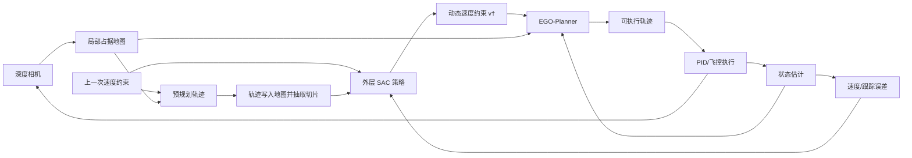

# Learning Speed Adaptation for Flight in Clutter——详细学习笔记

> 阅读范围：全文 8 个 PDF 实际页，包含正文、Equation (1)–(11)、Figure 1–10、仿真消融、真实飞行与结论。
>
> 版本说明：PDF 页眉明确写明这是“已被 IEEE Robotics and Automation Letters 接收、尚未完成最终编辑的作者版本”，因此本笔记只报告此 PDF 能确认的信息，不用后来可能变化的卷期替换它。

# 1. 论文基本信息

- 完整标题：*Learning Speed Adaptation for Flight in Clutter*
- 作者：Guangyu Zhao、Tianyue Wu（共同第一作者）、Yeke Chen、Fei Gao（通讯作者）
- 单位：浙江大学控制科学与工程学院、浙江大学湖州研究院
- 发表时间：2024 年 6 月接收；PDF 为 2024 年作者预印本
- 期刊：*IEEE Robotics and Automation Letters*（IEEE RA-L）
- DOI：10.1109/LRA.2024.3421789
- 研究领域：敏捷无人机飞行、在线轨迹规划、速度自适应、强化学习、感知规划
- 主要关键词：Motion and Path Planning（运动与路径规划）、Reinforcement Learning（强化学习）、Speed Adaptation（速度自适应）、Perception-aware Flight（感知感知/感知约束飞行）、EGO-Planner、Soft Actor-Critic（SAC）

> **这篇论文到底在干什么？**

它教无人机根据眼前环境、传感器和控制能力，自动决定“现在应该大胆加速还是谨慎减速”，而具体怎么绕障飞仍由成熟轨迹规划器负责。

# 2. 先告诉我为什么要研究这个问题

```text
现实/科研问题
无人机在树林、狭缝和遮挡环境中飞行：太慢效率低，太快又来不及感知、规划和跟踪
↓
现有方法一：用户预先设定固定最大速度
简单、安全边界容易理解
↓
问题
为最危险路段设置的低速会让开阔路段也一直慢；高固定速度又会在遮挡或密集处碰撞/急停
↓
现有方法二：手工设计“环境越复杂越减速”的代价
可以做一定自适应
↓
问题
人工特征表达能力有限，难同时包含遮挡、视野、感知延迟、规划超时和跟踪误差
↓
现有方法三：端到端 RL 直接输出低层控制
速度自适应可以隐式出现
↓
问题
训练成本高，安全与泛化依赖训练分布；在本文关注的复杂未知环境中不如成熟规划器可靠
↓
作者发现的机会
成熟规划器已经很会“给定速度上限后规划轨迹”，缺的是在线决定速度上限
↓
本文要解决的问题
只学习外层速度约束，让内层模型规划器继续负责安全、动力学和轨迹生成
```

如果没有这项研究，工程人员通常只能手调一个固定上限：设为 1.5 m/s 可能安全却浪费开阔区性能，设为 3–4 m/s 又可能在隐藏障碍、有限 FOV 和感知延迟下急停或碰撞。论文想让速度成为随观测动态变化的决策量。（Introduction、Section II，PDF 第 1–2 页）

# 3. 阅读论文前必须知道的基础知识

## 3.1 速度约束不等于速度命令

**是什么**：速度约束 \(v^\dagger\) 表示规划器允许使用的上限，例如 \(\|v\|\le 2.5\text{ m/s}\)；它不是命令无人机此刻必须飞 2.5 m/s。

**为什么需要它**：轨迹规划器仍会根据转弯、障碍和终点产生低于上限的实际速度。

**在本文中的作用**：RL 的唯一高层动作就是动态配置 \(v_t^\dagger\)。

**简单例子**：策略给出上限 4 m/s，但前方急弯的可行轨迹实际只有 2.3 m/s；规划器不会强迫飞机达到 4 m/s。

## 3.2 Aggressiveness

Aggressiveness 可译为**激进程度/敏捷程度**。

**是什么**：系统愿意多大程度利用速度与机动性能。

**为什么需要它**：开阔处高激进度能缩短任务时间，狭窄或未知处低激进度能留出感知和制动余量。

**在本文中的作用**：论文用速度约束作为激进度的可解释代理变量。

## 3.3 POMDP

POMDP 全称 **Partially Observable Markov Decision Process，部分可观测马尔可夫决策过程**。

**是什么**：真实环境状态不可完全获得，策略只能根据带遮挡和有限视野的观测行动。

**为什么需要它**：前向深度相机看不到墙角后的柱子，速度决策必须考虑“未知”本身。

**在本文中的作用**：环境、传感延迟、规划与跟踪系统都被看作 POMDP 动力学的一部分；策略只从局部地图和状态反馈中学习可接受速度。

## 3.4 Model-based Trajectory Planner

Model-based Trajectory Planner 是**基于模型的轨迹规划器**。

**是什么**：根据几何地图、车辆状态和动力学约束，通过优化生成时间化轨迹。

**为什么需要它**：可以显式检查碰撞、速度/加速度限制，通常比纯学习控制更易解释和泛化。

**在本文中的作用**：作者使用 EGO-Planner 作为内层策略 \(\pi''\) 的近似，只学习外层策略 \(\pi^\dagger\)。

## 3.5 Hierarchical Policy

Hierarchical Policy 是**分层策略**。

**是什么**：外层产生高层指令，内层把指令转换为可执行动作。

**在本文中的作用**：外层 RL 输出速度约束；内层 EGO-Planner 输出轨迹；低层 PID 跟踪轨迹。

**简单例子**：外层说“这段路最多 1.8 m/s”，内层决定绕哪根树、每一时刻速度多少，PID 再把期望位置变成执行动作。

## 3.6 Occupancy Map 与 Unknown Cell

- **Occupancy Map，占据地图**：把空间单元标成 free、occupied 或 unknown。
- **Unknown cell，未知体素**：当前传感器没有可靠观测到的空间，不等于“确定空闲”。

本文再加入第四种状态 on_trajectory，把预规划轨迹“画”进地图，告诉网络哪些未知/障碍恰好位于将要飞过的区域。（Figure 3、Section V-B，PDF 第 4 页）

## 3.7 Perception-aware Behavior

Perception-aware behavior 是**感知感知/考虑感知能力的行为**。

**是什么**：决策不仅看已经发现的障碍，还考虑视野边界、遮挡、传感更新频率与未知区域。

**在本文中的作用**：若轨迹即将转向当前 FOV 外，策略可能提前减速，等待更多区域被观察。

## 3.8 Pre-planned Trajectory

**是什么**：按照上一次速度约束先生成、但当前不会直接执行的一条候选轨迹。

**为什么需要它**：局部地图很大，策略需要知道“规划器大概打算走地图的哪一部分”。

**在本文中的作用**：把候选轨迹标记为 on_trajectory，并只抽取轨迹采样点对应的 x-y 切片，减少输入规模并聚焦关键区域。

## 3.9 SAC 与 PER

- **SAC：Soft Actor-Critic，软演员–评论家算法**。一种最大熵离策略 RL；在高回报之外鼓励策略保持一定随机探索。
- **PER：Prioritized Experience Replay，优先经验回放**。更频繁抽取学习价值高、误差大或稀有的经历。

本文用 SAC 学外层速度策略，用 PER 缓解碰撞/急停事件稀疏的问题。（Section VI-C，PDF 第 5 页）

## 3.10 Early Termination

**是什么**：发生碰撞、emergency_stop，或规划器未在有效时间内完成时，训练 episode 立即终止。

**为什么重要**：这些事件是真实系统中“速度太激进”的直接后果；但事件少、带随机性，奖励难学。

**在本文中的作用**：触发 \(r_{danger}\) 负奖励，并促成两阶段奖励设计。

# 4. 论文整体思路

## 4.1 输入、步骤与输出

1. 输入：局部三维占据地图、车辆当前速度、跟踪误差、上一次速度决策和预规划轨迹。
2. 表示：把预规划轨迹画入地图，沿轨迹抽取若干 2D x-y 切片。
3. 外层策略：CNN+MLP 的 Actor 输出当前速度约束 \(v_t^\dagger\)。
4. 内层规划：EGO-Planner 在此速度约束下生成无碰撞轨迹。
5. 控制：PID 跟踪轨迹，真实执行误差和感知延迟自然反馈给下一次决策。
6. 训练：先用人工稠密速度奖励预训练，再用客观速度奖励和稀疏危险惩罚微调。



最核心创新不是一个新的轨迹规划器，而是把“速度约束”提升为 RL 的辅助动作，并设计可学习这一动作的观测和两阶段奖励。（Section IV–VI）

# 5. 论文方法详细讲解

## 5.1 POMDP 问题建模

### 它要解决什么问题？

在未知、局部可观测的静态杂乱环境中，从一点飞到另一点，同时最大化速度并减少危险终止。（Section III，PDF 第 2–3 页）

### 状态与观测是什么？

- 可控状态 \(S^c\)：车辆状态；
- 环境状态 \(S^e\)：空间占据；论文假设环境静态；
- 观测：完美的车辆状态估计和受 FOV/遮挡限制的环境局部观测。

### 为什么这样设计？

速度是否安全取决于传感器、规划器和跟踪器的综合能力，作者把它们共同当作 POMDP 动力学，而不是分别建立精确解析模型。

### 限制

“状态估计完美”和“环境静态”都是强假设，真实系统只通过实机演示部分缓解，未做系统噪声实验。

## 5.2 内层模型轨迹规划器

### 输入是什么？

局部几何地图、车辆状态、导航目标和速度约束 \(v^\dagger\)。

### 具体做了什么？

求解带碰撞自由、动力学不等式和状态/控制等式约束的时间化轨迹优化。本文实例化为 EGO-Planner，并将速度限制设为 \(\|v\|\le\bar v\)。（Equation 2–3，PDF 第 3 页；Section VI-A）

### 输出是什么？

规划时域 \([t,t+T]\) 上的轨迹 \(u(t)\)。

### 为什么作者这样设计？

规划器已有几何安全、动力学与重规划能力；学习只补足它不会自动调速度的缺口。

### 如果去掉会怎样？

会变成端到端控制策略，训练搜索空间更大，也失去模型规划器的显式约束。本文未以同等训练预算直接做这个消融，只与相关方法讨论比较。

## 5.3 分层策略分解

### 它要解决什么问题？

原始策略直接产生轨迹/控制动作很复杂，能否把它拆成“速度约束决策”和“条件轨迹决策”？

### 具体做了什么？

把策略写成：

\[
\pi'(a,v^\dagger|o,g)=\pi''(a|v^\dagger,o,g)\pi^\dagger(v^\dagger|o,g).
\]

\(\pi^\dagger\) 是学习的外层速度策略，\(\pi''\) 由模型规划器近似。

### 为什么这样设计？

现代规划器被视为“给定速度约束时，内层动作的较好近似”，所以无需从零学习整个策略。

### 如果去掉这个分解会怎样？

用户只能固定 \(v^\dagger\)，或让单一网络直接承担全部控制。Figure 6 显示固定上限形成明显的速度–成功率折衷，而分层策略能落在更优区域。

## 5.4 外层策略的观测设计

### 输入是什么？

- 当前 3D 局部占据地图 \(m_t\)；
- 当前速度 \(v_t\)；
- 跟踪误差 \(e_t=p_t-\hat p_t\)；
- 上一次速度约束 \(v_{t-1}^\dagger\)；
- 按上一次约束生成、但不执行的预规划轨迹。

### 具体做了什么？

1. 地图体素标记为 free、occupied、unknown、on_trajectory。
2. 沿预规划轨迹以时间间隔 \(\delta t\) 采样。
3. 只保留对应位置的 x-y 二维切片。
4. CNN 编码地图切片，与速度、误差、上次动作在 MLP 融合。

网络共享四层 CNN 编码器与融合层；CNN 层参数按 `[通道数, 核大小, 步幅, padding]` 为 `[5,5,3,2]`、`[32,3,2,1]`、`[48,3,2,1]`、`[64,3,1,0]`。融合输出 64 维，Actor/Critic 各有 64、32 单元的两层 MLP。（Section V-A，PDF 第 4 页）

### 输出是什么？

当前高层速度约束 \(v_t^\dagger\)。

### 为什么这样设计？

预规划轨迹把“地图里哪些区域与我马上要飞的路线有关”显式告诉网络；unknown 状态让网络学会对视野外区域谨慎；跟踪误差反映控制器是否已经跟不上。

### 如果去掉会怎样？

去掉轨迹标记，网络需要在整个地图中自己寻找相关区域；去掉 unknown 状态，难以区分“确认空闲”和“尚未看见”；去掉跟踪误差，策略少了车辆执行能力反馈。论文没有逐项消融，以上是设计机理分析。

## 5.5 策略网络与运行频率

- Actor 与 Critic 共享感知编码器和融合层。（Figure 3）
- 外层策略运行 10 Hz；深度数据 15 Hz；PID 50 Hz。（Section VI-A，PDF 第 5 页）
- 相机 FOV 为水平 87°、垂直 58°，可信深度范围 0.28–5 m。
- 如果 \(v_t^\dagger-v_{t-1}^\dagger\in[-0.3,0.5]\text{ m/s}\)，不强制 EGO 因外层输出重规划，仍按 EGO 自身规则运行。

这个阈值是非对称的：较大的减速变化更容易强制重规划，而小幅加速可以不触发，从工程上兼顾响应与计算量。论文没有解释为什么恰好选择 -0.3 和 +0.5。

## 5.6 Early Termination 与危险奖励

### 终止条件

1. collided 或 emergency_stop；
2. 规划器没有在有效时间内给出解。

第二类失败很关键：即使几何轨迹理论上无碰撞，如果之前飞得太快，突然看见障碍后规划时间不够，系统仍然失败。

### 为什么不直接用离障碍距离做危险奖励？

作者认为在这个框架中，轨迹的空间形状主要由规划器决定，离障碍近不一定代表更容易碰撞；真正因果相关的是感知延迟、规划超时和跟踪失败导致的 episode 终止。（Section V-D，PDF 第 5 页）

## 5.7 两阶段奖励

### 第一阶段：人工知识稠密预训练

使用由最近障碍距离、障碍体积、障碍数量线性组合成的手工特征 \(\phi_t^1,\phi_t^2\)，在看起来危险时鼓励较低速度，在安全时鼓励更快速度。目标是先让策略学会“危险处慢”的基本模式。

### 第二阶段：客观奖励微调

去掉手工速度启发，仅保留实际速度正奖励，加上速度约束变化、跟踪误差和真实危险终止惩罚。第二阶段冻结 CNN 编码器。（Equation 10–11；Section VI-C）

### 为什么分两阶段？

- 只用客观危险惩罚：失败稀疏且随机，难学。
- 只用人工稠密奖励：容易继承人工规则的不准确，无法真正优化最终目标。
- 先学合理特征，再用真实目标校准，是课程学习式折中。

### 如果去掉一阶段或二阶段会怎样？

Figure 6 是直接消融：stage 1 only 与 stage 2 only 都低于完整 stage 1+2；前者受人工知识偏差限制，后者受稀疏奖励限制。

## 5.8 训练环境与现实因素嵌入

作者定制 30 个并行仿真环境，规划求解期间时钟不停，传感数据异步更新，以近似感知—执行延迟；并在仿真内运行实际 PID 跟踪器，将控制误差纳入交互。（Section VI-B）

这比“动作一计算完成世界才继续走”的普通同步 RL 仿真更接近真实。但作者也承认训练与部署计算平台不同，因此只能近似真实延迟。

# 6. 重要公式逐个讲懂

## 6.1 原始目标：Equation (1)

\[
\max_\pi\;\mathbb E\left[\sum_t\gamma^t r(s_t,a_t,g)\right].
\]

**想解决什么问题**：找一个策略，使不同目标和环境下的长期累计奖励最大。

**符号**：\(\pi\) 是策略；\(s_t\) 是真实状态；\(a_t\) 是轨迹/控制动作；\(g\) 是导航目标；\(\gamma\) 是折扣因子。

**中文意思**：不能只看当前一瞬间飞得快不快，还要看这个决定会不会导致稍后碰撞或成功到达。

**数字例子**：当前快飞奖励 2，但下一步碰撞奖励 -20，\(\gamma=0.99\)，两步回报约 \(2-19.8=-17.8\)，所以策略不该只贪当前速度。

## 6.2 规划器优化：Equation (2)

\[
\min_{u(t),T}\int_0^T J(u(t))\,dt+\rho(T)
\]

约束为

\[
u(t)\in\mathcal F,\quad \mathcal G(u(t))\preceq0,\quad \mathcal H(u(t))=0.
\]

**想解决什么问题**：在到达目标所需时间和轨迹代价之间优化，同时不撞障碍并满足动力学/状态关系。

**符号**：

- \(u(t)\)：位置、速度、控制等规划量；
- \(T\)：轨迹时长；
- \(J\)：沿途代价；
- \(\rho(T)\)：时间正则；
- \(\mathcal F\)：无碰撞区域；
- \(\mathcal G\)：速度、加速度等不等式约束；
- \(\mathcal H\)：动力学或状态控制等式关系。

**数字例子**：轨迹 A 代价 5、时间惩罚 3，总 8；轨迹 B 更平滑代价 3，但时间惩罚 8，总 11。在都满足约束时选择 A；若 A 穿障碍，则即使成本低也不可选。

## 6.3 速度约束：Equation (3)

\[
h(v)\preceq v^\dagger.
\]

在本文实现中是 \(\|v\|\le\bar v\)。

**中文意思**：\(v^\dagger\) 是规划器优化空间的边界。RL 改变这个边界，而不是直接指定整条速度曲线。

**数字例子**：若 \(v^\dagger=2\text{ m/s}\)，候选轨迹最大速度 2.3 m/s 就不可行；规划器必须延长时间或改变轨迹。

## 6.4 分层策略：Equation (4)–(5)

\[
\pi'(a,v^\dagger|o,g)=\pi''(a|v^\dagger,o,g)\pi^\dagger(v^\dagger|o,g).
\]

**符号**：\(\pi^\dagger\) 决定速度约束；\(\pi''\) 在该约束下决定轨迹动作；\(\pi'\) 是整体策略。

**中文意思**：整体做出“轨迹 a 且速度上限为 \(v^\dagger\)”这一选择的概率，可以拆成“先选上限”乘“在该上限下由规划器选轨迹”。

**数字例子**：外层给 2 m/s 的概率为 0.6；内层在该上限下选择轨迹 A 的概率/归一化偏好为 0.8，则联合选择约为 0.48。实际 EGO 是确定优化器，这个概率例子只是帮助理解分解。

## 6.5 总奖励与三个惩罚：Equation (6)–(9)

\[
r=r_{speed}+r_{smoothing}+r_{error}+r_{danger},
\]

\[
r_{smoothing}=-\lambda_{smoothing}\|v_t^\dagger-v_{t-1}^\dagger\|^2,
\]

\[
r_{error}=-\lambda_{error}\min\{\|e_t\|,e_{max}\}^2,
\]

\[
r_{danger}=\begin{cases}
-\lambda_{danger}\|v_t\|^2,&\text{episode 危险终止},\\
0,&\text{否则}.
\end{cases}
\]

**想解决什么问题**：同时鼓励快、限制速度上限跳变、惩罚跟踪误差，并让高速失败付出更大代价。

**符号**：\(e_t=p_t-\hat p_t\) 是真实与期望位置误差；\(e_{max}\) 截断过大误差，防止单个样本主导训练；\(v_t\) 是车辆实际速度。

**数字例子**：若上限从 2 变 3 m/s，\(\lambda_{smoothing}=0.2\)，平滑惩罚 -0.2；误差 0.3 m、\(\lambda_{error}=1\)，误差惩罚 -0.09；若以 3 m/s 撞击、\(\lambda_{danger}=2\)，危险惩罚 -18。这样高速失败会被强烈反对。

## 6.6 第一阶段速度奖励：Equation (10)

\[
r_{speed}=\begin{cases}
\lambda_{speed}^1(\phi_t^1-\|v_t\|),&\phi_t^2>\lambda_\phi^1,\\
\lambda_{speed}^2(\|v_t\|-\phi_t^1),&\phi_t^2<\lambda_\phi^2,\\
\lambda_{speed}^3\|v_t\|,&\text{其他情况}.
\end{cases}
\]

**想解决什么问题**：在危险终止信号还太稀疏时，用人的粗略知识先产生连续学习信号。

**符号**：\(\phi_t^1\) 是零均值的平滑速度参考特征；\(\phi_t^2\) 是人工危险程度估计；二者来自最近障碍距离、障碍体积和数量的归一化线性组合；\(\lambda\) 是阈值或权重。

**中文意思**：人工判断危险时，速度高于合适水平就少得分；安全时鼓励实际速度超过参考；中间状态直接奖励速度。

**数字例子**：只示意第二分支。若环境被判为安全，\(\|v_t\|=2.5\)、\(\phi_t^1=1.5\)、\(\lambda_{speed}^2=2\)，则速度奖励为 \(2(2.5-1.5)=2\)。论文没有给这些超参数具体数值，不能据此复现原训练。

## 6.7 第二阶段速度奖励：Equation (11)

\[
r_{speed}=\lambda_{speed}^3\|v_t\|.
\]

**中文意思**：微调时不再相信人工“哪里危险”的判断，只奖励真实速度；安全性通过真实终止、跟踪误差和策略在第一阶段学到的表征来约束。

**数字例子**：\(\lambda_{speed}^3=0.5\)、实际速度 3 m/s，则速度奖励 1.5；若随后高速碰撞，Equation (9) 的大额负分会抵消这一收益。

# 7. 论文中的重要 Figure

## Figure 1：自然杂乱环境中的行为（PDF 第 1 页）

- 四个案例分别展示：开阔处积极飞、发现树后隐藏竹子时减速、过狭缝谨慎、障碍间平滑通过、看到前方开阔后再加速。
- 这是整篇论文的直观任务定义：速度随“可见几何 + 未知/遮挡”变化。
- 它是案例展示，不是统计证据。

## Figure 2：系统结构（PDF 第 3 页）

- 上半部分是环境、局部建图、状态估计、跟踪控制和车辆。
- 虚线框内是外层 Agility Policy 与内层 Trajectory Planner；外层只输出 agility level \(v_t^\dagger\)。
- 重要记忆：感知延迟、跟踪器和车辆都在学习闭环里，而不是离线独立模块。

## Figure 3：观测与网络结构（PDF 第 4 页）

- 3D 地图有 free、occupied、unknown、on_trajectory 四类。
- 沿预规划轨迹抽取二维切片，经 CNN 编码；速度、跟踪误差、上一动作一同进入融合层；Actor 与 Critic 共享前端。
- 这张图解释了“感知感知”不是仅输入最近障碍距离，而是让网络看到轨迹将穿过的未知/占据分布。

## Figure 4：训练环境（PDF 第 5 页）

- 展示多种随机柱状/密度环境，蓝色区域是障碍。
- 作者使用 30 个并行环境训练，测试环境未在训练中出现。
- 图只展示部分环境，无法判断训练分布的全部宽度。

## Figure 5：三种速度分布示例（PDF 第 6 页）

- 深绿是参考路线；彩色执行轨迹以蓝→红表示约 0→4 m/s。
- (a) 完整方法在开阔处快、复杂处慢并成功；(b) 固定 2 m/s 在障碍处碰撞；(c) 只预训练未微调的中间模型在角落加速并碰撞。
- 证明方向：速度变化与环境复杂度相关；但它是单例，需结合 Figure 6 的统计。

## Figure 6：速度–成功率统计与消融（PDF 第 6 页）

- 横轴：成功试验的平均速度；纵轴：50 次试验成功率。
- 固定约束的浅蓝虚线形成能力边界：约从 \(v^\dagger=1.5\) m/s 时 0.98 成功率，降到 \(v^\dagger=4\) m/s 时约 0.49。
- 完整 stage 1+2 位于约 2.4 m/s、0.96 成功率附近，兼具接近低速基线的安全和更高平均速度。
- stage 1 only 和 stage 2 only 约在 0.70–0.74 成功率，说明两阶段缺一都明显退化。
- 图中精确数值未用表格给出，上述为读图近似，不能写成小数点后精确统计。

## Figure 7：与 EVA-Planner 的示例比较（PDF 第 6 页）

- 彩色为速度，标注平均速度来自 30 次试验。
- 本文方法 2.21 m/s，EVA-Planner 1.69 m/s，相差约 0.52 m/s，本文快约 31%。
- 作者同时承认本文方法速度变化更大；因此“更快”不等于“速度更平滑”。

## Figure 8：感知感知案例（PDF 第 6 页）

- (a) 给出有拐角遮挡的路线；(b) 学习策略在进入未知转角前减速；(c) EVA 因局部地图看起来无障碍而保持不安全速度，图中画出 yaw 和 FOV 边界。
- 这张图最能说明本文区别于“按障碍距离调速度”：真正危险来自遮挡和即将转头进入未知区。

## Figure 9：墙后隐藏柱子的真实实验（PDF 第 7 页）

- 红线是规划轨迹，彩线是执行轨迹，蓝色是局部地图。
- 固定 \(2.5\) m/s 和 \(3.5\) m/s 案例发生碰撞；自适应策略在墙角减速、看见更多柱子后再调整，并最终在目标停止。
- 它证明存在感知延迟/跟踪误差导致“规划线无碰撞但执行仍撞”的现实问题。

## Figure 10：真实人工密集障碍（PDF 第 7 页）

- (a) 固定 2.5 m/s 出现碰撞；(b) 自适应在开阔处加速、密集处减速并完成。
- 正文说固定策略约一半试验失败、自适应几乎全部成功，但没有给试验总数或表格，证据仍属描述性。

# 8. 论文中的重要 Table

本文没有编号 Table。核心定量比较放在 Figure 6 与 Figure 7。

这意味着我们能从图中读到速度–成功率权衡和消融趋势，却缺少精确均值、方差、置信区间和显著性检验。尤其真实实验没有统计表，不能把示例图当成完整定量对照。

# 9. 实验到底是怎么做的

## 9.1 仿真环境与系统设置

- EGO-Planner 作为轨迹规划 backbone；局部建图基于 Moravec–Elfes 占据栅格方法。
- 前视深度相机：87°×58° FOV，0.28–5 m 可信范围，15 Hz。
- PID 位置跟踪器：50 Hz；外层策略：10 Hz。
- 30 个并行定制仿真环境；规划期间仿真时钟不停，感知异步更新，以近似延迟。
- 训练场景障碍分布可变；评价场景训练中从未出现。（Section VI、VII-A）

## 9.2 Baseline

1. EGO-Planner 固定速度上限：\(v^\dagger=1.5,2,3,4\) m/s。
2. EVA-Planner：用人工代价函数调速度的环境自适应规划器，共享的 EGO 参数设为相同。
3. 消融：只用第一阶段奖励、只用第二阶段奖励、完整两阶段。

## 9.3 Evaluation Metrics

- 成功率：50 次试验中完成整个 track 的比例，越高越好。
- 成功试验平均速度：越高表示效率越高，但它排除了失败试验，必须与成功率一起看。
- 真实实验主要看碰撞/急停/成功和速度颜色分布。

## 9.4 训练实现

- SAC 学外层策略；PER 强化稀有失败经验。
- 第一阶段用 Equation (10)，第二阶段换成 Equation (11) 并冻结 CNN encoder。
- 论文未给学习率、批量大小、折扣因子、网络输出范围、训练步数和全部奖励权重，无法仅凭 PDF 完整复现。

## 9.5 真实平台

- 微型无人机尺寸：17×17×10 cm；
- 深度相机：Intel RealSense D430；
- 机载计算：Jetson Orin NX；
- 室内状态估计：NOKOV 动作捕捉；室外：VIO（Visual-Inertial Odometry，视觉惯性里程计）；
- 场景：墙后隐藏柱、人工密集障碍、自然竹林/树林。

## 9.6 Ablation Study

作者去掉的不是网络模块，而是训练阶段：

- **stage 1 only**：只有人工稠密奖励，学到保守/危险模式，但不能充分优化真实目标；成功率约 0.70。
- **stage 2 only**：直接用客观稀疏奖励，学习困难；成功率约 0.74。
- **stage 1+2**：先获得可用表征，再用客观目标校准；成功率约 0.96。

这个消融有力支持两阶段奖励，但没有验证地图四状态、预规划轨迹、跟踪误差、PER 等组件各自作用。

# 10. 实验结果说明了什么

## 实验 1：固定速度能力曲线

想证明：固定上限为什么不够。

→ 结果：固定上限越高，成功率从约 0.98 持续降到约 0.49；低速安全但慢，高速快但失败多。（Figure 6）

→ 结论：系统确实存在效率–安全折衷，不能用一个固定值同时覆盖所有路段。

## 实验 2：两阶段奖励消融

想证明：为什么不能只用人工知识或只用客观稀疏惩罚。

→ 结果：两个单阶段版本成功率约 0.70–0.74，完整版本约 0.96，且速度相近。（Figure 6）

→ 结论：第一阶段帮助学到可用特征/初始行为，第二阶段纠正人工偏差。

## 实验 3：与 EVA-Planner 比较

想证明：学习是否优于手工环境自适应代价。

→ 结果：示例统计平均速度 2.21 对 1.69 m/s；转角遮挡案例中学习策略提前减速，EVA 因看不见障碍而作出危险决策。（Figure 7–8）

→ 结论：学习策略能表达 FOV/遮挡等难手工建模因素。但 EVA 的 backbone 在复杂评价环境中不总能生成可行轨迹，作者把它排除出 Figure 6 主统计，这削弱了全面公平比较。

## 实验 4：真实隐藏障碍

想证明：仿真学到的“感知感知减速”能否迁移。

→ 结果：固定上限案例即使规划轨迹大多几何无碰撞，也会因延迟或跟踪不可行而撞；自适应在遮挡拐角处减速后完成。（Figure 9）

→ 结论：只检查几何碰撞不足，速度必须匹配端到端系统延迟和跟踪能力。

## 实验 5：人工与自然 clutter

想证明：行为是否适用于更复杂真实环境。

→ 结果：人工密集场景中固定 2.5 m/s 正文称约半数失败，自适应几乎全部成功；自然环境中出现开阔加速、狭缝/密集处减速。（Figure 1、10）

→ 结论：展示了丰富、符合直觉的速度行为，但缺少足够统计量。

## 论文真正证明的事情

- 在作者的 held-out 仿真场景中，两阶段学习策略取得比固定速度更好的速度–成功率组合。
- 两阶段奖励明显优于任一单阶段。
- 策略能学到与遮挡、unknown 和转向 FOV 相关的减速行为。
- 策略可部署到指定微型无人机，并在若干真实场景运行。

## 作者声称但证据并不充分的事情

- “formal safety guarantee”：规划器提供约束结构，但正文自己说明 EGO 用惩罚替代硬动力学约束，紧急情况下可能牺牲动力学可行性；实机也发生固定策略碰撞。因此更准确说法是“保留模型规划器的安全机制”，不是数学上绝对无碰撞。
- “优于 alternative EVA”：只有速度示例和案例，EVA 因 backbone 能力被排除出主统计，缺少同等成功率下的完整比较。
- “真实世界优势”：没有试验总数、均值方差和统计显著性。

# 11. 这篇论文最重要的创新点

## 11.1 把速度上限作为可学习的辅助动作

```text
以前：用户手调固定速度，或 RL 直接输出全部低层控制
↓
本文：RL 只输出规划器速度约束 v†
↓
为什么更好：动作低维可解释，同时保留成熟规划器的几何和动力学能力
```

## 11.2 轨迹条件化的局部地图表示

```text
以前：只给网络整张地图或最近障碍距离
↓
本文：把预规划轨迹画进地图，并沿轨迹抽取切片，显式区分 unknown
↓
为什么更好：网络知道“我将经过哪里”和“哪里只是没看见”，能学感知感知减速
```

## 11.3 两阶段奖励解决稀疏、随机危险信号

```text
以前：手工稠密奖励有偏；真实碰撞奖励太稀疏
↓
本文：人工知识预训练 + 客观奖励微调
↓
为什么更好：先学会基本危险模式，再让真实目标纠偏，消融显示二者缺一都差
```

## 11.4 把感知延迟与跟踪误差放进训练闭环

```text
以前：RL 仿真常在算法计算时暂停世界
↓
本文：规划时钟不停、传感异步更新，并运行 PID 跟踪
↓
为什么更好：策略学习到的是整套感知–规划–控制系统允许的速度，而非理想几何速度
```

# 12. 论文的优点

- 研究问题非常具体且有工程意义：不是泛泛“更快”，而是速度与感知/规划/控制能力匹配。
- 分层接口可解释：输出一个速度约束，容易监控、限幅和回退。
- 观测设计与问题因果关系匹配：unknown、FOV、预规划轨迹、跟踪误差都影响安全速度。
- 两阶段奖励有清楚动机，并由直接消融支持。
- 训练仿真显式保留计算时间和异步感知，比理想同步环境更真实。
- 有机载部署，且计算、感知与状态估计硬件说明较完整。
- 论文诚实报告完整方法以更大速度变化换取更高平均速度，也明确说明 planner 本身会限制性能。

# 13. 论文的缺点和局限

## 13.1 作者明确说明的限制（Conclusion，PDF 第 8 页）

- 车辆空间路径拓扑仍由 planner 决定；若 planner 在对抗性环境选错拓扑，外层速度再聪明也无法补救。
- 让学习策略拥有更大控制权会扩大搜索空间，使训练更低效。
- 深度渲染和系统仿真耗时，需要更可扩展训练环境。
- 本文专用两阶段奖励未必能泛化到其他辅助动作空间。

## 13.2 根据论文实验可合理发现的潜在限制

- POMDP 明确假设环境静态、状态估计完美；没有动态障碍或系统性定位噪声实验。
- 真实实验以示例为主，缺少试验数、统计表、置信区间和能耗测量。
- EVA-Planner 没进入 Figure 6 主统计，无法完整比较“同等成功率下谁更快”。
- 训练超参数与奖励权重披露不完整，官方 GitHub 未在 PDF 提供，复现困难。
- 速度策略依赖特定相机 FOV、深度范围、更新率、PID 和部署算力；换平台后策略是否仍合适没有证据。
- 规划器在紧急情况下以软惩罚近似动力学约束，可能输出难跟踪轨迹；因此安全不是绝对保证。
- 平均速度只在成功试验中计算，若单独看它会产生幸存者偏差，必须与成功率一起解释。
- 策略 10 Hz、深度 15 Hz、控制 50 Hz 的多频系统有时序复杂性，论文未给端到端最坏时延。

# 14. 给我一个非常简单的例子

假设无人机要沿一条 20 m 路线飞行，前 8 m 开阔，中间是遮挡拐角，最后 8 m 又开阔。

1. 起飞后局部地图显示轨迹附近都是 free，跟踪误差只有 0.02 m。
2. 外层策略输出 \(v_1^\dagger=3.5\) m/s；EGO 在这个上限下生成较快轨迹。
3. 接近拐角时，预规划轨迹上的切片出现大量 unknown：不是确认无障碍，而是墙后看不见。
4. 策略将上限降为 1.5 m/s。变化为 -2.0 m/s，超出“不强制重规划”区间，所以立即触发规划器更新。
5. PID 以较低速度跟踪，深度相机有更多时间看到墙后的柱子。
6. EGO 根据新障碍改变轨迹；若此时跟踪误差升到 0.4 m，策略继续保持保守。
7. 绕过柱子后，轨迹切片重新以 free 为主，误差降到 0.05 m，策略把上限升到 3.2 m/s。
8. 规划器仍可因终点或转弯让实际速度低于 3.2 m/s，最后安全到达。

这就是“策略调约束、规划器出轨迹、控制器执行、误差再反馈”的完整闭环。

# 15. 如果我要复现这篇论文

## 15.1 软件与框架

- ROS 或等价机器人中间件；
- EGO-Planner；
- 三维局部占据建图；
- 支持 SAC、PER、CNN/MLP 的深度学习框架；
- 带真实计时、异步传感和 PID 的并行仿真器；
- 真实机需要深度相机、VIO/动捕和足够的机载 GPU。

## 15.2 主要实现模块

1. 局部地图：free/occupied/unknown/on_trajectory 四状态。
2. 预规划接口：按上一次 \(v^\dagger\) 生成不执行轨迹。
3. 轨迹切片采样与 CNN 编码。
4. 速度、跟踪误差、上次动作融合。
5. SAC Actor/Critic 与 PER。
6. 两阶段奖励和第二阶段冻结 encoder。
7. \(v^\dagger\) 到 EGO 速度限制的在线接口。
8. 强制重规划阈值、碰撞/急停/超时终止。

## 15.3 推荐实现顺序

1. 固定速度 EGO 跑出 Figure 6 类似的能力曲线。
2. 加入真实时间推进和 PID，确保高速会真实暴露延迟/误差。
3. 构建轨迹标记地图表示并验证切片坐标。
4. 只训练第一阶段，使策略学会基本开阔加速、密集减速。
5. 加入真实终止惩罚、PER 和第二阶段微调。
6. 复现单阶段与两阶段消融。
7. 做 held-out 场景，再做硬件在环和真实机。

## 15.4 PDF 无法确认的信息

- 全部奖励权重和 SAC 超参数；
- \(v^\dagger\) 输出范围与单位映射；
- 地图尺寸、分辨率、切片数量与 \(\delta t\)；
- 训练步数和随机种子；
- 每项真实实验的试验总数；
- 官方 GitHub。PDF 未给出代码仓库，不能自行编造。

# 16. 如果老师问我这篇论文

## 1. 它解决的核心问题是什么？

它解决未知杂乱环境中固定速度上限无法同时兼顾效率和安全的问题，让 UAV 根据环境、感知和跟踪能力在线调速度。

## 2. RL 输出什么？

输出轨迹规划器的速度约束 \(v_t^\dagger\)，不是实际速度曲线，也不是电机或加速度命令。

## 3. 为什么要保留 EGO-Planner？

EGO 已能处理局部几何、碰撞和动力学优化。让 RL 只补速度参数，比从零学习全部控制更高效、更可解释。

## 4. 策略看到了什么？

轨迹条件化的局部占据地图切片、当前速度、位置跟踪误差、上次速度约束；地图区分 free、occupied、unknown、on_trajectory。

## 5. 预规划轨迹为什么不执行？

它是给外层策略的空间提示：告诉网络规划器下一步大概走哪里，从而只关注相关地图区域；最终轨迹要在新速度约束下重新规划。

## 6. 两阶段奖励为什么必要？

真实碰撞/急停奖励太稀疏，直接学很难；人工奖励虽稠密但有偏。先用人工知识学表征，再用客观奖励微调，消融显示成功率明显最高。

## 7. 什么叫 perception-aware？

不仅根据已知障碍距离调速，还会因遮挡、FOV 边界和即将进入 unknown 区域提前减速。

## 8. 最关键的定量结果是什么？

Figure 6 中完整策略在约 2.4 m/s 平均速度下仍接近 0.96 成功率，接近固定 1.5 m/s 的安全性，却明显更快；两个单阶段版本只有约 0.70–0.74。

## 9. 真实平台是什么？

17×17×10 cm 微型无人机，RealSense D430，Jetson Orin NX；室内用 NOKOV 动捕，室外用 VIO。

## 10. 最大局限是什么？

空间路径仍受 EGO 拓扑能力限制；训练/奖励依赖特定系统；静态环境和完美状态假设较强；真实对照缺少充分统计，安全也不是严格数学保证。

# 17. 最后一分钟复习

## 30 秒版本

这篇论文让强化学习只决定 EGO-Planner 的动态速度上限。策略读取轨迹条件化局部地图、当前速度、跟踪误差和上次决策，输出 \(v^\dagger\)；EGO 仍负责实际轨迹。为解决碰撞奖励稀疏，作者先用人工危险特征预训练，再用真实速度和终止惩罚微调。仿真显示它达到接近低固定速度的成功率，同时平均速度更高，并在真实遮挡、人工障碍和自然 clutter 中展示了提前减速行为。

## 2 分钟版本

论文的出发点是速度上限不能永远固定：低速安全但浪费开阔区，高速在有限视野、感知延迟和跟踪误差下容易碰撞。作者把整体策略分成外层学习策略和内层 EGO-Planner。外层 SAC 的动作只是速度约束 \(v_t^\dagger\)；输入是标有 free、occupied、unknown、on_trajectory 的局部地图切片、当前速度、跟踪误差和上次上限。预规划轨迹被画入地图，让网络知道马上会经过哪些未知区域。内层 EGO 在该上限下生成轨迹，PID 执行。训练最关键的是两阶段奖励：先用手工障碍特征提供稠密监督，再冻结视觉编码器，用实际速度奖励和碰撞、急停、超时等客观惩罚微调。Figure 6 显示完整方法在约 2.4 m/s 时仍有约 96% 成功率，两个单阶段只有约 70%–74%；真实机也会在墙角遮挡处减速。但它仍受 EGO 路径拓扑限制，真实实验统计不足，静态环境与完美状态估计假设也较强。

## 必须记住的 5 件事

1. \(v^\dagger\) 是最大速度约束，不是速度命令。
2. 外层 RL 调激进度，内层 EGO 生成轨迹，PID 执行。
3. 预规划轨迹 + unknown 地图状态是感知感知行为的关键输入设计。
4. 两阶段奖励由 Figure 6 消融直接支持。
5. 路径拓扑仍由 EGO 决定，真实统计和严格安全保证不足。

# 18. 学习自测

## 基础题

1. 本文中 RL 的动作是什么？
2. 局部地图的四种体素状态是什么？
3. 外层策略、深度相机和 PID 分别以多高频率运行？

## 理解题

4. 为什么只看最近障碍距离不足以决定安全速度？
5. 预规划轨迹为什么要画进局部地图？
6. Equation (9) 为什么让高速碰撞受到更大惩罚？
7. Figure 6 为什么必须同时读横轴速度和纵轴成功率？

## 深入题

8. 两阶段奖励分别解决什么问题？为什么顺序不能简单颠倒？
9. 作者所说的模型规划器“安全保证”为什么需要谨慎理解？
10. 若把 RealSense D430 换成更新率更低、量程更短的相机，旧策略可能发生什么？应如何重新验证？

# 自测答案

## 1.

动态速度约束/上限 \(v_t^\dagger\)，不是低层控制命令。

## 2.

free、occupied、unknown 和 on_trajectory。

## 3.

外层策略 10 Hz，深度相机 15 Hz，PID 位置跟踪 50 Hz。

## 4.

碰撞风险还取决于遮挡、FOV、未知区域、感知延迟、规划超时和控制跟踪误差；规划轨迹离障碍近也不一定必然危险。

## 5.

它把“规划器打算经过哪里”与地图对齐，网络可聚焦轨迹沿线的 occupied/unknown 分布，而不是在整个三维地图里盲目寻找相关区域。

## 6.

终止惩罚与 \(\|v_t\|^2\) 成正比，同样一次危险终止，3 m/s 的代价是 1 m/s 的九倍，推动策略避免高速失败。

## 7.

只看速度会偏爱经常失败的高固定上限，只看成功率会偏爱始终慢飞。目标是获得更优的速度–成功率组合。

## 8.

第一阶段用稠密人工知识克服稀疏失败信号、学到基本表征；第二阶段用客观目标修正人工偏差。若先用稀疏目标，训练可能难以进入有用策略区域；后用人工目标又会把微调结果拉回有偏启发式。

## 9.

EGO 有显式碰撞/动力学结构，但为实时性使用软惩罚近似约束，论文承认紧急时可能牺牲动力学可行性；未知障碍和感知延迟也使绝对无碰撞无法保证。

## 10.

可见距离更短、更新更慢会增大观测延迟与制动需求，原策略可能过于激进。应在新传感器时序和噪声下重建固定速度能力曲线、重新训练/微调，并在仿真、硬件在环和受控实机中逐级测试碰撞、急停和跟踪误差。

## 与另外两篇论文的关系

- 与 **RLPlanNav**：两者都采用“学习外层 + EGO 内层”。RLPlanNav 学“下一局部目标在哪”，本文学“当前速度上限多大”。
- 与 **RLoPlanner**：RLoPlanner 用带 LSTM 的最大熵策略解决局部目标选择，本文用 SAC 解决速度约束。两者可以组成两级高层：先选局部目标，再为该局部轨迹选择速度上限，但这样会扩大联合训练和安全验证难度，三篇论文都没有实际验证这一组合。
