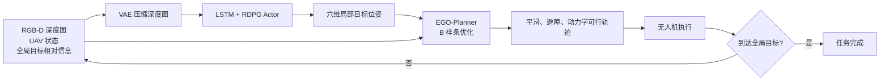

# RLPlanNav：运动规划与深度强化学习结合的无人机未知环境导航——详细学习笔记

> 阅读范围：全文 8 个 PDF 实际页，包含正文、公式、Figure 1–9、Table I–II、仿真与真实环境实验、结论。参考文献只在理解方法所必需处提及。
>
> 页码说明：本文统一写“PDF 第 X 页”，即阅读器从 1 开始计数的实际页码；该页对应的论文印刷页码为 634+X，例如 PDF 第 1 页是论文第 635 页。

# 1. 论文基本信息

- 完整标题：*Combining Motion Planner and Deep Reinforcement Learning for UAV Navigation in Unknown Environment*
- 作者：Yuntao Xue、Weisheng Chen（西安电子科技大学）
- 发表时间：2023 年 11 月 20 日在线发表；期刊卷期为 2024 年 1 月，Vol. 9, No. 1，pp. 635–642
- 期刊：*IEEE Robotics and Automation Letters*（IEEE RA-L）
- DOI：10.1109/LRA.2023.3334978
- 研究领域：无人机自主导航、深度强化学习、局部运动规划、未知环境避障
- 主要关键词：Deep Reinforcement Learning（DRL，深度强化学习）、Motion Planning（运动规划）、Partially Observable Markov Decision Process（POMDP，部分可观测马尔可夫决策过程）、UAV Navigation（无人机导航）、EGO-Planner、Local Goal（局部目标）

> **这篇论文到底在干什么？**

它让强化学习负责判断“下一小步应该往哪里走”，再让成熟的运动规划器负责把这一小步变成平滑、安全、无人机能执行的轨迹，从而兼顾未知环境中的脱困能力与飞行轨迹质量。

# 2. 先告诉我为什么要研究这个问题

```text
现实/科研问题
无人机要在没有先验地图的森林、建筑群等密集障碍环境中，从起点安全飞到远处目标
↓
现有方法一：建图 + 全局/局部运动规划
可以生成平滑、满足动力学的轨迹
↓
问题
需要持续建图和计算；有限视野下容易只看局部，在密集障碍或死胡同附近陷入局部困境
↓
现有方法二：端到端深度强化学习
能从传感器观测直接学到反应策略，具备一定泛化与脱困能力
↓
问题
还要自己学会底层飞行控制，训练慢；输出控制信号容易突变，轨迹不够平滑、动力学可行性难保证
↓
作者发现的机会
强化学习擅长“选方向、选探索点”，传统规划器擅长“生成可执行轨迹”
↓
本文要解决的问题
能否把两者分层组合：让学习只生成局部目标，让规划器负责到达局部目标？
```

如果没有这种分工，通常要在两个不理想的极端之间选择：要么使用规划器得到漂亮轨迹，却可能在未知密集环境中反复受困；要么使用端到端强化学习更积极地探索，却得到速度和加速度变化突兀、难以真实执行的控制序列。本文试图把“决策”和“执行”拆开，让每一类方法只做自己更擅长的部分。（论文 Introduction、Section II，PDF 第 1–3 页）

# 3. 阅读论文前必须知道的基础知识

## 3.1 未知环境与部分可观测性

**是什么**：未知环境表示无人机起飞前没有完整地图；部分可观测表示相机或测距传感器只能看到当前视野范围，而且会被障碍遮挡。

**为什么需要它**：如果完整地图可用，直接做全局规划即可；真正困难的是“看不见后面是什么”时仍要连续作出决策。

**在本文中的作用**：作者把导航建模为 POMDP，而不是普通的完全可观测 MDP，并用循环网络记住过去观测。

**简单例子**：无人机看到一面墙，却看不到墙后是出口还是死胡同。只看当前一帧无法判断，过去从哪边尝试过就很重要。

## 3.2 POMDP

POMDP 全称是 **Partially Observable Markov Decision Process，部分可观测马尔可夫决策过程**。

**是什么**：用七元组 \((S,A,T,R,\Omega,O,\gamma)\) 描述：真实状态、动作、状态转移、奖励、观测、观测概率和折扣因子。

**为什么需要它**：智能体看不到真实环境状态 \(s_t\)，只能得到观测 \(o_t\)，所以行动需要参考观测历史。

**在本文中的作用**：RLPlanNav 的“动作”不是油门或角速度，而是给运动规划器的六自由度局部目标。

**简单例子**：同一张“前方有墙”的深度图，若历史显示无人机刚从左侧退回来，则下一次可能更应该向右探索。

## 3.3 DRL、Actor–Critic、DDPG 与 RDPG

- **DRL：Deep Reinforcement Learning，深度强化学习**。神经网络根据观测选动作，通过奖励学习策略。
- **Actor–Critic，演员–评论家结构**。Actor 产生动作；Critic 用 \(Q\) 值评价该动作长期来看好不好。
- **DDPG：Deep Deterministic Policy Gradient，深度确定性策略梯度**。用于连续动作空间，Actor 对同一输入输出确定动作。
- **RDPG：Recurrent Deterministic Policy Gradient，循环确定性策略梯度**。在 DDPG 中加入循环网络，用历史信息处理部分可观测问题。

本文所谓“RDPG/RLPlanNav 上层”负责产生连续的局部目标位姿，而不是直接产生电机命令。（Section IV-B，PDF 第 3–4 页）

## 3.4 LSTM

LSTM 全称是 **Long Short-Term Memory，长短期记忆网络**。

**是什么**：一种带门控记忆的循环神经网络。

**为什么需要它**：单帧传感器数据可能不足以判断障碍结构；LSTM 能把历史观测压缩为内部记忆。

**在本文中的作用**：Actor 利用过去观测与动作历史选择当前局部目标，使无人机不容易重复走进同一个局部陷阱。

**简单例子**：连续三次看到右侧距离变小，虽然当前帧仍有空隙，LSTM 也可能推断右侧通道正在收窄。

## 3.5 Local Goal

Local Goal 是 **局部目标/子目标**。

**是什么**：不是最终终点，也不是一个瞬时控制量，而是规划器下一段轨迹要到达的短程目标位姿。

**为什么需要它**：远处全局目标可能被遮挡，直接朝它飞会撞墙；分成一连串短目标可以边感知边调整。

**在本文中的作用**：强化学习输出 \([x,y,z,\phi,\theta,\psi]\)，运动规划器据此生成下一段轨迹。

**简单例子**：最终目标在墙后，局部目标先选墙的左侧开口，抵达后再重新观察并选下一个点。

## 3.6 VAE

VAE 全称是 **Variational Autoencoder，变分自编码器**。

**是什么**：编码器把高维图像压成低维潜变量，解码器尝试重建原图。

**为什么需要它**：直接把 \(84\times84\) 深度图交给强化学习会增加训练计算量。

**在本文中的作用**：把单通道深度图压缩为 50 维表示，再与姿态和目标相对信息融合。

**简单例子**：7056 个像素被压成 50 个“环境特征”，可能概括前方空隙、左右障碍和通道宽度。

## 3.7 路径、轨迹与动力学可行性

**路径（path）**只说明空间中经过哪里；**轨迹（trajectory）**还说明每个时刻的位置、速度、加速度。动力学可行表示速度、加速度等不超过无人机实际能力。

本文的关键分工是：RL 只选“到哪里”，轨迹规划器负责“何时到、怎样平滑地到”。

## 3.8 B-spline 与 EGO-Planner

- **B-spline：B 样条曲线**。用一组控制点与节点向量表示连续曲线，便于求导和优化速度/加速度。
- **EGO-Planner：ESDF-free Gradient-based Local Planner，无需完整 ESDF 的梯度局部规划器**。
- **ESDF：Euclidean Signed Distance Field，欧氏有符号距离场**。通常记录空间每点到最近障碍的距离；EGO-Planner 不维护完整 ESDF，而是在轨迹碰到新障碍时建立局部碰撞梯度信息。

本文使用 EGO-Planner 在平滑、避障和动力学可行三类代价之间优化 B 样条。（Section IV-C，PDF 第 4 页）

## 3.9 加速度与 Jerk

**加速度**是速度变化率；**Jerk（加加速度）**是加速度变化率。

较低的平均加速度和 jerk 通常意味着控制更平顺、机体冲击较小；论文进一步把低加速度解释为更节能，但它没有直接测量电流或电量，因此“节能”属于间接推断。（Section V-B、Table II）

# 4. 论文整体思路

## 4.1 输入、中间步骤与输出

1. 输入：当前 UAV 状态、与最终目标的相对关系、机载 RGB-D 深度观测。
2. 感知压缩：VAE 把深度图压成 50 维特征。
3. 高层决策：带 LSTM 的 RDPG Actor 根据当前信息和历史记忆产生局部目标位姿。
4. 低层规划：EGO-Planner 根据局部目标和新感知到的障碍优化 B 样条。
5. 执行与重复：无人机执行该段轨迹，得到新观测，再选下一个局部目标。
6. 输出：一连串平滑、避障并尽量满足动力学限制的局部轨迹，最终到达全局目标。



核心创新发生在接口处：作者把 RL 的动作空间从底层控制信号改成了规划器配置空间中的局部目标，让 RL 不必重复学习“如何平稳飞行”。（Figure 1，PDF 第 2 页；Section IV-A）

# 5. 论文方法详细讲解

## 5.1 问题与假设

### 它要解决什么问题？

从任意三维起点 \(p_0\) 出发，在无先验地图、静态密集障碍和有限视野条件下，无碰撞、平滑地到达 \(p_g\)。（Section III-B，PDF 第 3 页）

### 输入是什么？

传感器观测与 UAV 位姿/运动信息。作者假设 RGB-D 或测距感知是准确的，环境静态。

### 具体做了什么？

把问题建模为 POMDP，并评价成功率、到达时间、平均加速度和 jerk。

### 为什么这样设计？

有限视野意味着当前观测不等于完整状态，必须显式承认“看不全”。

### 关键边界

论文的简化动力学忽略动量，并假设转向立即生效。这个模型适合训练概念验证，但不能等同真实四旋翼动力学。

## 5.2 感知与观测编码

### 输入是什么？

- \(84\times84\) 单通道深度图 \(I\)；
- UAV 自身方向/运动信息；
- 与最终目标的相对关系 \(\xi\)。

### 具体做了什么？

VAE 先进行无监督重建训练，编码器输出 50 维潜变量。Actor 网络将图像潜变量、\(\vartheta+\varphi\) 分支和 \(\xi\) 分支拼接，送入 LSTM 和全连接层。（Figure 4，PDF 第 5 页）

### 输出是什么？

适合策略网络处理的紧凑观测表示。论文写作中把观测表示为 \(o=[\vartheta,\varphi,I,\xi]\)，但没有把 \(\xi\) 的每个分量在本篇中完整展开。

### 为什么这样设计？

深度图提供障碍几何，VAE 降维减轻训练负担；历史通过 LSTM 保留。

### 如果去掉会怎样？

去掉图像/距离信息，策略不知道哪里有障碍；去掉 LSTM，面对遮挡与死胡同时只能依据当前帧；去掉压缩未必不能工作，但计算和样本需求可能增大。本文没有对此做独立消融，因此后两点是结构上的合理判断，不是论文实验证明。

## 5.3 高层局部目标生成策略 LoGP

LoGP 是 **Local Goal generation Policy，局部目标生成策略**。

### 它要解决什么问题？

在当前可见范围不完整时，决定下一个值得探索且较安全的局部目标。

### 输入是什么？

当前观测与 LSTM 汇总的历史信息。

### 具体做了什么？

RDPG Actor 输出连续动作

\[
a=[x,y,z,\phi,\theta,\psi],
\]

即机体系下的局部目标位置和方向。Critic 评价这个局部目标带来的长期回报，训练时通过经验回放和目标网络提高数据利用率与稳定性。（Section IV-B）

### 输出是什么？

运动规划器的局部目标位姿，不是油门、速度或电机指令。

### 为什么这样设计？

把搜索/脱困交给有历史记忆的策略，把平滑控制交给规划器，缩小 RL 需要学习的任务范围。

### 如果去掉会怎样？

只剩 EGO-Planner 加启发式目标时，Table II 中困住率从 1.25% 增至 5.75%；但这项对比同时改变了高层目标生成方式，不能单独证明 LSTM 或 RDPG 中某一个组件的贡献。

## 5.4 奖励函数

### 它要解决什么问题？

让局部目标既推动 UAV 接近最终目标，又不要落在障碍旁。

### 具体做了什么？

总奖励由距离项和障碍项相加：距离项关注执行一段局部轨迹后到全局目标的距离变化；障碍项根据局部目标到最近障碍的距离给负惩罚。（Equation 4–6，PDF 第 4 页）

### 为什么这样设计？

仅给“最终到达”奖励太稀疏；逐步距离变化提供稠密反馈。障碍惩罚阻止策略把局部目标直接放在障碍附近。

### 如果去掉会怎样？

去掉距离项会缺少持续朝最终目标前进的信号；去掉障碍项可能选中危险局部目标。论文没有奖励消融，因而没有量化这两个判断。

### 论文中的不一致

Equation (4) 按印刷为“新距离减旧距离”；若 \(\omega_g>0\)，接近目标反而得到负值，与正文“奖励缩短的距离”不一致。实验又列出 \(\alpha,\beta,r_{free},r_{step}\)，但这些符号未出现在本篇 Equation (4)–(6) 中，也未给出 \(\omega_g\)。因此奖励的完整可复现定义在论文中未明确说明。

## 5.5 低层 EGO-Planner

### 它要解决什么问题？

把离散的“去这个局部位姿”转换成连续、避障、尽量满足动力学约束的轨迹。

### 输入是什么？

当前状态、局部目标和局部障碍信息。

### 具体做了什么？

用均匀 B 样条控制点 \(Q_1,\ldots,Q_N\) 参数化轨迹，最小化平滑、碰撞和动力学可行性代价；若结果违反动力学限制，再重新分配时间进行细化。优化用拟牛顿方法近似 Hessian，并用各向异性曲线拟合调整高阶导数。（Section IV-C）

### 输出是什么？

到局部目标的连续轨迹/控制序列。

### 为什么这样设计？

EGO-Planner 计算轻、重规划快，适合未知环境持续出现新障碍的场景。

### 如果去掉会怎样？

变成端到端 RDPG。Table II 显示成功率从 93.5% 降至 86.25%，飞行时间从 19.45 s 增至 28.94 s，平均加速度和 jerk 也明显增大。

## 5.6 闭环运行

一次完整循环是：观察 → 选择局部目标 → EGO 规划 → 执行 → 更新观察。Figure 2（PDF 第 4 页）强调有限视野随着飞行位置变化；局部目标的价值就是把一次无法解决的全局任务拆成多次可更新的短程决策。

# 6. 重要公式逐个讲懂

## 6.1 简化 UAV 运动模型：Equation (1)

\[
\begin{aligned}
\vartheta_{t+1}&=\vartheta_t+\rho_t,\\
\varphi_{t+1}&=\varphi_t+\tau_t,\\
x_{t+1}&=x_t+v\cos\vartheta_{t+1}\cos\varphi_{t+1},\\
y_{t+1}&=y_t+v\sin\vartheta_{t+1}\cos\varphi_{t+1},\\
z_{t+1}&=z_t+v\sin\varphi_{t+1}.
\end{aligned}
\]

**想解决什么问题**：给强化学习环境一个从转向动作到下一位置的简单三维状态转移。

**符号**：

- \(\vartheta_t\)：水平面方向角；
- \(\varphi_t\)：竖直方向角；
- \(\rho_t,\tau_t\)：两方向角的转向增量；
- \(v\)：每个时间步的前进量/速度参数；
- \((x_t,y_t,z_t)\)：当前位置。

**中文意思**：先更新水平方向与仰角，再把前进量 \(v\) 分解到 x、y、z 三个轴。

**数字例子**：若当前位置为 \((0,0,0)\)，更新后水平角 \(0^\circ\)、仰角 \(30^\circ\)，\(v=2\)，则下一步约为 \((1.732,0,1)\)。

**注意**：公式没有显式 \(\Delta t\)，且论文明确忽略动量、假定转向立即生效；它不是完整四旋翼刚体方程。（Section III-A，PDF 第 2–3 页）

## 6.2 循环确定性策略梯度：Equation (3)

\[
\nabla\eta(\mu)=\mathbb E_{\tau}\left[
\sum_t\gamma^{t-1}\nabla_\theta\mu(h_t)
\nabla_a Q^\mu(h_t,a)\big|_{a=\mu(h_t)}
\right].
\]

**想解决什么问题**：怎样调整 Actor 参数，使它输出的局部目标得到更高的长期评价。

**符号**：

- \(\mu(h_t)\)：Actor 根据历史 \(h_t\) 输出的确定性动作；
- \(Q^\mu(h_t,a)\)：Critic 对动作长期收益的估计；
- \(\theta\)：Actor 参数；
- \(\gamma\)：折扣因子；
- \(\tau\)：完整交互轨迹；
- \(h_t=(o_1,a_1,\ldots,o_t)\)：截至 t 的观测–动作历史。

**中文意思**：Critic 告诉 Actor“动作往哪个方向改变会更好”，再通过 Actor 的网络梯度把这个方向传回参数。

**数字例子**：假设 Critic 判断局部目标 x 每增大 1 m，Q 值增加 0.4，而 Actor 参数 \(\theta_1\) 每增大 1 会让 x 增大 0.5 m，则该步对 \(\theta_1\) 的上升方向贡献约为 \(0.4\times0.5=0.2\)；若这一项发生在后续时刻，还要乘 \(\gamma^{t-1}\)。

## 6.3 距离与障碍奖励：Equation (4)–(6)

论文印刷公式为：

\[
r_{dist}=\omega_g\left(\|p^{t+1}-g\|-\|p^t-g\|\right),
\]

\[
r_{obs}=-e^{-\sigma d_{min}},\qquad r=r_{dist}+r_{obs}.
\]

**符号**：

- \(p^t,p^{t+1}\)：执行局部轨迹前后的位置；
- \(g\)：全局目标；
- \(\omega_g\)：距离项权重，论文未给数值；
- \(d_{min}\)：候选局部目标到最近障碍的欧氏距离；
- \(\sigma\)：障碍惩罚衰减速度，实验写为 2.0。

**中文意思**：第一项比较离目标的距离变化，第二项对贴近障碍的局部目标施加负分。

**数字例子**：若旧距离 10 m、新距离 8 m，按印刷式且 \(\omega_g=1\)，\(r_{dist}=-2\)。若 \(d_{min}=1\) m、\(\sigma=2\)，\(r_{obs}=-e^{-2}\approx-0.135\)，总计约 -2.135。正文却说这是“缩短距离的奖励”，所以除非 \(\omega_g<0\)，符号与文字意图相反。复现时必须向代码或作者补充确认，不能凭论文自行确定。

## 6.4 EGO 轨迹目标：Equation (7)

\[
\min_Q J=\lambda_sJ_s+\lambda_cJ_c+\lambda_dJ_d.
\]

**想解决什么问题**：在多种互相冲突的要求中找到一条综合最好的 B 样条。

**符号**：

- \(Q\)：待优化的 B 样条控制点；
- \(J_s\)：平滑代价；
- \(J_c\)：碰撞代价；
- \(J_d\)：动力学不可行代价；
- \(\lambda_s,\lambda_c,\lambda_d\)：三类代价的权重。

**中文意思**：既不要拐得太急，也不要靠近障碍，还不要要求无人机完成超出速度/加速度能力的动作。

**数字例子**：若三项代价为 \((2,5,1)\)，权重为 \((1,10,3)\)，总成本是 \(2+50+3=55\)。碰撞权重大，所以优化器宁可稍微绕远，也优先远离障碍。

# 7. 论文中的重要 Figure

## Figure 1：分层框架（PDF 第 2 页）

- 图中左侧是起点、有限视野、局部目标与全局目标；右侧是 RL、Motion Planner 和轨迹执行闭环。
- 虚线表示 RL 逐步给局部目标，实线表示规划器输出轨迹并执行。
- 它证明的是系统设计逻辑，不是性能结果。
- 必须记住：RLPlanNav 不是“RL + 规划器并排工作”，而是 RL 的输出成为规划器的输入。

## Figure 2：有限视野与局部目标序列（PDF 第 4 页）

- 展示 UAV 在 \(P_1\) 到 \(P_4\) 过程中视野锥不断变化，并绕过不可一次看穿的障碍。
- 红点/箭头是每次选出的局部目标位姿，橙色虚线表示逐段前进。
- 它解释为什么需要 POMDP、历史记忆和反复选局部目标。

## Figure 3：四类随机训练/测试场景（PDF 第 5 页）

- Scene-I：方柱；Scene-II：圆柱；Scene-III：不规则雾状三维障碍；Scene-IV：环形障碍。
- 作者借此模拟建筑、树林及复杂三维障碍。
- 它支持环境结构具有多样性，但四类都由同一仿真生成范式构造，不能等同无限真实世界分布。

## Figure 4：Actor 网络（PDF 第 5 页）

- 深度图走 VAE encoder；重建支路只用于训练视觉表示。
- 图像潜变量、方向角分支和目标相对信息分支拼接，再经过 LSTM、全连接与 softmax，输出局部目标。
- 图中没有给出每层宽度、激活函数和输出分布细节，因此不能单靠本文完全复建网络。

## Figure 5：训练奖励曲线（PDF 第 5 页）

- 横轴：history trajectories 数量，范围到 \(2\times10^4\)；纵轴：Reward。
- 红实线 RLPlanNav 约在 9000 轮收敛到 50–60；橙色 DDPG 约 30–40；蓝色 RDPG 更慢，最终约 10–20。
- 阴影表示波动范围；图支持 RLPlanNav 收敛更快、平均回报更高，但未说明阴影究竟是标准差、置信区间还是别的统计量。

## Figure 6 与 Figure 7：轨迹和速度连续性（PDF 第 6 页）

- Figure 6 对比 RLPlanNav 与端到端 RDPG 的二维投影轨迹；RLPlanNav 路线更连续，RDPG 转折和局部徘徊更多。
- Figure 7 横轴是飞行时间，纵轴是速度；RLPlanNav 红线升到约 2.1–2.2 m/s 后较平稳，RDPG 蓝虚线多次骤降/骤升。
- 这两图直观支持“规划器提高轨迹平顺性”，但 Figure 6 只给少量示例，不是统计证明。

## Figure 8：密度与地图尺度泛化（PDF 第 7 页）

- (a)(b) 横轴为障碍密度，纵轴分别为成功率、困住率；(c)(d) 横轴为场景边长。
- 橙色 RLPlanNav、绿色 REL-DDPG、蓝色 PPO。
- 障碍密度 60% 左右时，RLPlanNav 成功率约 90%，PPO 约 67%；场景边长 100 m 时 RLPlanNav 仍约 82%。
- 记住：所有方法随难度增加都会退化，RLPlanNav 是退化较慢，不是“完全不受密度和尺度影响”。

## Figure 9：真实树林与建筑飞行（PDF 第 7 页）

- 航迹叠加在卫星/俯视图上，红色小段表示连续选择的局部目标方向。
- 建筑环境平均速度报告为 2.1 m/s，树林为 0.9 m/s。
- 该图支持仿真训练策略可以在真实环境运行；但没有对照组、成功次数或碰撞统计，所以不能量化证明真实世界优于 baseline。

# 8. 论文中的重要 Table

## Table I：四类场景的时间与路径效率（PDF 第 6 页）

指标方向：飞行时间越低越好；路径效率“直线距离/实际轨迹长度”越高越好。

| 场景 | 飞行时间 | 路径效率 |
|---|---:|---:|
| Scene-I 方柱 | 49.84 s | 78.15% |
| Scene-II 圆柱 | 40.16 s | 86.71% |
| Scene-III 不规则障碍 | 41.79 s | 85.29% |
| Scene-IV 环形 | 39.85 s | 87.53% |

方柱场景比最快场景慢约 9.99 s，路径效率比最高值低 9.38 个百分点。作者解释直角边缘在高密度下会遮挡视野、形成更难的局部结构。需要注意：这里是“100 次成功飞行”的统计，不能从该表计算总体成功率。

## Table II：主方法与两类 baseline（PDF 第 7 页）

| 方法 | 成功率↑ | 碰撞率↓ | 困住率↓ | 飞行时间↓ | 加速度↓ | Jerk↓ |
|---|---:|---:|---:|---:|---:|---:|
| RLPlanNav | **93.5%** | **5.25%** | **1.25%** | **19.45±3.72 s** | 0.14±0.01 m/s² | 3.65±0.13 m/s³ |
| RDPG（端到端） | 86.25% | 10.25% | 3.5% | 28.94±4.18 s | 0.36±0.02 | 6.11±0.42 |
| EGO-Planner（建图规划） | 84.5% | 9.75% | 5.75% | 20.79±2.85 s | **0.13±0.01** | **3.52±0.16** |

关键解读：

- RLPlanNav 比 RDPG 成功率高 7.25 个百分点，不是正文所说的 15 个百分点；若按相对提升计算约 8.4%。正文“surpasses ... by 15%”与表格不一致。
- RLPlanNav 比 RDPG 时间少 9.49 s，约 32.8%，正文写 24% 同样与表格不一致。
- RLPlanNav 的加速度比 RDPG 低约 61%，不是正文写的 29%。
- 与 EGO-Planner 比，RLPlanNav 的主要优势是成功/脱困；EGO 在加速度和 jerk 上反而略优。因此论文不能声称它在每项指标上都最好。
- 成功率 + 碰撞率 + 困住率均为 100%，三者是互斥结果类别。

# 9. 实验到底是怎么做的

## 9.1 数据集 / 仿真环境 / 实验平台

- ROS 随机场景，四种障碍结构；起点、目标和障碍位置训练时随机化。（Section V-A）
- 论文没有使用公开“数据集”，数据来自在线仿真交互。
- Table I 测试使用边长 50 m × 50 m、障碍密度 50% 的四种场景。
- 真实环境包含大型建筑与树林，真实实验固定飞行高度以简化计算。（Section V-G）
- 论文没有说明真实无人机型号、机载计算平台、相机型号、试验次数和安全员设置。

## 9.2 Baseline

- 端到端：RDPG、PPO、REL-DDPG；Table II 只列 RDPG。
- 非学习建图规划：RGB-D 建占据栅格，A* 给全局片段，EGO-Planner 做局部轨迹；受困时重新做 A*。
- 作者说比较时使用相同状态、动作和奖励，但同页又说明端到端动作是油门/转向、RLPlanNav 动作是六维局部目标，因此“相同动作”表述不严谨。

## 9.3 Evaluation Metrics

- 平均奖励：越高越好。
- 成功率：到达目标的比例，越高越好。
- 碰撞率、困住率：越低越好。
- 路径效率：直线距离/实际长度，越高越好。
- 到达时间、平均加速度、平均 jerk：越低通常越好。

## 9.4 参数设置

- 深度图 84×84×1，VAE 潜变量 50 维。
- \(\sigma=2.0\)，实验同时列出 \(\alpha=8.0,\beta=25.0,r_{free}=0.1,r_{step}=-0.6\)，但公式没有对应定义。
- LSTM 最长历史 100。
- Adam 学习率 0.01；目标网络软更新率 \(\tau=0.01\)。
- Replay Buffer 大小 \(10^5\)，每 100 时间步采样；\(\gamma=0.99\)。

## 9.5 实验流程

1. 随机选择训练场景、起点、目标和障碍。
2. VAE 压缩深度观测，RDPG 选择局部目标。
3. EGO-Planner 生成并执行局部轨迹。
4. 收集奖励和历史，更新策略。
5. 在不同障碍结构、密度和地图尺度上统计表现。
6. 将仿真训练策略迁移到真实建筑/树林，固定高度飞行。

## 9.6 Ablation Study

本文没有严格的模块消融实验。没有单独去掉 LSTM、VAE、障碍奖励、距离奖励或更换规划器的对照。RDPG E2E 与 EGO-only 是系统级 baseline，但一次改变多个组件，不能等同单因素消融。

# 10. 实验结果说明了什么

## 实验 1：训练曲线

想证明：把 RL 动作改成局部目标是否更易训练。

→ 结果：RLPlanNav 约 9000 轮收敛，比 RDPG 早约 4000 轮，最终奖励更高。（Figure 5）

→ 结论：在作者的仿真和奖励定义下，分层动作空间提高了样本效率与回报。

## 实验 2：不同障碍结构

想证明：方法是否适应不同几何形状。

→ 结果：四场景成功飞行的时间约 39.85–49.84 s，路径效率 78.15%–87.53%；方柱最难。（Table I）

→ 结论：同一策略可在多类仿真障碍中运行，但性能受结构明显影响。

## 实验 3：与端到端 RL 比较

想证明：规划器能否改善成功率和轨迹质量。

→ 结果：相对 RDPG，RLPlanNav 成功率更高、飞行更快、平均加速度与 jerk 更低；速度曲线连续得多。（Table II、Figure 6–7）

→ 结论：高层决策/低层规划的分工在该设置下优于让 RL 同时学习导航与底层控制。

## 实验 4：与传统建图规划比较

想证明：学习局部目标能否减少局部受困。

→ 结果：RLPlanNav 困住率 1.25%，EGO 组合基线 5.75%；但 EGO 基线的加速度与 jerk 略好。（Table II）

→ 结论：学习的历史决策可能改善脱困，轨迹平顺性的主要来源仍是共同使用的规划器。

## 实验 5：密度和尺度泛化

想证明：训练后是否能应对更密、更大的地图。

→ 结果：各方法都随难度退化，但 RLPlanNav 在 60% 密度约 90% 成功、100 m 边长约 82%，优于 PPO/REL-DDPG。（Figure 8）

→ 结论：在同一仿真生成分布的参数变化下，RLPlanNav 泛化较好。

## 实验 6：真实环境

想证明：是否可从仿真迁移到真实无人机。

→ 结果：报告在建筑环境平均 2.1 m/s，在树林平均 0.9 m/s；树枝摆动和感知质量会降低速度。（Figure 9）

→ 结论：至少存在真实运行案例；由于没有对照、次数与成功率，证据不足以证明真实世界统计优势。

## 论文真正证明的事情

- 在作者构造的静态随机仿真中，分层框架比所列端到端 RDPG 和 EGO 组合基线有更高成功率。
- 共同使用 EGO-Planner 后，速度、加速度和 jerk 更平顺。
- 对同类仿真场景的密度和尺度变化有一定泛化。
- 策略能在固定高度真实建筑/树林案例中运行。

## 作者声称但证据不充分的事情

- “更节能”：只用加速度/jerk 代理，没有测功耗。
- “良好通用性”：主要仍在同一套随机仿真生成器内测试，真实实验缺少统计。
- “可迁移到不同 motion planner”：结论提到可迁移，但实验只展示 EGO-Planner。

# 11. 这篇论文最重要的创新点

## 11.1 把 RL 动作改成局部目标

```text
以前：RL 直接输出油门/转向，还要学会稳定飞行
↓
本文：RL 输出六维局部目标位姿
↓
更好之处：缩小学习问题，把轨迹可执行性转交成熟规划器
```

## 11.2 用循环策略处理有限视野

```text
以前：仅凭当前传感器帧决定动作，容易忘记走过的局部结构
↓
本文：LSTM 汇总观测–动作历史
↓
更好之处：在遮挡与局部陷阱中可利用过去信息选探索方向
```

## 11.3 学习决策与 EGO 轨迹优化分层闭环

```text
以前：纯规划善于轨迹质量但可能受困；纯学习善于反应但轨迹粗糙
↓
本文：LoGP 选点，EGO 以平滑/碰撞/动力学代价优化
↓
更好之处：实验中同时降低困住率与控制变化
```

# 12. 论文的优点

- 问题分解合理：没有让神经网络重复学习已有规划器成熟解决的轨迹优化问题。
- 接口清晰：局部目标是学习与规划之间可解释、可替换的中间表示。
- 考虑部分可观测：LSTM 的选择与有限 FOV 问题匹配。
- 指标较全面：不仅看成功率，还看困住、碰撞、时间、路径效率、加速度和 jerk。
- 测试跨度较大：包括四类几何、密度/尺度变化以及真实建筑和树林案例。
- 结果不是“全面碾压”：Table II 如实显示 EGO baseline 的加速度和 jerk 略优，便于看清真正优势是脱困与成功率。

# 13. 论文的缺点和局限

## 13.1 作者明确说明的限制

- 当前只处理静态环境，不能直接处理运动障碍。（Conclusion，PDF 第 8 页）
- 动态环境需要加入目标检测和准确位置估计。
- 多 UAV 信息共享与协同导航仍是未来工作。
- 真实树林中树枝受旋翼气流摆动、观测质量下降，速度从建筑环境 2.1 m/s 降到 0.9 m/s。（Section V-G）

## 13.2 根据论文可以合理发现的潜在限制

- 动力学模型忽略动量并假设转向立即生效，训练模型与真实四旋翼存在差距。
- 假设感知准确，未系统评估深度噪声、定位漂移和延迟。
- 距离奖励符号、超参数符号、正文百分比与 Table II 多处不一致，妨碍精确复现。
- 没有组件级消融，无法区分 LSTM、VAE、局部目标动作空间各自贡献。
- 真实实验主要是轨迹示意与平均速度，缺少试验次数、成功率、碰撞率、硬件和 baseline。
- “map-free”需要谨慎理解：高层策略不依赖完整先验地图，但低层 EGO 仍使用局部障碍表示进行规划。
- 训练/测试场景均以随机静态障碍为主，对玻璃、细线、强光、雨雾等真实感知困难没有证据。
- 未给官方代码仓库或足够网络细节，复现门槛较高。

# 14. 给我一个非常简单的例子

假设无人机在 \((0,0,1)\)，全局目标在 \((10,0,1)\)，前方 \(x=3\) 处有一面墙，左侧有开口。

1. 深度相机看到正前方近距离墙面；VAE 把图像压成“前方堵塞、左侧较空”的 50 维特征。
2. LSTM 还记得上一时刻右侧距离正在变小，因此 Actor 不再向右试探。
3. Actor 输出局部目标 \((2,2,1,0,0,45^\circ)\)：先飞到左前方并朝开口方向。
4. 障碍奖励检查该点离墙 1.5 m，不会受到强惩罚；执行后到全局目标的距离也应缩短。
5. EGO-Planner 用 B 样条生成弧形轨迹，避免直接折线转弯，同时限制速度和加速度。
6. 无人机抵达左前方后重新拍深度图，看见墙后通道。
7. Actor 再输出 \((3,-1,0,\ldots)\) 一类新的机体系局部目标；规划器再生成下一段。
8. 多次重复后到达 \((10,0,1)\)。

这个例子最重要的点是：Actor 没有命令“油门 60%、右转 10°”，而是命令“下一段去左前方这个位姿”；轨迹细节由 EGO 处理。

# 15. 如果我要复现这篇论文

## 15.1 大概需要的软件与框架

- ROS 仿真环境和随机三维障碍生成器；
- 深度相机模型；
- PyTorch 或 TensorFlow 实现 VAE、LSTM、Actor–Critic/RDPG；论文未指定具体深度学习框架；
- EGO-Planner 及其 B 样条轨迹执行接口；
- UAV 动力学/控制仿真与数据记录工具。

## 15.2 数据与模型

- 在线生成的深度图、UAV 状态、目标相对信息；
- 84×84 单通道 VAE，50 维潜变量；
- 带 LSTM 的 Actor 与 Critic、经验回放、目标网络；
- 连续六维局部目标输出。

## 15.3 推荐实现顺序

1. 先单独跑通 EGO-Planner：给定局部目标能稳定生成并执行轨迹。
2. 建立四类静态随机环境和统一观测/动作坐标定义。
3. 训练 VAE，检查重建与潜变量是否保留障碍开口。
4. 实现不带 LSTM 的局部目标 Actor–Critic，确认奖励方向正确。
5. 加入 LSTM、序列经验回放和目标网络。
6. 联调“策略目标 → EGO → 执行 → 新观测”闭环。
7. 复现 Table II，再做密度和尺度外推。
8. 最后才做真实机迁移，并加入速度限制、急停和安全员。

## 15.4 无法仅凭 PDF 确定的内容

- 完整奖励实现与 \(\omega_g\) 符号；
- Actor/Critic 全部层参数和局部目标范围；
- 轨迹执行周期、训练 episode 终止条件；
- 真实机硬件与软件栈；
- 官方 GitHub。PDF 中没有给出官方代码仓库，不能自行假定某个仓库就是作者实现。

# 16. 如果老师问我这篇论文

## 1. 这篇论文解决了什么问题？

它解决无先验地图、有限视野、静态密集障碍中的 UAV 点到点导航，希望既不易陷入局部困境，又能生成平滑、满足动力学的轨迹。

## 2. 最核心的方法是什么？

分层：上层 RDPG+LSTM 从深度观测和历史中选六维局部目标，下层 EGO-Planner 把目标变成 B 样条轨迹，执行后重新观测并循环。

## 3. 为什么不让 RL 直接输出控制量？

端到端 RL 同时要学导航和飞行技能，训练慢，输出速度/转向容易突变。局部目标动作空间让 RL 专注决策，规划器保证轨迹质量。

## 4. 为什么是 POMDP？

相机视野有限且有遮挡，无人机看不到完整环境状态；同一当前图像可能对应不同历史，因此需要历史信息。

## 5. LSTM 起什么作用？

把过去观测和动作压成记忆，帮助策略理解刚刚走过的通道与失败方向，减少重复受困。

## 6. 奖励函数是什么？

距离变化项加最近障碍指数惩罚。不过印刷的距离差方向与文字“接近目标得奖励”不完全一致，\(\omega_g\) 又未给出，复现必须核对代码。

## 7. EGO-Planner 优化什么？

优化 B 样条控制点，使平滑代价、碰撞代价和动力学不可行代价的加权和最小；必要时再重分配轨迹时间。

## 8. 最有说服力的实验结果是什么？

Table II：RLPlanNav 成功率 93.5%、困住率 1.25%，优于端到端 RDPG 的 86.25%/3.5% 和 EGO 组合基线的 84.5%/5.75%；相对 RDPG 的加速度、jerk 也明显下降。

## 9. 它是否每个指标都最好？

不是。EGO 组合基线的平均加速度 0.13 和 jerk 3.52 略优于 RLPlanNav 的 0.14 和 3.65。RLPlanNav 的核心优势是成功率和脱困。

## 10. 最大局限是什么？

静态、准确感知假设较强；真实实验缺少统计；奖励与部分数字存在写作不一致；没有组件级消融，且未展示更换其他规划器。

# 17. 最后一分钟复习

## 30 秒版本

RLPlanNav 面向未知静态障碍环境，把无人机导航拆成“选点”和“飞过去”。VAE 压缩深度图，带 LSTM 的 RDPG 根据当前和历史观测输出局部目标，EGO-Planner 再生成平滑、避障、动力学可行的 B 样条。仿真中它比端到端 RDPG 和传统 EGO 组合基线有更高成功率、更低困住率；但奖励定义有不一致，真实实验统计和消融不足。

## 2 分钟版本

这篇 RA-L 论文关注 UAV 在没有先验地图、视野有限的密集静态障碍中点到点导航。传统建图规划能产生好轨迹，但在局部信息下可能陷住；端到端 RL 能学探索，却还要学习底层控制，轨迹不平顺。作者提出 RLPlanNav：先用 VAE 将 84×84 深度图压到 50 维，融合 UAV 状态和目标相对信息；带 LSTM 的 RDPG 根据观测历史输出六维局部目标位姿；EGO-Planner以平滑、碰撞和动力学可行为代价优化 B 样条，执行一段后重新观测。Table II 中成功率为 93.5%，高于 RDPG 的 86.25% 和 EGO 基线的 84.5%，困住率只有 1.25%；相对端到端方法的速度变化、加速度和 jerk 更平稳。密度和地图尺度测试也显示它退化较慢，并做了固定高度真实建筑/树林演示。但它只正式处理静态环境，感知假设较理想，没有模块消融；奖励符号和正文部分百分比与表格不一致，真实实验也缺少统计对照。

## 必须记住的 5 件事

1. RL 输出的是局部目标位姿，不是底层控制。
2. LSTM 是为有限视野/POMDP 服务的历史记忆。
3. EGO-Planner 是轨迹平滑和动力学可行性的主要来源。
4. Table II 的优势主要在成功率、困住率和相对端到端方法的平顺性，不是所有指标第一。
5. 静态环境、奖励定义不完整、消融与真实统计不足是主要局限。

# 18. 学习自测

## 基础题

1. RLPlanNav 的高层和低层分别由什么方法承担？
2. 什么是局部目标？它与最终全局目标有什么区别？
3. 论文为什么使用 LSTM？

## 理解题

4. 为什么把 RL 动作从油门/转向改为局部目标可能加快收敛？
5. Equation (7) 的三项代价分别约束什么？
6. Table II 为什么说明“EGO 是轨迹平顺性的主要来源”？
7. Figure 8 能证明哪种泛化，不能证明哪种泛化？

## 深入题

8. Equation (4) 有什么可复现性问题？请用一个距离缩短例子说明。
9. 如果要证明 LSTM 本身有效，应该增加怎样的消融实验？
10. 若环境出现行人等动态障碍，当前框架至少要增加哪些能力？

# 自测答案

## 1.

高层是带 LSTM 的 RDPG 局部目标生成策略，低层是 EGO-Planner B 样条运动规划器。

## 2.

全局目标是整个任务终点；局部目标是根据当前有限观测选出的短程中间位姿，抵达或执行一段后会重新生成。

## 3.

因为环境部分可观测。LSTM 用历史观测和动作弥补单帧视野有限、遮挡严重的问题，帮助避免重复走入局部陷阱。

## 4.

油门/转向动作要求 RL 同时学稳定飞行、平滑控制与导航；局部目标动作把前两项交给成熟规划器，学习问题更聚焦于“去哪里”。

## 5.

\(J_s\) 惩罚不平滑，\(J_c\) 惩罚碰撞/靠近障碍，\(J_d\) 惩罚超过速度、加速度等动力学限制。

## 6.

RLPlanNav 和 EGO baseline 都使用规划器，二者加速度/jerk 很接近；端到端 RDPG 则明显更差。RLPlanNav 的新增优势集中在成功率与困住率。

## 7.

它证明在同一类随机仿真生成机制下，对障碍密度和地图边长变化有一定泛化；不能证明对任意真实传感器、动态障碍、天气或完全不同场景分布都泛化。

## 8.

印刷式是新距离减旧距离。旧距离 10 m、新距离 8 m、\(\omega_g>0\) 时得到 -2，与“接近目标得正奖励”的文字意图相反；论文又未给 \(\omega_g\)，所以无法唯一复现。

## 9.

保持观测、动作、奖励、EGO 和训练预算完全相同，只把 LSTM 换为参数量相近的前馈网络；分别在需要历史记忆的死胡同/遮挡场景统计成功率和困住率，并报告多随机种子均值与方差。

## 10.

需要动态目标检测与跟踪、速度/轨迹预测、时间相关碰撞检查和动态重规划；还要重新训练含动态障碍的策略，并评估感知延迟与安全急停。

## 与另外两篇论文的关系

- 与 **RLoPlanner**：两篇同为 Xue 与 Chen 的“学习选局部目标 + EGO 规划”路线。RLoPlanner 篇幅更长，使用最大熵随机策略 RSPG，并在 EGO 目标中显式加入局部目标位置/速度代价；RLPlanNav 使用循环确定性策略梯度，方法与实验叙述更简化。
- 与 **Learning Speed Adaptation for Flight in Clutter**：后者同样采用“学习外层参数 + EGO 内层规划”的分层思想，但学习的不是“去哪里”，而是“允许飞多快”。二者可以互补：一个决定局部目标，一个决定速度上限。
