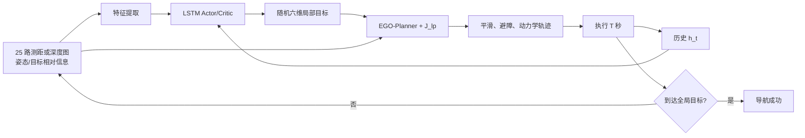

# RLoPlanner：学习与运动规划结合的无人机安全导航——详细学习笔记

> 阅读范围：全文 14 个 PDF 实际页，覆盖正文、Theorem 1、Algorithm 1、Equation (1)–(18)、Figure 1–11、Table I–II、仿真实验与结论。
>
> 页码说明：PDF 第 1 页对应论文印刷页 4904，之后依次递增。本笔记优先标 PDF 实际页码，方便直接回查。

# 1. 论文基本信息

- 完整标题：*RLoPlanner: Combining Learning and Motion Planner for UAV Safe Navigation in Cluttered Unknown Environments*
- 作者：Yuntao Xue、Weisheng Chen（西安电子科技大学）
- 收稿/发表时间：2023 年 6 月 29 日收稿，2023 年 11 月 2 日接收，2023 年 11 月 20 日在线发表，2024 年 4 月为当前期刊版本
- 期刊：*IEEE Transactions on Vehicular Technology*（IEEE TVT），Vol. 73, No. 4，pp. 4904–4917
- DOI：10.1109/TVT.2023.3330703
- 研究领域：无人机未知环境导航、深度强化学习、最大熵策略梯度、局部轨迹规划
- 主要关键词：Deep Reinforcement Learning（DRL，深度强化学习）、Maximum Entropy DRL（最大熵深度强化学习）、Hierarchical Navigation（分层导航）、POMDP、Recurrent Soft Policy Gradient（RSPG，循环软策略梯度）、EGO-Planner

> **这篇论文到底在干什么？**

它让一个带记忆、愿意探索的强化学习策略不断选择“下一步去哪”，再让 EGO-Planner 把这些局部目标变成平滑、安全的无人机轨迹，从而减少端到端控制的抖动和传统规划的局部受困。

# 2. 先告诉我为什么要研究这个问题

```text
现实/科研问题
无人机要在没有先验地图、视野有限、障碍密集的三维环境中到达远处目标
↓
传统反应式避障
直接根据传感器快速躲障，不必建完整地图
↓
问题
密集障碍中鲁棒性较差，感知误差会直接影响控制
↓
传统 SLAM + 路径/轨迹规划
能生成平滑、动力学可行的轨迹
↓
问题
有限视野下缺少长期探索能力，局部规划或乐观 A* 容易在死胡同/局部最小值受困
↓
端到端 DRL
可以从历史经验学会探索和脱困
↓
问题
还要从零学习底层飞行控制；训练慢、样本复杂，轨迹可能不连续、不平滑或难以执行
↓
作者发现的机会
DRL 擅长回答“往哪里探索”，运动规划器擅长回答“怎样平滑安全地到那里”
↓
本文要解决的问题
用最大熵循环策略生成局部目标，用改进 EGO-Planner 生成实际轨迹
```

如果没有这种分层方法，纯规划器可能在有限视野的局部结构里不断重规划却找不到出路，纯强化学习又要花大量训练学会“怎样稳定飞”。RLoPlanner 的目标不是替代规划器，而是为规划器提供更有长期价值的局部目标。（Introduction，PDF 第 1–2 页）

# 3. 阅读论文前必须知道的基础知识

## 3.1 未知环境与有限视野

**是什么**：没有完整先验地图；RGB-D 或测距传感器只能观察有限 FOV（Field of View，视场）内、未被遮挡的区域。

**为什么需要它**：如果地图完全已知，局部目标选择相对容易；困难来自每走一步才看到新空间。

**在本文中的作用**：作者把导航建模成 POMDP，并用 LSTM 汇总历史。

**简单例子**：无人机走到 U 形障碍底部时，当前目标方向仍指向墙外；只有记住进入路线，才可能判断应该后退而不是继续贴墙。

## 3.2 POMDP

POMDP 全称 **Partially Observable Markov Decision Process，部分可观测马尔可夫决策过程**。

七元组 \((S,A,T,R,\Omega,O,\gamma)\) 分别表示状态、动作、转移、奖励、观测集合、观测概率和折扣因子。真实状态 \(s_t\) 不可直接获得，策略应根据历史

\[
h_t=(o_1,a_1,o_2,a_2,\ldots,a_{t-1},o_t)
\]

作决策。（Section II-A，PDF 第 3 页）

## 3.3 Actor–Critic

**是什么**：Actor（演员）输出动作分布；Critic（评论家）估计动作的长期价值 \(Q\)。

**为什么需要它**：局部目标是连续六维动作，无法像小规模离散表格那样穷举。

**在本文中的作用**：Actor 与 Critic 都带 LSTM；Critic 指导 Actor 增大高价值、高熵动作的概率。

## 3.4 最大熵强化学习

Maximum Entropy Reinforcement Learning 是**最大熵强化学习**。

**是什么**：目标不仅最大化奖励，还最大化策略熵 \(\mathcal H(\pi)\)，避免过早只选择一种动作。

**为什么需要它**：未知环境里过早确定“永远向左绕”可能错过更好的出口；随机性保留探索机会。

**在本文中的作用**：RLoPlanner 使用软策略梯度，让局部目标策略在高回报的同时保持一定多样性。

**简单例子**：两个开口目前评价接近。确定性策略可能永远选左；最大熵策略训练时仍会尝试右侧，从而发现右侧才是长期出口。

## 3.5 DSPG 与 RSPG

- **DSPG：Deep Soft Policy Gradient，深度软策略梯度**。最大熵策略梯度，但通常基于当前完全状态/观测。
- **RSPG：Recurrent Soft Policy Gradient，循环软策略梯度**。本文将 DSPG 扩展到 POMDP，用循环网络表示历史。

RSPG 的关键不是简单“随机动作 + LSTM”，而是把软 Q、策略熵和历史条件策略一起写入更新公式。（Section IV-B，PDF 第 6–7 页）

## 3.6 LSTM 与 BPTT

- **LSTM：Long Short-Term Memory，长短期记忆网络**。用门机制保留/遗忘历史。
- **BPTT：Backpropagation Through Time，时间反向传播**。把多个时间步展开后训练循环网络。

本文用 LSTM 减轻普通 RNN 的梯度消失/爆炸，并额外使用梯度裁剪控制软 Q 引起的梯度尺度。（PDF 第 6–7 页）

## 3.7 Local Goal 与机体系

Local Goal 是**局部目标**。策略动作是

\[
a=[x,y,z,\phi,\theta,\psi],
\]

即相对于 UAV 机体系的局部目标位置与方向。相对表示使策略不依赖某张地图的绝对原点。

## 3.8 Rangefinder 与 RGB-D 两种观测版本

- **RLoPlanner(rangefinder)**：25 条测距射线 + IMU/方向 + 目标相对信息。
- **RLoPlanner(image)**：\(84\times84\) 深度图经 VAE 压成 50 维 + 姿态/目标相对信息。
- **VAE：Variational Autoencoder，变分自编码器**。通过重建学习低维图像表示。

论文用 rangefinder 版本与端到端 RL 公平比较，用 image 版本与 RGB-D 的 A*+EGO 传统方案比较。（Section IV-A、V-B）

## 3.9 EGO-Planner、B-spline 与 ESDF-free

- **B-spline，B 样条**：用控制点表示连续轨迹，便于计算速度、加速度等导数。
- **EGO-Planner**：无须预先维护完整 ESDF 的梯度局部规划器。
- **ESDF：Euclidean Signed Distance Field，欧氏有符号距离场**：每个空间点到最近障碍的带符号距离。

本文在 EGO 的平滑、碰撞和动力学代价之外，加入局部目标位置/速度代价 \(J_{lp}\)。（Section IV-C，PDF 第 7–8 页）

## 3.10 路径效率、加速度与 Jerk

- 路径效率 = 起终点直线距离总和 / 实际轨迹长度总和，越高越接近直达。
- 平均加速度越低，速度变化通常越温和。
- **Jerk（加加速度）**是加速度变化率，越低通常越平滑。

论文用加速度和 jerk 间接讨论能效，但没有直接测电流或电池消耗，因此“节能”不是直接能耗实验证据。

# 4. 论文整体思路

## 4.1 输入、中间步骤与输出

1. 输入：UAV 当前方向/状态、目标相对关系、25 路测距或压缩深度图，以及历史观测–动作。
2. 高层 RSPG：Actor-LSTM 输出一个随机的六维局部目标；Critic-LSTM 估计软 Q。
3. 奖励：鼓励接近全局目标，并惩罚局部目标靠近障碍。
4. 低层 EGO：优化 B 样条的平滑、碰撞、动力学和局部目标一致性。
5. 执行：执行规划器输出 T 秒，获取新观测，再生成下一个局部目标。
6. 输出：连续局部轨迹序列，直到到达全局目标或失败。



核心创新发生在两个地方：一是把最大熵软策略梯度扩展到带历史的 RSPG，用于选局部目标；二是在 EGO 目标中加入 \(J_{lp}\)，让优化轨迹末端更贴合上层目标。（Section IV）

# 5. 论文方法详细讲解

## 5.1 UAV 模型与问题假设

### 它要解决什么问题？

在静态、未知、密集障碍环境中，从任意 \(p_0\) 无碰撞到达 \(p_g\)，成功定义为进入目标 0.5 m 半径。（Section III，PDF 第 3–4 页）

### 具体假设

- 四旋翼内部状态完整描述为位置、欧拉角、线速度和角速度共 12 维。
- 用于训练的简化运动方程忽略动量，假设转向立即生效。
- 环境静态；RGB-D/测距感知准确。

### 为什么这样设计？

简化模型降低 RL 环境计算量，把论文重点放在局部目标决策。

### 如果真实假设不成立会怎样？

动量、延迟或感知噪声可能使局部目标虽合理，实际飞行仍跟不上；论文没有实机实验验证这一差距。

## 5.2 Rangefinder 观测空间

### 输入是什么？

1. UAV 初始观察方向相对世界轴的水平角 \(\vartheta\) 与垂直角 \(\varphi\)；
2. 25 条测距数据 \(D=\{d_{i0},d_{i1},d_{i2},d_{i3},d_{i4}\}_{i=1}^5\)，范围 [0,10]；
3. 目标相对关系 \(\xi=[d_5,\varpi,\varpi_z]\)：目标距离、水平相对角和垂直相对角。

组合为 \(o=[\vartheta,\varphi,D,\xi]\)。（Figure 3，PDF 第 5 页）

### 具体做了什么？

Figure 2/3 显示测距射线分布在水平和竖直两个扇面，总共 25 个距离值。姿态和目标关系走全连接分支，测距数据走卷积/特征分支，最后拼接。

### 输出是什么？

适合 Actor/Critic LSTM 的紧凑观测。

### 为什么这样设计？

相对目标信息告诉策略总体前进方向，测距告诉它附近哪里能走，历史弥补 FOV 之外的信息。

### 如果去掉会怎样？

去掉目标关系会退化成只避障、不知道终点；去掉障碍观测会朝目标直飞；去掉历史会在遮挡/死胡同中更易受困。Table I 中 DSPG 与 RSPG 的差异对“历史有用”提供一定证据。

## 5.3 图像观测与 VAE

### 输入是什么？

\(84\times84\) 单通道深度图 \(I\)。

### 具体做了什么？

先无监督训练 VAE 重建深度图，取编码器 50 维潜变量作为 DRL 输入，构造 \(o=[\vartheta,\varphi,I,\xi]\)。（Section IV-A，PDF 第 5 页）

### 为什么这样设计？

保留视觉几何特征，同时减少直接用图像训练的矩阵计算和样本压力。

### 如果去掉会怎样？

可直接用 CNN 端到端编码，但算力与训练数据需求可能增加。本文没有“有/无 VAE”的消融。

## 5.4 六维局部目标动作

### 它要解决什么问题？

避免 RL 直接输出油门与转向时轨迹不连续、训练慢的问题。

### 输入是什么？

当前观测和 LSTM 历史表示。

### 具体做了什么？

Actor 采样局部目标 \([x,y,z,\phi,\theta,\psi]\)。位置告诉 EGO 去哪里，方向用于减少不必要旋转，让运动更自然。（Section IV-A.2）

### 输出是什么？

机体系下的局部目标位姿。

### 如果去掉这个模块会怎样？

使用端到端 RSPG 时，Table I 成功率仍为 95.75%，但飞行时间 29.96 s、加速度 0.46、jerk 7.18；接入 planner 后为 19.9 s、0.14、3.65。说明 planner 显著改善执行轨迹。

## 5.5 距离与障碍奖励

### 它要解决什么问题？

让策略选择能推进全局任务且位于自由空间的局部目标。

### 具体做了什么？

\(r_{dist}\) 比较执行局部轨迹前后的目标距离，\(r_{obs}\) 以最近障碍距离给指数负惩罚，总奖励相加。（Equation 6–8，PDF 第 5–6 页）

### 为什么这样设计？

只在最终成功时奖励太稀疏；距离变化提供逐段反馈。障碍惩罚避免高层把目标直接放到障碍旁。

### 复现问题

印刷的距离式为“新距离减旧距离”。若 \(\omega_g>0\)，靠近终点得到负值，与正文含义相反；论文未给 \(\omega_g\)。实验列出的 \(\alpha=8,\beta=25\) 也没有在 Equation (6)–(8) 中出现。完整奖励映射未明确。

## 5.6 最大熵目标

### 它要解决什么问题？

防止策略在未知环境中过早收敛到单一局部目标模式。

### 具体做了什么？

在普通累计奖励上加入策略熵：高回报且保持动作多样性的策略更优。（Section II-B）

### 为什么这样设计？

局部最优选择在当前看来不错，却可能把无人机带进无法观察到的死胡同；随机探索能发现替代路径。

### 如果去掉会怎样？

Table/Figure 6 中确定性 FRDPG 更快收敛，但收敛后的平均回报低于 RSPG；论文把这解释为过早收敛到单一行为。不过对照同时存在算法更新机制差别，不能只归因于熵。

## 5.7 从 DSPG 到 RSPG

### 输入是什么？

整段历史 \(h_t\)，而不是单个状态 \(s_t\)。

### 具体做了什么？

1. 用 LSTM Actor 表示 \(\pi_\theta(a|h)\)；
2. 用 LSTM Critic 近似 \(Q^\pi(h,a)\)；
3. 经验回放存储历史、动作、观测和奖励；
4. 对每个历史样本多次采样动作，分别估计状态和动作期望；
5. 使用目标 Actor/Critic 软更新稳定训练；
6. 使用梯度裁剪限制软 Q 对梯度尺度的影响。（Theorem 1、Algorithm 1，PDF 第 6–7 页）

### 输出是什么？

带历史记忆的随机连续动作策略。

### 为什么这样设计？

最大熵解决探索，LSTM 解决部分可观测，目标网络/回放解决深度离策略训练稳定性。

### 如果去掉 LSTM 会怎样？

端到端 DSPG 成功率 74.75%、困住率 15.75%；RSPG 为 95.75% 和 1.75%。（Table I）这强烈支持历史记忆，但两者网络结构和训练行为可能还有其他差异。

## 5.8 带局部目标代价的 EGO-Planner

### 它要解决什么问题？

普通 EGO 优化平滑/避障/动力学后，轨迹终点可能偏离 RL 所选局部目标，使高层决策无法落实。

### 输入是什么？

B 样条控制点、障碍、动力学限制，以及期望局部目标位置 \(p_{lp}\) 和速度 \(v_{lp}\)。

### 具体做了什么？

在原代价 \(J_s+J_c+J_d\) 上加入

\[
J_{lp}=\lambda_p\|p(t_{lp})-p_{lp}\|^2+\lambda_v\|p'(t_{lp})-v_{lp}\|^2.
\]

它是软约束：偏离目标会增加代价，但不是绝对禁止。（Equation 17–18，PDF 第 7–8 页）

### 输出是什么？

末端位置/速度更贴近上层局部目标的 B 样条。

### 为什么这样设计？

让“学习选点”与“规划执行”之间的接口更紧密，同时保留避障和动力学折中。

### 如果去掉会怎样？

论文声称实验会分析 \(J_{lp}\) 对成功率的影响，但没有提供一个只去掉 \(J_{lp}\)、其他全部相同的明确表格/曲线。因此其独立贡献没有被严格消融。

### 复现歧义

高层动作定义为位置+姿态，没有说明期望速度 \(v_{lp}\) 如何得到；Equation (18) 使用 \(v_{lp}\)，但正文没有给映射。方向 \((\phi,\theta,\psi)\) 又没有显式出现在 \(J_{lp}\) 中。二者都需要代码或作者补充。

## 5.9 完整在线循环

EGO 生成的命令执行 T 秒，随后传感器获取新图像/距离，RSPG 再选局部目标并重新规划，直到进入全局目标 0.5 m 半径或发生碰撞/超时。（Section IV-C）

# 6. 重要公式逐个讲懂

## 6.1 POMDP 历史 Q：Equation (1)

\[
Q^\pi(h_t,a_t)=\mathbb E_{s_t|h_t}[r(s_t,a_t)]
+\mathbb E_{\tau_{>t}|h_t,a_t}\left[\sum_{i=1}^{\infty}\gamma^i r(s_{t+i},a_{t+i})\right].
\]

**想解决什么问题**：当前看不到真实状态时，如何定义动作长期价值。

**符号**：\(h_t\) 是观测–动作历史；\(s_t|h_t\) 是根据历史推断真实状态的分布；\(\tau_{>t}\) 是未来轨迹。

**中文意思**：一个局部目标的价值等于当前预期奖励，加上从这个历史和动作继续执行策略时的折扣未来奖励。

**数字例子**：当前预期奖励 2，未来两步奖励 3、4，\(\gamma=0.9\)，则近似 Q 为 \(2+0.9\times3+0.9^2\times4=7.94\)。

## 6.2 最大熵目标：Equation (2)

\[
J(\pi)=\sum_t\mathbb E_{(s_t,a_t)\sim\rho_\pi}
[r(s_t,a_t)+\alpha\mathcal H_\pi(\cdot|s_t)].
\]

\[
\mathcal H_\pi(\cdot|s)=-\sum_a\pi(a|s)\log\pi(a|s).
\]

**想解决什么问题**：在高奖励之外保留探索。

**符号**：\(\alpha\) 是熵权重；\(\rho_\pi\) 是策略访问状态–动作的分布。

**数字例子**：两个动作概率各 0.5 时，熵为 \(-2(0.5\log0.5)=0.693\)；概率 0.99/0.01 时熵约 0.056。若奖励接近，最大熵目标偏好前者。

**论文不一致**：Equation (2) 显式有 \(\alpha\)，后续 Equation (3)、(9)–(16) 的熵/\(-\log\pi\) 项没有统一保留 \(\alpha\)，等价于把温度设为 1 或省略，但论文未解释。实验参数 \(\alpha=8\) 又被称为 reward 参数，含义不清。

## 6.3 简化三维运动：Equation (5)

\[
\begin{aligned}
\vartheta_{t+1}&=\vartheta_t+\rho_t,\\
\varphi_{t+1}&=\varphi_t+\tau_t,\\
x_{t+1}&=x_t+v\cos\vartheta_{t+1}\cos\varphi_{t+1},\\
y_{t+1}&=y_t+v\sin\vartheta_{t+1}\cos\varphi_{t+1},\\
z_{t+1}&=z_t+v\sin\varphi_{t+1}.
\end{aligned}
\]

**想解决什么问题**：用水平/垂直转向角把一步前进量分解到三维坐标。

**数字例子**：当前位置 \((1,2,1)\)，更新后水平角 90°、仰角 0°、\(v=1\)，下一位置为 \((1,3,1)\)。

**限制**：没有显式时间步、推力、姿态动力学和动量，不能代表真实四旋翼闭环。

## 6.4 距离与障碍奖励：Equation (6)–(8)

\[
r_{dist}=\omega_g(\|p^{t+1}-g\|-\|p^t-g\|),
\]

\[
r_{obs}=-e^{-\sigma d_{min}},\qquad r=r_{dist}+r_{obs}.
\]

**符号**：\(d_{min}\) 是局部目标到最近障碍的距离；\(\sigma\) 控制惩罚随距离衰减速度。

**数字例子**：旧距离 12 m，新距离 10 m，\(\omega_g=1\)，印刷式给 -2；\(d_{min}=0.5\) m、\(\sigma=2\)，障碍项为 \(-e^{-1}\approx-0.368\)，总计 -2.368。正文说接近目标应受奖励，所以符号或 \(\omega_g\) 取值存在未说明问题。

## 6.5 循环软策略梯度：Theorem 1 / Equation (11)

\[
\nabla_\theta J(\pi_\theta)=\mathbb E_\tau\left[
(Q^\pi(h,a)-\log\pi(a|h)-1)\nabla_\theta\log\pi(a|h)
\right].
\]

**想解决什么问题**：如何调整历史条件 Actor，使高价值动作概率增加，同时维持策略熵。

**符号**：

- \(Q^\pi(h,a)\)：给定历史选择动作的软长期价值；
- \(\log\pi(a|h)\)：动作对数概率；
- \(\nabla_\theta\log\pi\)：改变参数对动作概率的影响；
- \(-1\)：熵梯度推导产生的项。

**中文意思**：若一个动作 Q 高、当前概率又不应过度集中，它会推动参数增大这个动作的适当概率；熵项阻止策略过早塌缩。

**数字例子**：若 \(Q=3\)，动作概率 0.2，则 \(\log0.2=-1.609\)，前面的系数是 \(3-(-1.609)-1=3.609\)。若该动作概率梯度方向为正，就得到较强正更新。

## 6.6 实际近似梯度：Equation (16)

\[
\nabla_\theta J(\pi_\theta)=\mathbb E_\tau\left[
(Q^\omega(h,a)-\log\pi(a|h)-1)\nabla_\theta\log\pi(a|h)
\right].
\]

与 Equation (11) 唯一核心变化是把不可知的真实 \(Q^\pi\) 换成 Critic 网络 \(Q^\omega\)。Algorithm 1 再用回放样本、多个动作采样、软 Bellman target 和目标网络来实现这一期望。

## 6.7 EGO 总目标：Equation (17)

\[
\min_Q J=\lambda_1J_s+\lambda_2J_c+\lambda_3J_d+\lambda_4J_{lp}.
\]

**符号**：\(J_s\) 平滑、\(J_c\) 碰撞、\(J_d\) 动力学、\(J_{lp}\) 局部目标一致性。

**数字例子**：若四项为 2、1、3、4，权重为 1、10、2、3，则总成本 \(2+10+6+12=30\)。若移动控制点能把 \(J_c\) 从 1 降到 0.1，即使 \(J_{lp}\) 稍增也可能值得。

## 6.8 局部目标代价：Equation (18)

\[
J_{lp}=\lambda_p\|p(t_{lp})-p_{lp}\|^2+
\lambda_v\|p'(t_{lp})-v_{lp}\|^2.
\]

**想解决什么问题**：让轨迹末端不仅位置接近局部目标，速度也接近期望。

**符号**：\(t_{lp}\) 是局部轨迹终止时刻；\(p(t)\) 是优化轨迹；\(p'\) 是速度；\(p_{lp},v_{lp}\) 是期望局部目标位置/速度。

**数字例子**：一维简化下，末端位置 2.8 m、目标 3 m，末端速度 0.8 m/s、期望 1 m/s，\(\lambda_p=10,\lambda_v=2\)，则 \(J_{lp}=10(0.2)^2+2(0.2)^2=0.48\)。

# 7. 论文中的重要 Figure

## Figure 1：有限视野下的局部目标导航（PDF 第 4 页）

- UAV 从 \(P_1\) 到 \(P_4\)，视野扇面不断变化；障碍形成局部遮挡与类似陷阱结构。
- 红色局部目标引导每一小段，最终到黄色全局目标。
- 它解释为什么“直接朝全局目标”不够，以及为什么需要历史和逐段决策。

## Figure 2：RLoPlanner 框架与传感器布置（PDF 第 5 页）

- 左侧展示水平/竖直测距扇面，中间是起点—局部目标—全局目标，右侧是 RL → Motion Planner → 轨迹执行闭环。
- 黑色反馈包括 UAV pose 和 rangefinder/camera 信息。
- 记住：RL 产生一系列局部目标，规划器产生连续轨迹。

## Figure 3：测距几何与目标相对角（PDF 第 5 页）

- 左图是三维第一观察方向；中/右图说明目标的水平与竖直相对角。
- 论文称水平+竖直共有 25 条测距数据。
- 它主要用于澄清观测坐标，而非证明性能。

## Figure 4：四类随机仿真场景（PDF 第 8 页）

- Scene-I 方柱，Scene-II 圆柱，Scene-III 不规则“森林/雾状”障碍，Scene-IV 环形障碍。
- 场景为 40×40×12 m，障碍限制在 35×35×12 m。
- 多几何增加测试宽度，但仍是静态程序生成环境。

## Figure 5：Actor 网络（PDF 第 9 页）

- Rangefinder \(D\) 经过两层卷积+ReLU；方向角、目标关系走全连接；拼接后进入 LSTM、全连接和 softmax。
- 黄色输出点代表选择局部目标。
- 图未给每层通道、核大小、隐藏维度和动作分布参数，不能独立完整复现。

## Figure 6：四种策略梯度训练曲线（PDF 第 10 页）

- 横轴为 history trajectories，至 \(2\times10^4\)；纵轴 Reward。
- DSPG（青色）约 5000 轮最快达到高回报，但波动大；RSPG（红色）约 9000 轮到达约 90–100 且较稳定；FRDPG、FRSVG(0) 最终较低。
- 图说明“最快收敛”和“最终稳定回报最高”不是同一件事。
- 正文多处把 RSPG 误写成 RSVG，阅读时要结合图例判断。

## Figure 7：RLoPlanner 与端到端 RSPG 的速度（PDF 第 10 页）

- 横轴飞行时间，纵轴速度；红色 RLoPlanner 约 6 s 后稳定在 1.8–1.95 m/s，蓝色 RSPG 多次降至约 0.7–1.2 m/s。
- Caption 错写成导航轨迹示意，实际图是速度曲线。
- 它直观支持 planner 使执行速度更连续，但仍是单个示例。

## Figure 8：RLoPlanner(rangefinder) 与 RSPG 轨迹（PDF 第 11 页）

- 上图 RLoPlanner 轨迹较直接平滑；下图 RSPG 有更多折点和绕行。
- Figure 7/8 与 Table I 共同说明高层相同思想下，规划器改善了轨迹质量与时间。

## Figure 9：三种“RL + EGO”随障碍密度变化（PDF 第 12 页）

- 比较 FRDPG+EGO、FRSVG(0)+EGO 和 RLoPlanner(rangefinder)。
- 四个子图分别为成功率、碰撞率、困住率、路径效率。
- 密度 70% 时，RLoPlanner 成功率约 92%，困住率约 4%；三种方法路径效率都降到约 0.78–0.79。
- 说明 RSPG 高层在高密度脱困上更好，但几何密度上升仍让所有方法路线变差。

## Figure 10：RLoPlanner(image) 与 A*+EGO（PDF 第 12 页）

- 密度从 10% 到 70%，RLoPlanner 成功率约 96% 降至 87%，A*+EGO 约 82% 降至 64%。
- 70% 时 A*+EGO 困住率接近 24%，RLoPlanner 约 3%–4%。
- RLoPlanner 路径效率也随密度下降，说明脱困优势要以更多绕行为代价。

## Figure 11：60% 密度死胡同案例（PDF 第 12 页）

- (a) RLoPlanner(image) 在局部目标引导下退出死胡同并到达目标；(b) A*+EGO 在局部区域受困。
- 这是 Figure 10 困住率差异的可视化例子，不能代替统计本身。

# 8. 论文中的重要 Table

## Table I：250 次平均导航结果（PDF 第 11 页）

指标方向：成功率越高越好；碰撞率、困住率、飞行时间、加速度、jerk 越低越好。

| 类别 | 方法 | 输入 | 成功率↑ | 碰撞率↓ | 困住率↓ | 时间↓ | 加速度↓ | Jerk↓ |
|---|---|---|---:|---:|---:|---:|---:|---:|
| E2E | FRDPG | Rangefinder+IMU | 96.75% | 1.75% | 1.50% | 31.84±5.06 s | 0.49±0.03 | 8.77±0.57 |
| E2E | FRSVG(0) | Rangefinder+IMU | 97.25% | 2.00% | **0.75%** | 34.12±4.56 s | 0.55±0.02 | 7.43±0.49 |
| E2E | DSPG | Rangefinder+IMU | 74.75% | 9.50% | 15.75% | 37.71±5.83 s | 0.53±0.05 | 9.84±0.61 |
| E2E | RSPG | Rangefinder+IMU | 95.75% | 2.50% | 1.75% | 29.96±4.39 s | 0.46±0.04 | 7.18±0.52 |
| RL+planner | FRDPG+EGO | Rangefinder+IMU | 96.5% | 2.00% | 1.50% | 21.65±3.48 s | 0.15±0.01 | 3.52±0.15 |
| RL+planner | FRSVG(0)+EGO | Rangefinder+IMU | **97.50%** | 1.75% | **0.75%** | 20.38±3.57 s | 0.14±0.01 | 3.72±0.14 |
| RL+planner | DSPG+EGO | Rangefinder+IMU | 77.25% | 8.50% | 14.25% | 22.14±3.96 s | **0.13±0.02** | 3.64±0.16 |
| RL+planner | RLoPlanner(rangefinder) | Rangefinder+IMU | **97.50%** | **1.50%** | 1.00% | **19.9±3.72 s** | 0.14±0.01 | 3.65±0.13 |
| RL+planner | RLoPlanner(image) | RGB-D+IMU | 96.75% | **1.50%** | 1.75% | 23.36±3.51 s | 0.16±0.02 | 3.89±0.17 |
| Classic | A*+EGO | RGB-D+IMU | 78.5% | 6.25% | 15.25% | 20.83±2.97 s | **0.13±0.01** | **3.43±0.14** |

关键解读：

- RLoPlanner(rangefinder) 与 FRSVG(0)+EGO 并列最高成功率 97.5%，不是单独第一。
- RLoPlanner 的最低碰撞率 1.5% 与 image 版本并列；最低困住率属于 FRSVG(0) 系列的 0.75%。
- RLoPlanner(rangefinder) 飞行时间最短 19.9 s，比端到端 RSPG 快 10.06 s，约 33.6%。
- 轨迹平顺性主要来自 planner：四种 RL+planner 的加速度/jerk 都集中约 0.13–0.16 / 3.52–3.89，远低于 E2E 的 0.46–0.55 / 7.18–9.84。
- A*+EGO 的加速度和 jerk 最好，但成功率只有 78.5%、困住率 15.25%。这说明“轨迹漂亮”和“能否脱困到达”是不同维度。
- RLoPlanner(rangefinder) 和 FRSVG(0)+EGO 的整体差距很小；论文优势主要在高障碍密度曲线和训练稳定性，而不是 Table I 的压倒性差距。

## Table II：Scene-III 的飞行距离与计算时间（PDF 第 13 页）

| 方法 | 0.3 障碍密度：距离 | 0.3：计算时间 | 0.6 障碍密度：距离 | 0.6：计算时间 |
|---|---:|---:|---:|---:|
| RLoPlanner(rangefinder) | 53.71 m | 4.69 s | 58.74 m | 8.94 s |
| RLoPlanner(image) | 54.29 m | 5.37 s | 59.27 m | 9.63 s |

论文表头明确把 \(t_{com}\) 单位写成 **s**，值为 4.69–9.63；正文却说“total computation time within 5.5 ms / below 10 ms”。二者相差 1000 倍，无法同时成立。合理可能性包括表头单位应为 ms、正文把 s 误写成 ms，或表中统计口径不是正文所称“总时间”；论文没有明确说明，不能擅自选择。正文还把密度写成“30% and 0.6%”，应与表格 0.3/0.6 对照理解为 30%/60%，但这是根据上下文的推断。

# 9. 实验到底是怎么做的

## 9.1 数据集 / 仿真环境 / 实验平台

- ROS `mockamap` 生成四种静态随机障碍场景。
- 地图 40×40×12 m，障碍区域 35×35×12 m。
- 障碍密度定义为空间被占据体积百分比。
- 平台：Ubuntu 16.04、32 GB RAM、AMD R5-5600G CPU、GeForce GTX 1080 GPU。
- 论文写训练 10,000 time steps、约 12 小时；Figure 6 横轴到 20,000 history trajectories，正文又说约 5000/9000 episodes 收敛，三种计数单位未统一。
- 没有真实飞行实验；全文 Section V 明确是 Simulation Experiments。

## 9.2 Baseline

### 端到端 RL

- FRDPG：快速循环确定性策略梯度；
- FRSVG(0)：循环随机值梯度；
- DSPG：无循环的深度软策略梯度；
- RSPG：本文循环软策略梯度，但直接输出油门/转向。

这些方法输入 Rangefinder+IMU，动作是 \([\rho,\varphi]\) 油门/转向，并额外惩罚油门变化。

### RL + Planner

- FRDPG+EGO；FRSVG(0)+EGO；DSPG+EGO；
- RLoPlanner(rangefinder)；RLoPlanner(image)。

它们都让高层产生局部目标、EGO 做低层规划，用于比较高层算法。

### 传统 Planner

- RGB-D+IMU；轻量 ESDF 地图；乐观 A* 把未知区域视为空闲，EGO 做局部规划；受困时重新调用全局 A*。

## 9.3 Evaluation Metrics

- 平均奖励，越高越好；正文此处写 200 个导航任务，而 Table I 写 250 次，统计口径存在不一致。
- 成功率、碰撞率、困住率。
- 路径效率。
- 平均加速度、平均 jerk。
- 飞行时间。
- 飞行距离与计算时间。

## 9.4 参数设置

- 最大速度 2.1 m/s；高度限制 [0,10] m。
- \(\sigma=2.0,\alpha=8.0,\beta=25.0\)，但 \(\alpha,\beta\) 与公式的对应不清楚。
- 最长历史 100；Adam 学习率 0.01。
- 目标网络软更新 \(\tau=0.01\)。
- Replay Buffer \(10^5\)，每 100 时间步采样。
- 折扣因子 \(\gamma=0.99\)。

## 9.5 实验流程

1. 在四类随机场景和随机起终点上训练策略。
2. 比较 FRDPG、FRSVG(0)、DSPG、RSPG 收敛回报。
3. 在 250 次平均测试中比较 E2E、RL+planner 和 classic planner。
4. 在 Scene-I 逐步提高障碍密度，比较三种 RL+EGO。
5. 用 RGB-D 版本与 A*+EGO 比较密度泛化和死胡同脱困。
6. 在 Scene-III 记录两种传感版本的距离与计算时间。

## 9.6 Ablation Study

本文有“近似消融”，但不是所有核心组件都有严格单变量消融：

- DSPG vs RSPG：主要考察循环历史记忆。
- RSPG E2E vs RLoPlanner(rangefinder)：考察加入 planner 的系统效果，但动作空间与低层执行同时改变。
- rangefinder vs image：考察传感输入版本，但输入模态和编码器一起改变。
- 没有明确的“RLoPlanner 去掉最大熵”“去掉 \(J_{lp}\)”“去掉 VAE”“去掉目标姿态”单变量实验。

# 10. 实验结果说明了什么

## 实验 1：最大熵与循环网络训练

想证明：RSPG 是否兼顾探索和部分可观测记忆。

→ 结果：DSPG 约 5000 轮最快上升，但波动较大；RSPG 约 9000 轮收敛，最终回报和稳定性更好；FRDPG 更快但最终回报较低。（Figure 6）

→ 结论：在该训练设置中，循环最大熵策略牺牲部分收敛速度，换取较好最终回报与稳定性。

## 实验 2：端到端 vs 分层规划

想证明：运动规划器能否改善轨迹执行质量。

→ 结果：RSPG E2E 到 RLoPlanner(rangefinder)，时间从 29.96 降至 19.9 s，加速度从 0.46 降至 0.14，jerk 从 7.18 降至 3.65，成功率增加 1.75 个百分点。（Table I、Figure 7–8）

→ 结论：planner 对时间和平顺性的提升非常明显，对已经很高的 RSPG 成功率提升较小。

## 实验 3：不同高层策略 + 同一 EGO

想证明：RSPG 选局部目标是否在密集环境更好。

→ 结果：低密度时三者接近；到 70% 时 RLoPlanner 成功率约 92%、高于另两者，困住率低于 4%。（Figure 9）

→ 结论：最大熵+历史策略的优势主要在高密度、部分可观测结构，而不是简单场景。

## 实验 4：图像 RLoPlanner vs A*+EGO

想证明：学习局部目标能否克服乐观 A* 的短视/受困。

→ 结果：Table I 成功率 96.75% 对 78.5%，困住率 1.75% 对 15.25%；70% 密度下成功率约 87% 对 64%，死胡同案例中前者能退出。（Figure 10–11）

→ 结论：历史学习的局部目标在作者构造的死胡同分布中明显减少受困。

## 实验 5：实时性

想证明：rangefinder 和 image 版本能否在线运行。

→ 结果：Table II 数值随密度从约 4.69–5.37 增到 8.94–9.63；rangefinder 略快、路径略短。

→ 结论：密度越高计算量越大，rangefinder 版本计算更轻。但由于表格单位为秒、正文解释为毫秒，论文无法可靠证明具体实时周期。

## 论文真正证明的事情

- 在静态随机仿真中，RLoPlanner 达到很高成功率，并显著改善端到端策略的时间、加速度与 jerk。
- 循环历史对部分可观测脱困非常重要，DSPG 无循环版本明显较差。
- 相比乐观 A*+EGO，学习局部目标在高密度/死胡同场景困住率更低。
- Rangefinder 和 RGB-D 两种观测版本都能在仿真中工作。

## 作者声称但证据不充分的事情

- “安全、可部署真实 UAV”：论文只有仿真，没有真实飞行或硬件在环证据。
- “更节能”：只测加速度/jerk，没有直接功耗。
- \(J_{lp}\) 提高成功率：没有独立去除 \(J_{lp}\) 的严格消融。
- “实时低于 10 ms”：Table II 单位与正文冲突，无法确认。
- “97.5% 是全面最佳”：与 FRSVG(0)+EGO 并列成功率，且后者困住率更低。

# 11. 这篇论文最重要的创新点

## 11.1 循环最大熵局部目标策略

```text
以前：确定性或无记忆策略容易过早固定行为，有限视野下易受困
↓
本文：RSPG 用 LSTM 表示历史，并在目标中加入策略熵
↓
为什么更好：同时保留记忆和探索，高密度场景成功率/脱困表现更好
```

## 11.2 把局部目标作为学习与规划接口

```text
以前：端到端 RL 直接输出油门/转向，轨迹抖动且训练还要学飞行技能
↓
本文：RL 输出六维局部目标，EGO 输出连续 B 样条
↓
为什么更好：Table I 中时间、加速度、jerk 大幅降低
```

## 11.3 在 EGO 中加入局部目标软代价

```text
以前：平滑/避障/动力学优化可能把末端推离高层选点
↓
本文：J_lp 同时惩罚末端位置和速度偏差
↓
为什么更好：理论上能让高层决策真正传递到低层；但独立实验验证不足
```

## 11.4 两种感知接口

```text
以前：单一输入难同时与端到端 RL、视觉规划公平比较
↓
本文：25 路 rangefinder 版本和 VAE 深度图版本
↓
为什么更好：能分别对照控制型 RL 与 RGB-D A*+EGO，并展示模块化
```

# 12. 论文的优点

- “去哪里”与“怎么飞”的分解清晰，局部目标接口可解释。
- 不只套用现成 SAC，而是给出 POMDP 历史条件下的循环软策略梯度推导和伪代码。
- Baseline 类型多：端到端、RL+同一 planner、经典 A*+EGO 都覆盖。
- 指标较全面，尤其同时报告成功、碰撞、受困和轨迹导数。
- Table I 允许看见真正取舍：经典规划最平滑但易受困，学习规划兼顾到达率和轨迹质量。
- 高密度曲线比单一平均值更能说明方法优势出现在哪种难度。
- 明确给出仿真尺寸、硬件和大量训练参数，虽仍不足完整复现，但比只报最终成功率更有价值。

# 13. 论文的缺点和局限

## 13.1 作者明确说明的限制（Conclusion，PDF 第 13 页）

- 实验环境是静态的；动态障碍需要未来用 RL 预测局部目标并避让。
- 尚未考虑观测误差和控制误差。

## 13.2 根据论文可合理发现的潜在限制

- 全部结果来自仿真；没有真实无人机、传感噪声或 sim-to-real 验证。
- 简化运动模型忽略动量，与真实四旋翼动力学差距明显。
- 奖励距离项符号、\(\alpha/\beta\) 参数、最大熵温度系数没有一致说明。
- \(v_{lp}\) 如何从六维“位置+姿态”动作得到未说明；目标方向怎样进入 EGO 代价也不清楚。
- Table II 秒/毫秒严重冲突；200/250 测试数、10000 steps/20000 histories/episodes 等计数也不一致。
- 没有 \(J_{lp}\)、VAE、最大熵或目标姿态的严格单变量消融。
- 训练环境只来自 mockamap 静态随机障碍，可能学习到生成器特征；对玻璃、细线、动态枝叶和真实深度缺陷没有证据。
- 与 FRSVG(0)+EGO 的平均性能非常接近，论文对自身“明显更优”的表达应结合误差和统计显著性谨慎看待。
- “A* 容易局部最小”需准确理解：一般完整已知静态图上的 A* 是完备图搜索；这里失败来自未知空间乐观假设、局部地图/重规划和有限视野，不是 A* 数学算法本身必然陷局部最小。
- 官方代码仓库未在 PDF 中给出。

# 14. 给我一个非常简单的例子

假设 UAV 在走廊入口，终点在正前方 10 m，但正前方 3 m 是 U 形障碍底部，右侧出口暂时被遮挡。

1. 25 路测距显示前方近、左侧也近、右后方未知；目标相对角接近 0°。
2. LSTM 记得 UAV 刚才从左侧尝试过并被墙挡回。
3. 最大熵 Actor 不直接输出“右转油门”，而采样一个机体系局部目标，例如 \((1,-2,0,0,0,-60^\circ)\)，指向右后方探索。
4. 另一个候选点离障碍只有 0.2 m，\(r_{obs}\) 很负；当前点离障碍 1.2 m，更可能保留。
5. EGO 以该目标优化 B 样条。\(J_c\) 让轨迹避墙，\(J_s\) 让转弯平滑，\(J_d\) 限制导数，\(J_{lp}\) 把末端拉向右后方目标。
6. UAV 执行 T 秒后，看见右侧出口；新观测进入 LSTM。
7. Actor 下一次选右前方目标，EGO 再规划。
8. 退出 U 形障碍后，策略重新选朝最终目标的局部点并完成任务。

这个例子体现：LSTM 避免重复左侧失败，最大熵保留尝试右侧的机会，EGO 则保证尝试过程不是生硬折线。

# 15. 如果我要复现这篇论文

## 15.1 软件与框架

- Ubuntu/ROS 与 `mockamap` 或等价随机三维地图生成器；
- EGO-Planner；
- PyTorch/TensorFlow 等实现 LSTM Actor–Critic、目标网络和经验回放；论文未指定框架；
- Rangefinder/IMU 仿真，或 RGB-D + VAE；
- 轨迹执行与碰撞、超时、成功判定模块。

## 15.2 主要实现模块

1. 统一机体系观测：\(\vartheta,\varphi,D,\xi\)。
2. 25 射线几何和范围归一化。
3. 可选 84×84 深度图 VAE→50 维。
4. LSTM Actor/Critic 与随机六维动作分布。
5. 历史序列回放、多动作采样、软 Bellman target、目标网络软更新、梯度裁剪。
6. 距离/障碍奖励与 episode 终止。
7. EGO 目标中加入 \(J_{lp}\)。
8. 统一统计成功/碰撞/受困/时间/加速度/jerk。

## 15.3 推荐实现顺序

1. 先复现原始 EGO 和经典 A*+EGO baseline。
2. 实现简化 UAV 环境和 E2E DSPG，确保奖励符号经单元测试正确。
3. 加 LSTM 得 RSPG，对比 DSPG 验证历史。
4. 把动作从控制改为局部目标，先用原 EGO 执行。
5. 加 \(J_{lp}\)，专门做有/无该项的消融。
6. 训练 rangefinder 版本，复现 Table I/Figure 9。
7. 训练 VAE 和 image 版本，对比 A*+EGO。
8. 统一时间单位后再做实时性测试。
9. 若上真机，必须补定位/深度噪声、动力学、延迟、急停和安全员流程。

## 15.4 PDF 无法唯一确定的内容

- \(\omega_g\) 与距离奖励正确符号；
- 最大熵温度 \(\alpha\) 在各公式/代码中的实际位置；
- \(\beta\) 的含义；
- Actor/Critic 完整层参数与动作上下限；
- \(v_{lp}\) 和目标姿态到 planner 的映射；
- \(J_{lp}\) 各权重；
- Table II 正确时间单位；
- 官方 GitHub。PDF 中没有提供，不能自行指定。

# 16. 如果老师问我这篇论文

## 1. RLoPlanner 解决什么问题？

它解决 UAV 在未知、有限视野、密集静态障碍中的点到点导航，希望同时减少传统规划的局部受困和端到端 RL 的轨迹不平滑。

## 2. 为什么叫“分层”？

高层 RSPG 选局部目标，低层 EGO-Planner 生成并执行到该目标的 B 样条；二者通过局部目标接口连接。

## 3. RSPG 与 DSPG 的区别是什么？

两者都有最大熵软策略梯度，RSPG 额外用 LSTM 根据历史 \(h_t\) 选动作，适合部分可观测环境。

## 4. 最大熵有什么用？

在提高回报的同时保留动作多样性，避免未知环境中过早固定一个局部目标模式，从而增强探索。

## 5. 观测空间有哪些内容？

Rangefinder 版包含两个方向角、25 路距离和目标距离/水平/垂直相对角；image 版把 84×84 深度图经 VAE 压到 50 维。

## 6. 为什么动作是六维局部目标？

位置决定下一步去哪，姿态描述希望朝向；让规划器处理轨迹，避免 RL 同时学习底层油门、转向和平滑性。

## 7. \(J_{lp}\) 是什么？

它惩罚轨迹末端位置和速度偏离高层局部目标，使 EGO 的优化结果尽量落实上层决策，是软约束。

## 8. 最关键的 Table I 结果是什么？

RLoPlanner(rangefinder) 成功率 97.5%、碰撞率 1.5%、时间 19.9 s；相对端到端 RSPG，时间少约 33.6%，加速度和 jerk 大幅降低。但成功率与 FRSVG(0)+EGO 并列，困住率不是最低。

## 9. 它有没有真实机验证？

没有。论文全部是 ROS/mockamap 仿真，所以“可真实部署”仍待验证。

## 10. 最大的论文质量/复现问题是什么？

奖励符号和熵系数定义不一致，\(v_{lp}\) 来源不清，测试次数与训练计数混用，Table II 把秒和毫秒写冲突，且缺少 \(J_{lp}\) 的严格消融。

# 17. 最后一分钟复习

## 30 秒版本

RLoPlanner 用带 LSTM 的最大熵 RSPG 从测距/深度和历史中选择六维局部目标，再用加入 \(J_{lp}\) 的 EGO-Planner 生成平滑轨迹。最大熵负责探索，LSTM 负责部分可观测记忆，EGO 负责避障和动力学。仿真中 rangefinder 版本成功率 97.5%、时间 19.9 s，明显比端到端 RSPG 平滑且更快，也比 A*+EGO 少受困；但没有真实机，公式/时间单位有多处复现歧义。

## 2 分钟版本

这篇 TVT 论文研究未知密集静态环境中的 UAV 导航。传统 A*+局部规划能生成平滑轨迹，但在有限视野、乐观未知空间和死胡同结构下容易受困；端到端 RL 能探索，却要自己学习底层控制，轨迹转折大。作者提出 RLoPlanner：高层把任务建成 POMDP，用 Actor–Critic LSTM 总结历史，并在策略目标中加入熵，形成 RSPG，以保留探索；动作是机体系下六维局部目标。低层使用 EGO-Planner 优化 B 样条，在平滑、碰撞和动力学代价之外加入末端位置/速度局部目标代价 \(J_{lp}\)。Table I 中 RLoPlanner(rangefinder) 成功率 97.5%、碰撞率 1.5%、时间 19.9 s；与端到端 RSPG 相比，时间、加速度和 jerk 都显著降低。高密度下它也比其他 RL+EGO 和 A*+EGO 更少受困。不过全部实验都在仿真；奖励符号、熵系数、\(v_{lp}\) 来源和 Table II 秒/毫秒有不一致，且 \(J_{lp}\) 没有严格单独消融。

## 必须记住的 5 件事

1. RSPG = 最大熵探索 + LSTM 历史记忆。
2. 高层动作是六维局部目标，不是油门/转向。
3. EGO 的 \(J_{lp}\) 让末端位置和速度贴近局部目标。
4. Table I 的主要优势是高成功率、低碰撞和相对 E2E 的轨迹质量；并非每项单独第一。
5. 只有静态仿真，且奖励/时间单位/复现细节存在明显歧义。

# 18. 学习自测

## 基础题

1. RLoPlanner 的高层和低层分别是什么？
2. RSPG 中“R”和“Soft”各自解决什么问题？
3. RLoPlanner(rangefinder) 的 25 路距离之外还输入哪些信息？

## 理解题

4. 为什么最大熵策略可能比确定性策略更适合未知环境？
5. 为什么 EGO 原有三项代价之外还要加入 \(J_{lp}\)？
6. Table I 如何说明规划器是轨迹平滑的主要来源？
7. 为什么不能简单说“A* 算法本身会陷入局部最小值”？

## 深入题

8. Equation (11) 中 \(-\log\pi(a|h)-1\) 与普通策略梯度相比带来了什么？
9. 设计一个严格验证 \(J_{lp}\) 的消融实验。
10. Table II 存在哪些单位/口径问题？在复现中怎样解决？

# 自测答案

## 1.

高层是带 LSTM 的循环软策略梯度 RSPG，输出局部目标；低层是加入局部目标代价的 EGO-Planner，输出 B 样条轨迹。

## 2.

“R”表示 recurrent，用历史处理部分可观测；“Soft”表示最大熵软策略梯度，在回报之外保持探索随机性。

## 3.

UAV 初始观察方向的水平/垂直角，以及目标距离、水平相对角、垂直相对角；还通过 LSTM 使用历史。

## 4.

当前观测不完整，眼前看似最佳的方向可能是死胡同。最大熵避免过早把概率集中到单一动作，在训练中保留尝试其他局部目标的机会。

## 5.

平滑、碰撞和动力学优化可能为了降低自身代价而偏离高层选点。\(J_{lp}\) 对轨迹末端的位置/速度偏差加罚，使高层决策能落实到低层。

## 6.

所有 RL+planner 方法的加速度约 0.13–0.16、jerk 约 3.52–3.89，而 E2E 方法为 0.46–0.55 和 7.18–9.84；高层算法不同但接入同一 planner 后都显著变平滑。

## 7.

在完整已知的有限图上，标准 A* 是完备的图搜索。本文受困来自未知空间被乐观当作自由、有限局部地图和反复重规划，不应归咎为 A* 数学机制天然的局部最小。

## 8.

它来自策略熵梯度，使更新不仅追求高 Q，还惩罚过度集中的动作概率；策略因而在高回报附近保持一定随机性。

## 9.

固定同一训练好的 RSPG、观测、局部目标、EGO 参数和随机测试场景，只比较 \(\lambda_4=0\) 与论文设置 \(\lambda_4>0\)。统计局部目标末端位置/速度误差、规划失败率、碰撞率、成功率和轨迹代价，并用多随机种子/配对场景报告均值和置信区间。

## 10.

Table II 表头为秒、正文却称毫秒；正文还混写 30% 和 0.6%。复现时应分别记录单次规划延迟、整次任务累计计算时间和墙钟飞行时间，明确单位；按 0.3/0.6 定义为 30%/60% 密度，并在无法取得作者代码时不声称复现了“低于 10 ms”。

## 与另外两篇论文的关系

- 与 **RLPlanNav**：两篇作者相同，框架都为“循环 RL 选局部目标 + EGO 规划”，公式、场景和部分实验高度相似。RLoPlanner 使用最大熵随机 RSPG，并显式增加 \(J_{lp}\)；RLPlanNav 使用循环确定性策略梯度，EGO 目标只列平滑/碰撞/动力学。两份 PDF 没有明确说其中一篇是另一篇的扩展版，因此不能擅自确定正式继承关系。
- 与 **Learning Speed Adaptation for Flight in Clutter**：两者都把成熟 EGO 作为内层、只学习外层缺失能力。RLoPlanner 学“局部目标在哪里”，Speed Adaptation 学“速度约束多大”。后者有真实机与两阶段奖励消融，前者有更详细的局部目标策略推导和大规模 baseline 表。
